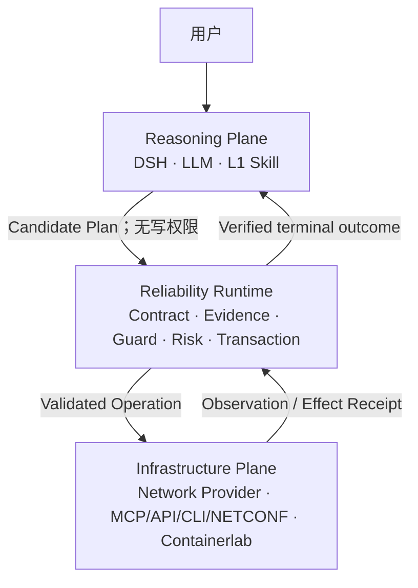

# NetOpYuAgent 架构 / Architecture

## 中文

### 1. 权威架构

NetOpYuAgent 当前只以 **EnsuredSkill 网络可靠执行研究原型**为目标。本文依据[原型权威准则](docs/ENSUREDSKILL-PROTOTYPE.md)描述当前架构；历史 P1/P2 产品化设计不再是当前架构的一部分。

核心命题：

```text
Reasoning correctness does not imply execution safety.
LLM 决定尝试什么；Runtime 决定允许发生什么。
No evidence, no action.
```

### 2. 三平面



| 平面 | 负责 | 不负责 |
|---|---|---|
| Reasoning Plane | 自然语言理解、诊断假设、追问、任务分解、L1 编排和 Candidate Plan | 不持有基础设施写权限；不自行宣布执行成功 |
| Reliability Runtime | L0 合同解析、Typed Graph、Evidence、Guard、Risk、事务、验证、补偿和审计 | 不做开放式语言推理；不把模型置信度当权限 |
| Infrastructure Plane | 提供事实 Observation 和 Effect Capability | 不判断上层意图；Provider 返回的 `success` 不是 Runtime 的 Commit 证据 |

Decision、Promotion、Catalog、Approval 和 Provider Adapter 都必须归入上述平面，不能再形成平级“控制面”。

### 3. 唯一写路径

```text
User Intent
→ L1 semantic guidance
→ Candidate Plan
→ active Contract-Governed L0
→ immutable Runtime Plan
→ Evidence + Guard + Risk
→ approval when required
→ revalidation
→ exactly one controlled Effect
→ independent verification
→ COMMIT / COMPENSATE / ESCALATE
```

产品原型不允许 L1/LLM 直接写 Provider。L1→L0 转换失败、证据不足或置信度不足时，只能读、追问、生成 proposal、请求人工处理或拒绝。原生 Agent 写入仅存在于隔离的本地 A/B evaluator，作为实验 Control，不是产品 fallback。

### 4. 核心源码边界

| 目录 | 所属平面 | 当前职责 |
|---|---|---|
| `dsh-plugin-netopyu/`, `dsh_adapter/` | Reasoning | DSH 投影、Candidate Plan 和窄 Worker bridge |
| `skills/`, `profiles/*/skills/` | Reasoning | L1 Semantic Guidance；不得授予效果权限 |
| `effect_runtime/reliability.py`, `effect_runtime/graph_scheduler.py` | Runtime | 领域中性 Contract、Evidence、Risk、Typed Graph 与 fail-closed 图调度门禁 |
| `network_runtime/l0/` | Runtime | L1→L0.5→L0 authoring、编译、静态安全门禁和激活合同 |
| `network_runtime/engine.py` | Runtime | prepare、evidence gate、approve、execute、verify、compensate、audit |
| `network_runtime/{graph_runtime,provenance}.py` | Runtime | 哈希链图执行、崩溃边界恢复、分阶段时延和跨步骤 Evidence DAG |
| `network_runtime/{validation,evidence,verifiers,compensators}.py` | Runtime | 参数、证据、后置条件和恢复验证 |
| `network_runtime/{contracts,journal}.py` | Runtime | 不可变计划、状态与哈希链事件 |
| `network_lab/`, `network_provider/`, `service_layer/` | Infrastructure | 本地 Observation/Effect Provider 和 Containerlab/FRR 网络锚点 |
| `evaluation/`, `data/ensured_skill_scenarios.yaml` | Evaluation | 配对实验、故障注入、消融和指标；不得进入执行链 |

### 5. 依赖规则

允许：

```text
DSH/L1 → public Runtime API
Runtime → L0 contract + domain-neutral Capability gateway
Provider Adapter → Infrastructure
Evaluation → all public test surfaces
```

禁止：

- Runtime 依赖 DSH UI、模型 SDK、Prompt 或会话实现；
- L1、模型或评测器直接调用产品原型写 Capability；
- Provider 自报成功被直接映射为 `COMMIT`；
- verifier 只复用写返回值，不进行独立 Observation；
- 模型生成的 L0 自动注册或激活；
- `evaluation/` 被产品 Runtime 导入；
- 企业身份、供应链或治理模块成为核心 Runtime 的必需依赖。

企业身份、Provider 发布、A2A、轨迹学习和历史 L1 shadow/canary 已改为**显式使用时才延迟加载**；默认原型路径不导入这些冻结扩展。DSH 能力检索 parity 位于 `evaluation/`，只能从离线命令运行并使用内存状态，产品 Adapter 不导入 Golden Set。

### 6. 核心不变量

1. **Candidate is not authority**：任何模型输出都只是候选。
2. **No evidence, no action**：缺失、过期、来源/范围不匹配或摘要损坏的 Evidence 阻断写入。
3. **Contract before score**：结构、Evidence 和 Guard 门禁先于风险分数。
4. **One immutable plan**：审批和执行绑定同一个 plan/contract digest。
5. **Revalidate before effect**：审批后、写入前重新读取易变前置条件。
6. **Verify, do not infer**：只有独立后置条件允许 `COMMIT`。
7. **Uncertainty is a state**：写后断连进入 `RECONCILE`，不能盲重试。
8. **Compensation is explicit**：合同声明可逆性、快照、补偿和恢复验证；不可逆操作降低自治等级。
9. **Terminal paths are auditable**：Commit、Abort、Escalate 和恢复失败均有证据链。
10. **No automatic promotion**：L1→L0.5→L0 只生成待审制品。

### 7. 架构决策

- **ADR-001：DSH 只承担 Reasoning Harness。** 不再自建 Agent loop、会话、模型 client 或 Web UI。
- **ADR-002：L0 是可执行合同，不是更长的 Prompt。** L1 保留语义弹性，L0 固定执行语义。
- **ADR-003：Evidence 是一等对象。** 它绑定类型、Capability、采集者、时间、范围、Action 和 payload digest。
- **ADR-004：网络事务采用近似事务语义。** 通过 Snapshot、Precheck、Verify、Reconcile 和 Compensation 控制非 ACID 设备。
- **ADR-005：Risk 输出只有 `EXECUTE / ASK_HUMAN / REJECT`。** 模型 confidence 不参与授权。
- **ADR-006：网络是唯一优先锚点。** 通用接口保留，但暂停扩展更多非网络领域。
- **ADR-007：先完成原型证据，再恢复产品化。** 企业 IAM、供应链、治理、Hermes/A2A、HA/DR、WORM 和 SLO 均冻结。

### 8. 冻结工程

以下代码保留作未来实验和回归，但不是当前核心能力、完成条件或效果证据：

- `hermes_adapter/`、`a2a_provider/`；
- `network_runtime/enterprise.py`；
- `network_runtime/provider_release.py` 与资格/部署供应链；
- `network_runtime/catalog_control.py`、`evidence_plane.py`；
- `l1_runtime/` 的 canary/productization 路径；
- 多团队治理、远端 WORM、HA/DR 和生产 SLO。

恢复任一冻结工程前，必须先满足[原型完成判据](docs/ENSUREDSKILL-PROTOTYPE.md#11-原型完成判据)。

---

## English

### 1. Authority and thesis

NetOpYuAgent is currently a network-first EnsuredSkill research prototype. The [prototype charter](docs/ENSUREDSKILL-PROTOTYPE.md) supersedes historical P1/P2 productization architecture.

Reasoning correctness does not imply execution safety. The LLM decides what to attempt; the Runtime decides what is allowed to happen. No evidence means no action.

### 2. Three planes

The **Reasoning Plane** contains DSH, the LLM, and L1 semantic guidance. It understands, diagnoses, clarifies, plans, and emits Candidate Plans without write authority.

The **Reliability Runtime** resolves Contract-Governed L0 operations, compiles typed graphs, gates evidence and guards, applies risk policy, executes transactions, verifies outcomes, compensates failures, and records audit evidence. It performs no open-ended language reasoning.

The **Infrastructure Plane** exposes observations and effects through protocol-neutral capabilities backed by MCP, API, CLI, NETCONF, or Containerlab. Provider success text cannot declare a Runtime commit.

### 3. Unique effect path

Every prototype mutation follows Candidate Plan → active L0 contract → immutable plan → evidence/guard/risk → optional approval → revalidation → controlled effect → independent verification → commit, compensation, or escalation.

An unqualified L1-to-L0 translation may only read, clarify, propose, ask a human, or reject. Native-Agent mutation exists only inside the isolated local A/B evaluator as the control arm; it is never a product fallback.

### 4. Dependencies and invariants

The Runtime depends on L0 contracts and a domain-neutral Capability gateway, never on DSH UI, prompts, model SDKs, or evaluation code. L1 and providers cannot bypass the Runtime. A journal-backed Typed Graph scheduler gates every current transaction branch and records crash-boundary uncertainty without replaying Effect. Evidence must be typed, fresh, scoped, integrity-checked, and action-bound; the inspection view projects Evidence → Observation → Capability/Collector → Object lineage with hashed collector/object identifiers. Approval and execution share an immutable plan digest. Postconditions require independent observations. Outcome uncertainty enters reconciliation, not blind retry. Compensation and recovery verification are explicit.

Enterprise identity, provider supply-chain admission, A2A, trajectory learning, and the historical L1 shadow/canary path are lazy optional extensions rather than core imports. DSH retrieval parity lives in `evaluation/`, uses memory-only state, and is never imported by the product adapter.

### 5. Frozen engineering

Hermes/A2A productization, enterprise IAM/PDP/change integration, signed provider supply chains, governance control planes, WORM/HA/DR/SLO work, and additional non-network domains are frozen future engineering. Their code may remain regression-tested, but it is not current architecture, prototype completion evidence, or an active roadmap.
