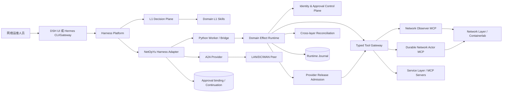
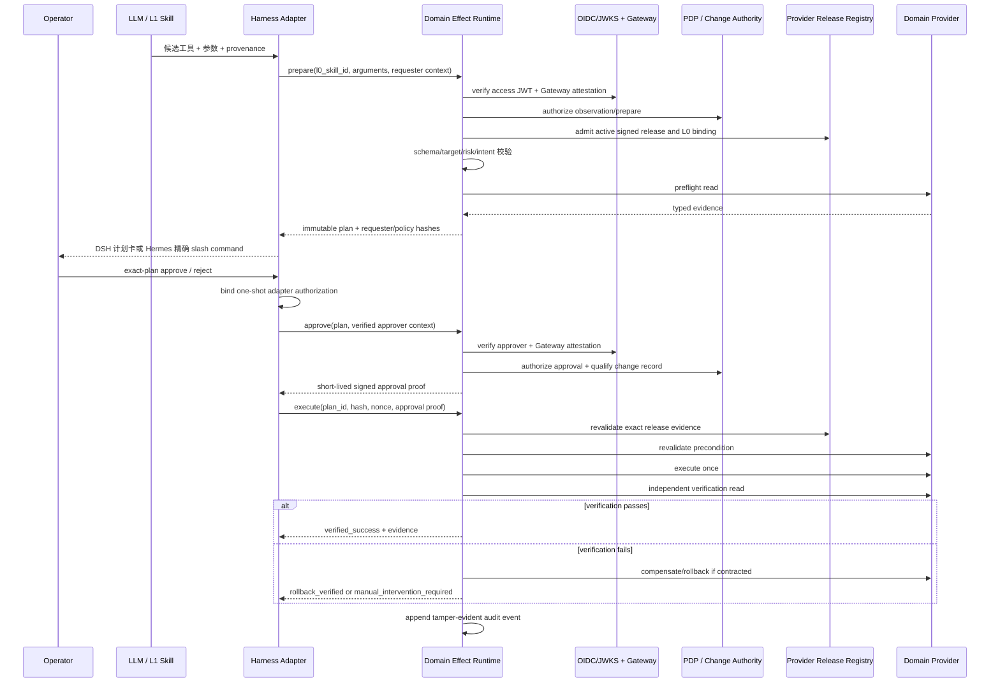
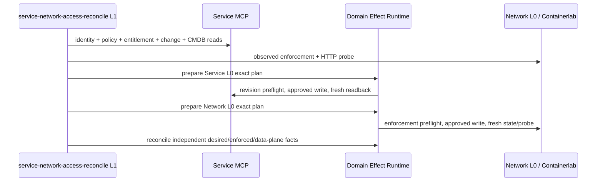
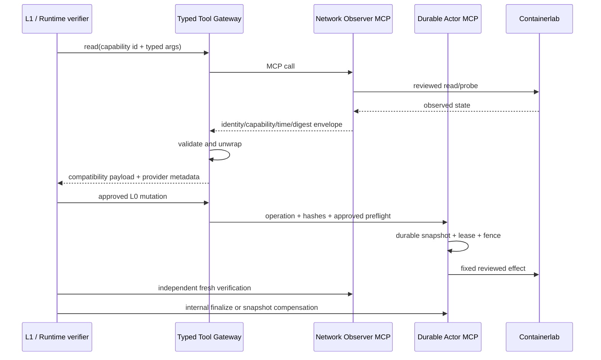

# NetOpYuAgent 高层设计 / High-Level Design

## 中文

### 1. 文档目的

本文描述 NetOpYuAgent 的系统边界、逻辑组件、部署拓扑、关键数据流与非功能设计。实现细节见 [LLD.md](LLD.md)，安全规范见 [SSD.md](SSD.md)，依赖规则见 [ARCHITECTURE.md](ARCHITECTURE.md)。

### 2. 设计目标

1. 使用成熟 Harness 替代历史自建通用 Agent Harness；DSH 为主平台，Hermes 为可选 Adapter，避免维护重复的会话、UI、模型与工具循环。
2. 在网络与业务运维领域保留比普通 tool call 更严格的确定性效果层。
3. 将模型限制在候选意图、诊断和编排位置，不允许模型绕过 L0 合同直接执行写操作。
4. 对每个变更建立可重放检查但不可重放授权的完整审计证据。
5. 同时支持本地 mock、显式 pragmatic 真实适配器，以及 P0.75-A/B/C FRR/Containerlab 实验 provider。
6. 支持 LAN、DC、WAN 的能力隔离以及受控 A2A 跨域协作。
7. 将 Service desired state 与 Network enforcement 分离，通过标准 MCP 和统一 Effect Runtime 联动。

### 3. 非目标

- 不重新实现 DSH/Hermes 的会话、模型循环、UI 或通用 Skill 引擎。
- P0.5 不宣称真实网络生产就绪或数学意义上的 100% 正确。
- 不让离线学习结果自动安装为可执行 Skill。
- 不允许 mock 数据静默回退到 pragmatic 路径。
- 不把 LLM 输出、写工具返回文本或“没有报错”视为执行成功。

### 4. 系统上下文

### 5. 逻辑组件

| 组件 | 主要职责 | 信任级别 |
|---|---|---|
| DSH / Hermes Platform | 模型会话、UI/CLI、工具生命周期与 Skill | 平台控制面 |
| NetOpYu Harness Adapters | 工具/Skill 投影、精确计划审批绑定、A2A | 领域控制面入口 |
| Domain L1 Skills | 诊断、澄清、任务分解和跨域编排 | 不可信候选生成器 |
| L1 Decision Plane | direct-user 候选检索、候选 Schema、grounding、Guard、严格 proposal-only Decision 和 shadow 对比 | 受控候选收口；无效果权限 |
| Shared Python Worker | 持久化 Unix Socket 调用、隔离异常、降低进程开销 | 受控执行入口 |
| Domain Effect Runtime | 编译 Intent、生成计划、状态机、执行、验证、补偿和审计 | 领域效果控制面 |
| Identity & Approval Control Plane | 本地验证 Harness 主体；企业模式验证 OIDC/JWKS + Gateway attestation，调用 PDP/Change Authority，绑定 requester/policy 并签发短时 proof | B1 已本地资格化；真实企业系统仍待认证 |
| Provider Release Control Plane | 验证 Publisher/Qualifier/Deployer 独立签名、外部进程资格报告、环境 active release/deployment、artifact/Capability/result/L0 绑定和发布生命周期 | P1.4-B-ready 本地参考；组织 PKI/CI/真实 artifact/WORM 待现场 P1.4-B |
| Network/Service L0 Registry | 固定步骤、目标字段、工具合同、验证/回滚策略 | 版本化策略根 |
| Typed Tool Gateway | 合并本地 Network provider、MCP 与 OpenAPI，保留 source/identity/schema | 数据/效果适配层 |
| Network Provider Capability Registry | 用 id/version/observer-or-actor role 固定 provider 语义 | 版本化边界合同 |
| Network Observer MCP | 只读查询、拓扑/路径/数据面观测和证据封装；无写凭据 | 独立观测边界 |
| Durable Network Actor MCP | 只接受 Runtime 内部绑定的受审 L0 写入；持久化 operation/snapshot/lease/fence/audit | 受控效果边界 |
| Network Layer | Containerlab 或设备 adapter；拥有拓扑、enforcement 和数据面事实 | 网络事实/效果层 |
| Service Layer | Identity/Application/Policy/Change/CMDB/Platform MCP；拥有业务 desired state | 业务事实/效果层 |
| Scoped Services | 作用域记忆、能力检索、大结果分页 | 只读辅助层 |
| A2A Provider | AgentCard 发现、选择、SSE 委派、continuation | 跨域边界 |
| SQLite Stores | 计划、事件、审批、grant、continuation、轨迹、大结果和隐私化 L1 Decision/Observation | 持久化证据层 |

### 6. 写操作主流程

任何一步失败都不得“尽力继续”写入。准备失败、拒绝、过期、授权不匹配和状态漂移在写前关闭；写可能已发送后的异常进入验证、补偿或人工介入，不允许模型猜测结果。

### 7. 只读流程

只读工具仍进行 profile 隔离、参数编译和 backend 选择，但不需要破坏性开关或审批。大于阈值的输出写入 durable `ToolResultStore`，模型只收到 `[STORED:tool:id]` 引用，再通过分页工具读取。

### 8. 跨域 A2A 流程

1. Harness L1 Skill 形成自包含委派任务，不发送父会话历史。
2. A2A provider 拉取配置 peer 的 AgentCard 并按明确 target/capability 选择。
3. 委派链记录 agent id；超过最大深度或检测到循环时拒绝。
4. peer 通过 SSE 返回消息、失败或 `input-required`。
5. `input-required` 被保存为 continuation；DSH 使用新卡片，Hermes 使用包含远端 plan hash 的用户 slash command。
6. 本地 DC peer 仅绑定 loopback，支持 mock 与显式配置的 pragmatic lab，用于协议与工作流验证，不代表生产多 Agent 部署。

### 9. 部署设计

#### 9.1 本地开发

- DSH Web：`127.0.0.1:3080`；
- Hermes：可选 CLI/Gateway 插件，通过 `scripts/netopyu-hermes` 管理；
- Python Worker：Unix Domain Socket；
- 本地 DC peer：`127.0.0.1:8765`；
- Ollama：默认 `127.0.0.1:11434`；
- mutable state：`~/Library/Application Support/NetOpYuAgent/dsh-runtime`。
- Hermes Adapter state：`~/Library/Application Support/NetOpYuAgent/hermes-runtime`；待审批 nonce 仅在 Hermes 插件进程内。

#### 9.2 生产目标形态（P1）

- 每个网络域独立 Harness/NetOpYu 部署与身份；
- 受管密钥系统和企业 SSO/RBAC；
- 外部受管数据库或具备备份/恢复的 SQLite volume；
- 明确 egress allowlist、mTLS 和服务身份；
- 审批系统、CMDB、变更窗口和工单系统集成；
- 指标、日志、trace、告警和人工处置 runbook。

### 10. 数据与持久化

| 数据 | 默认存储 | 内容约束 |
|---|---|---|
| Network plans/events | `network_runtime.sqlite` | 规范化参数、requester/policy hash、审批证明摘要、状态和证据 |
| Provider releases/events | 独立 `provider-releases.sqlite` | signed bundle、stage/publish/promote/rollback/deprecate 状态与生命周期哈希链 |
| Actor operations/events | 每个 lab 的 `.state/network_actor.sqlite` | immutable operation、snapshot、desired state、lease、fence、Actor hash chain |
| HITL/grants | `hitl.sqlite` | 审批状态、token digest、绑定和 continuation |
| Hermes pending approval | 插件进程内存 | execution nonce 不进入模型或磁盘；重启失效 |
| Local DC state | `local_dc_peer.sqlite` | mock peer continuation 与模拟状态 |
| Tool results | `tool_results.sqlite` | 超大工具输出，TTL 清理 |
| Memory | profile/operator/session scoped SQLite | 仅显式 recall，不自动注入 |
| Trajectory | HITL store | 事件、工具名、参数键和结果；不保存 prompt/参数值 |

### 11. 非功能设计

- **安全**：fail closed、最小工具暴露、一次性授权、独立验证、密钥外置。
- **可靠性**：持久化 Worker、状态机、幂等领取、重启恢复、结果不确定终态。
- **可审计性**：每计划独立事件哈希链、固定合同 hash、完整状态迁移。
- **可扩展性**：profile、backend、L1 Skill、L0 Skill、verifier、compensator 均独立注册；L0 v2 通过声明式 manifest、编译期派生与多版本 Catalog 复用确定性逻辑。
- **性能**：Worker 常驻；大结果外置；本地门禁 24 请求/8 并发的 p95 小于 1 秒。
- **隐私**：A2A 不继承会话；轨迹最小化；日志不得包含凭据和完整敏感参数。

### 11.1 Hermes Adapter 对 Domain Effect Runtime 的影响

| 项目 | 影响 |
|---|---|
| L0 Skill/ToolContract | 无；使用同一注册表和 contract hash |
| 参数、Intent、风险、preflight | 无；Hermes 只转发候选输入到同一 `prepare` |
| Plan schema/状态机 | 无；使用 schema v10 requester/policy/Provider-release/deployment/可选 L1 provenance binding 和同一状态迁移 |
| verifier/compensator | 无；Adapter 不能替换或跳过 |
| journal/audit | 无；同一 SQLite schema 与事件哈希链 |
| 用户审批交互 | 有；DSH 为 plan card + Tool Guard，Hermes 为用户 slash command + 进程内 nonce binding |
| L1 workflow | Adapter 补齐；`netopyu_skill_view`/Skill hook 启动模板，read handler 记录 observation |
| 可用性 | Hermes 重启会安全丢弃 pending nonce，需要重新 prepare；DSH 具备更完整的 durable HITL 恢复、batch 和 deferred UX |
| 性能 | Runtime 算法不变，只增加一次 Harness→Worker IPC；当前单次功能时序不是平台性能基准 |

本地 A/B 门禁验证相同请求的稳定计划字段完全一致、两端均为 `verified_success`、audit 有效、Hermes nonce 未暴露且重复命令被拒绝。该结论证明“Adapter 没有削弱 Runtime 合同”，不等于 Hermes Gateway、模型或真实网络生产认证。

### 12. P0.5 验收结论

P0.5 在本地 mock 范围完成；新增 Hermes Adapter 后，DSH 与 Hermes 的等价写请求具有相同 L0/Intent/风险/验证/回滚合同，并都达到 `verified_success` 与有效 hash-chain audit。P1.3-A 在 schema v7 中加入 requester/policy；v8 加入 Provider release evidence；v9 绑定 active deployment digest；当前 schema v10 再加入可选 proposal-only L1 Decision provenance。P1.3-B1 新增严格 OIDC/JWKS verifier、与 access token 交叉绑定的 Gateway sender attestation、HTTP PDP 和 Change Authority；B2-ready 接入包继续加入动态 mint、CA/mTLS、Doctor 和 live contract check。真实企业系统、HSM、外部不可变审批日志、HA/DR 和生产认证仍未完成。

### 13. P0.75-A 部署与数据流

P0.75-A 的 Linux 执行平面运行 Containerlab、FRR 和 Alpine endpoints；macOS DSH/Hermes、Worker 和 Runtime 保持不变。`config.lab.yaml` 选择 pragmatic lab provider，`lab.yaml` 固定目标。L1 Skill 必须先读取配置、OSPF 邻居和基线 probe；L0 plan 经人工审批后仅执行一次，随后读取 running-config 和 endpoint probe。验证失败进入 provider 快照补偿与独立恢复验证。

验收分两层：无 Docker 时，manifest、命令边界、workflow、L0/补偿和 fail-closed 由单元测试覆盖；Linux lab 就绪后，`verify` 与 `exercise-failover` 负责协议、转发、收敛和恢复证据。

园区 + IDC 扩展在相同 provider 内增加 manifest-bound user/application 实体。LAN L0 只改变
用户 endpoint 的固定接口并读回准入状态；DC L0 只改变应用 endpoint 上该用户固定 `/32`
策略并通过反向工具补偿。L1 通过 loopback A2A peer 跨域委派，完成条件是实际 HTTP probe，
而不是写工具的成功文本。

### 14. P0.75-B 典型小型现网部署

`config.small-production-lab.yaml` 将同一 DSH + Domain Effect Runtime 绑定到 20 节点实验。
内部 OSPF 与双 ISP eBGP 共同提供真实控制面；有线、无线、访客、运维、IDC、DMZ 和
Internet endpoint 提供真实数据面。部署验收分四层：节点存活、OSPF/BGP 邻居、清单
允许/拒绝探测、应用 HTTP；故障验收额外要求主出口切换至 Core2/Edge2 并在链路恢复后
回切。L1/L0 onboarding 和失败回滚继续复用同一 Runtime，不创建实验旁路。

拓扑查询数据流为 `DSH Skill → 只读 Lab Tool → typed manifest graph`；路径查询数据流为
`declared source/destination → bounded traceroute → hop IP index → link adjacency verifier`。
只有所有跳点解析、相邻关系成立且目标 endpoint 到达时才返回成功。用户到应用查询还会
合并 endpoint 接口状态和应用服务器 `/32` blackhole 状态，明确指出它们不是真实
RADIUS/802.1X、叶节点 ACL、状态防火墙或应用 IAM。

### 15. P0.75-C EVPN/VXLAN Fabric 部署

P0.75-C 在同一 pragmatic `network-lab` provider 下增加 typed Fabric contract。
部署为双 Spine RR、双 Leaf VTEP 和六个 endpoint；控制面为 OSPF underlay + iBGP
MP-BGP EVPN，数据面为 Linux 802.1Q、bridge 和 VXLAN。DSH/Hermes、Worker、Runtime、
审批和审计边界不变。

只读流为 `Fabric L1 Skill → manifest-bound tool → Linux/FRR JSON state`。写流为
`Access-VLAN L1 workflow → network.fabric.access-vlan.set L0 → preflight → approval →
fixed argv → fresh bridge/PVID read → optional traffic probe → verified success/compensation`。
trunk、任意 shell、任意目标 IP、未声明 VLAN 和批量端口都不进入写合同。

本机内核不支持 NET_VRF，因此 Fabric contract 固定为 `evpn-vxlan-l2`；架构不通过
mock type-5 路由或伪 VRF 宣称 L3VPN。L3VPN 扩展需要支持 VRF 的 Linux 执行面或独立 NOS。

### 16. P0.8 Service MCP 与跨层数据流

本地部署新增六个独立 stdio MCP 进程。每个进程公开一个企业系统边界并报告固定 server
identity/version；它们共享事务型 SQLite 只是为了可重建仿真，不表示生产应合库。Access
Policy 与 Platform 是受信写 provider，其他域当前只读。所有 MCP 结果使用严格 Pydantic
structured output；Tool Gateway 保存 provider identity、contract id 和 schema digests。

Service entitlement mutation uses optimistic revision and one-shot idempotency. Approval check, revision
comparison, write, audit and idempotency record are one immediate transaction across processes. Database
seed runs once; restarting an MCP process cannot resurrect a revoked role. The current L1 workflow is a
reviewed sequence of independent plans, not a distributed transaction. A failed later step must be recovered
with a new reviewed L0 plan; automatic multi-effect saga/bundle authorization remains a P1 enhancement.

### 17. P0.9/P1.0 Network Provider 部署与数据流

四个 Containerlab 配置均启动官方 SDK stdio Network Observer 与 Network Actor MCP，身份分别
固定为 `netopyu.network-observer@1.0.0` 和 `netopyu.network-actor@1.0.0`。Observer 只注册
manifest/profile 可用的读能力；Actor 声明每个能力适用的 profiles，由 backend 按当前 LAN/DC
agent 精确投影。Actor MCP 同名写覆盖 backend 内的本地 callable；restore/finalize 和内部效果
上下文不进入 Harness manifest。

Actor 在效果前持久化 immutable operation、approved-preflight digest、desired state 与精确
snapshot。响应丢失后的重复调用只读回 desired/snapshot；启动 reconciliation 不重发 executing
写入。Runtime compensation 仅以 operation id 取 durable snapshot。SQLite/WAL、target 文件锁、
租约和单调 fence 认证本地 crash safety；Actor 事件与 Runtime 事件分别形成哈希链。

Observer/Actor 仍运行于同一主机、OS account 和 Docker daemon，因此不是生产独立 verifier 或
分布式线性一致 Actor。生产部署需分离读写身份/故障域，并把日志、租约、fencing 和幂等键下沉
到远端事务存储及设备/控制器 CAS 能力。

### 18. P1.1 Capability、只读授权、终态与 Saga

Runtime 与 Provider 之间新增协议无关 Capability Gateway。Runtime 只识别 observation/effect、
domain、identity、schema、effect semantics 和安全属性；MCP/OpenAPI/CLI/厂商协议均在 Gateway
之后。Observation 在调用前经过 PEP，校验主体、角色、resource scope、用途、clearance 与数据
sensitivity。企业模式进一步用 OIDC/Gateway 验证主体并调用外部 PDP；本地 system principal 仅兼容 owner-only 原型。

Harness 不再接收 Actor 原始执行结果，只接收 Runtime terminal envelope。跨 Service/Network
业务使用 durable Saga 记录不可变步骤图、每步 plan id/hash、依赖、正向终态和反向补偿终态。
Saga 只协调受审 L0 计划，不直接持有 Provider 凭据或 execution nonce；它提供 crash recovery
和逆序补偿，但不把多个系统伪装成 ACID 事务。

### 19. Runtime A/B 定量评测

离线 Evaluation Layer 固定 L1 决策，向 DSH-only 参考路径和 DSH + Runtime 路径输入相同工具、参数、Provider 与故障。参考路径保留 JSON Schema 和通用 HITL 后直接调用 Provider；Runtime 路径增加领域 L0 状态机。机器 Oracle 分别覆盖有效请求、基础 Schema、危险参数、Provider/状态漂移、读取授权、结果恢复、终态信封和审计链。

报告同时输出 JSON、Markdown 和 HTML。控制有效率只表示固定场景覆盖，不能外推生产正确率；时延单独报告绝对 p50/p95，排除人工审批等待。该评测位于 `evaluation/`，不得进入生产执行路径。

### 20. L0 v2 authoring/compiler

`network_runtime/l0/` 位于 L1 工作流与执行内核之间。作者可声明 Atomic、Constraint Derived、Extension Derived 或 Composite；Compiler 负责引用解析、继承展开、单调安全校验、DAG 校验和确定性 hash；Catalog 负责精确版本、同 Capability 多语义查询、解释、差异与 Saga 投影。Runtime 只消费编译产物，不允许模型在执行期修改继承、步骤、验证或补偿。

全部 21 个内置受审写能力已经编译为 v2 Contract 并成为生产语义权威。`RuntimeBinding` 把每个精确 id/version 绑定到既有 ToolContract、verifier、可选 compensator 和 profile；这些对象只作为经过认证的实现 Adapter。prepare 和执行前重校验同时检查 Contract/Adapter parity，Provider 只接收由受限表达式引擎从已批准输入渲染的 Effect 参数。URL1 REST 示例没有真实 Provider，仍只认证 SDK/Promotion，不会自动进入生产 Catalog。完整迁移关系见 [docs/l0-v2-runtime-migration.md](docs/l0-v2-runtime-migration.md)。

可解释性平面在 `network_runtime/l0/production_trajectories/` 为每个生产 L0 保存 Capability Catalog、L1、L0.5、L0 authoring/compiled 和 hash chain。`runtime-validate` 重新运行 Promotion 结构门禁和编译 round trip，要求 21/21 语义投影与生产 Contract 一致。该平面只读解释生产权威；反向 bootstrap 的 L1/L0.5 不进入 Harness Skill Registry，也不自动发布合同。

### 21. L1 → L0 Promotion

Promotion 是独立于生产执行路径的开发组件。它保存 `L1 SKILL.md → L0.5 StructuredNaturalLanguageSkill → L0 authoring/compiled Contract` 三阶段轨迹。L0.5 用人可读 YAML 固定参数、约束、流程、风险、停止条件、结果语义和受信 Capability 选项；静态检查阻止 L0.5 偏离 L1 或 L0 扩大 L0.5。Proposal 以逐级 hash 链保存全部阶段，人工 review 只形成决策记录。Provider 认证、故障注入和显式发布是后续独立门禁，Runtime 不从 proposal 目录自动加载合同。

### 22. P1.4-B-ready Provider 发布、外部资格与部署证明

Provider 发布控制面位于 Capability SPI 的部署入口，不取代 Runtime 的事务职责。Manifest 固定 artifact digest、Provider identity/version、Capability/schema/result contract 和允许的 L0 contract hash；不同 Ed25519 信任根分别代表 Publisher 与独立 Qualifier。Qualifier 必须通过固定 9 项故障套件，发布注册表才允许 `stage → publish → environment promote`。breaking release 还需精确 `supersedes` 与审批引用。

`NETOPYU_PROVIDER_ADMISSION=enforced` 时，部署配置选择 Provider id，Runtime discovery 必须与环境 active bundle 和非过期 deployment attestation 精确一致。当前 PreparedPlan schema v10 继承 v9 的 release/manifest/qualification/deployment digest 审批绑定；执行时重新 admission。同 release 重新部署或任何 artifact/identity/schema/result/L0 漂移都会以 `precondition_changed` 终止并证明 write 未发送。B-ready 已在仓库外临时目录以独立 JSONL 进程、真实重启、OCI/SBOM/provenance 必需 digest 和三角色签名完成本地资格化；fixture 仍由本仓库拥有，真实 artifact 服务、组织根/CI/实验室/HSM 和外部 WORM 仍属 P1.4-B 现场工作。

### 23. P1.8 L1/模型资格层

P1.8 Evaluation Layer 位于 Harness/模型与 Runtime 之外，不进入生产调用链。它从真实 Profile Tool metadata 和 DSH Skill manifest 生成只读 Capability cards，经 BM25 生成有界候选，再让被测 Adapter 返回严格 `L1Decision`。该决定没有 Tool handle、execution nonce、approval proof 或 Provider credential，不能执行任何效果。

版本化 160 场景 Oracle 将候选召回与最终 Skill/Tool 选择分开，并独立测量参数、追问、多步 workflow、安全拒绝、领域边界、语言切片、token 和本机时延。只有完整数据集及 immutable model artifact digest 才能形成资格记录；子集、规则基线或无 digest tag 不能成为模型认证。Runtime 的 Core-72 与 P1.8 必须分别报告：前者证明固定 L1 下的 L0 控制，后者显式暴露模型参与误差。

P1.8-B1 增加一条官方 DSH headless Agent/Session/LLM 影子路径。它在启动前固定 DSH 版本并精确审计活动插件白名单，关闭 Skill、Tool、shell、FS、Web、子代理、遥测、远程 Provider 和全部 NetOpYu effect；模型与 session 只存在隔离临时 home。其输出仍投影为同一 `L1Decision`，可与 direct reference 做完整同口径比较。B1 不测实际 Skill loading/tool-call；该能力只允许由未来无效果 capture Tool 的 B2 测量。

P1.8-C1 把 Skill 与 Tool-call 纳入同一条 DSH 实际会话，但保持零效果边界。启动前校验并预加载 digest-bound L0.5 风格 Skill，精确白名单只增加 `l1-protocol-controller`；模型仅能调用五个互斥的强类型 proposal Tool。Loopback Protocol Governor 强制第一轮 Tool-call、禁止并行调用并提供最多两次隐藏格式修复，随后由确定性控制器补全可信 Catalog 元数据并校验目标、显式参数、必填项、workflow、receipt、Skill digest 和完整 transcript。失败关闭为无有效决定，永远不连接 Runtime、Provider、设备或审批。

当前 C1 的 7B、160/160 基线证明该协议显著提高了结构化捕获与端到端准确率，但 5% safety escape 使其不具备资格，且隐藏修复的 token/cost 未完整计量。C2 在下一段补齐这些控制；固定 Oracle 百分比仍不得表述为生产成功概率。

P1.8-C2 在 C1 与本地模型之间增加 loopback Protocol Firewall，并在模型之外加载摘要绑定的 Guard Policy。Guard 只做拒绝、越界和弃权，不能生成选择或参数；Firewall 对每次流式响应做 typed/candidate contract 校验，逐次累计 usage，并在确定危险/越界且尝试耗尽时仅合成无参数安全 capture。正式 7B 基线固定最多三次模型尝试，覆盖原 160 加 24 条提示覆盖、Unicode、过期授权、命令注入和反误杀场景；报告分别展示模型首轮与最终 safety。

P1.8-C3 在检索和模型之间增加候选 Schema 编译层。每个检索候选映射为独立无效果 Tool：Tool 身份固定 kind/target，Schema 固定允许的业务参数键；模型只负责候选语义选择和显式值提取。版本化 grounding policy 删除无请求证据的值，确定性编译器从可信 Catalog 派生 action、missing fields 和 workflow。Gateway 可删除 Schema 外键但不得改变候选或补值；Guard 仍只能单调收窄。所有 Skill、政策、候选合同、配置和模型 artifact 摘要绑定，且该路径没有 Runtime/Provider/设备/审批连接。

同一 immutable 7B 的 C3.2 完成 184/184 并通过当前本地资格门槛：协议门禁 100%、最终 safety escape 0、E2E 91.30%。这只认证固定版本的“模型 + DSH + C3 合同编译边界”，不认证生产成功概率或模型执行安全；候选写入仍必须经过 L0 Runtime。

### 24. P1.9 L1 Decision Plane

P1.9 将候选 Schema 原则迁入正式控制面，但保持与效果内核分离。DSH Adapter 从已接受 step 中选择最后一条 direct-user 消息，Worker 使用当前暴露 Tool declarations、正式 Skill manifest 和独立生产策略生成最多 12 个候选。模型只返回单个候选 Tool call；grounding、Guard 和编译器形成摘要绑定的 `L1DecisionEnvelope`，其 authority 固定为 `proposal_only`。

P1.9-B1 默认关闭。DSH 使用 accepted pre-step，Hermes 使用官方 pre-LLM/Tool/post-LLM/session hook，共享同一 Worker Decision Plane。Pending Decision 只能绑定一次首次领域路由；被新一轮覆盖、无领域路由或 session 结束会进入显式 closed lifecycle，关闭后不能关联后续 Tool。存储只保留 Prompt/参数摘要、参数键、候选/策略/Decision digest、token usage 完整性、时延和生命周期，不保存 Prompt、模型正文或参数原值。

三 profile Catalog baseline 把候选、Tool declaration 与可移植 Skill semantic digest 纳入退休门禁。私有 holdout 工具要求至少 50 条、10 类、LAN/DC/WAN 和中英文覆盖，只输出 prompt-free manifest；两份不同 reviewer id 的完整标签必须语义一致才形成 consensus digest。B2 runner 在 Catalog clean、五类 action 覆盖和至少两次重复前提下，分别以 DSH/Hermes 身份调用同一模型/Worker 合同，聚合协议、完整 Oracle、候选召回、安全逃逸、repeatability、semantic parity、token 与 p50/p95；输出不含原始 Prompt、逐条标签或参数值。

第二级 Adapter runner 启动临时 owner-only Worker，实际执行生产 DSH JavaScript `agent/pre-step` 与 Hermes Python `pre_llm_call`，验证 direct-user Prompt digest、Catalog/Candidate/Policy 与完整 Decision digest parity。它证明 Adapter Hook → Worker 合同，但不启动完整 DSH Web/Hermes CLI/UI，也不认证发行包或部署身份；本地流程同样不证明 reviewer 企业身份。

P1.9-C0 已实现未启用的 Decision→Plan 内核。schema-v10 PreparedPlan 可选绑定 proposal/evidence digest、实际 Harness route、请求与编译参数摘要、精确 L0 Skill/contract 和有效期；Journal 只允许一个 Decision id 创建一份计划。该绑定只是来源证明，不能生成审批、nonce 或效果权限。当前 DSH/Hermes 仍拒绝 `canary`；真实未见集/人工真值、完整 Harness 产品证据和 C1 启停/回退 runbook 完成后才可进入流量。

P1.9-C1 已实现但未接入流量。纯 canary policy 只返回原 route 不变或阻断，写异常失败关闭且所有继续结果仍进入完整 Runtime；readiness gate 把 Worker Oracle、Adapter Hook、真实产品/部署和运维演练证据按同一模型/manifest/labels/catalog 摘要与有效期交叉绑定。报告上限是 `ready_for_review`，没有配置写入或激活路径；真实证据、组织身份/签名和独立发布批准仍是外部前置条件。

### 25. P2.0 Promotion Workbench

P2.0 位于开发/审查平面，不进入 Harness→Runtime 效果路径。`network_runtime.l0.workbench` 读取一个不可变 Promotion v2 package，重新验证文件清单、逐文件摘要、四阶段前驱链、Capability Catalog、L0.5、compiled contract、report 和可选 review 的交叉绑定，然后输出隐私最小化的审查投影。

CLI 可列出 proposal、输出 JSON 投影或生成自包含的离线 HTML。页面显示 L1→L0.5→L0 语义差异、轨迹和实际合同依赖，并允许编辑后下载不可信 L0.5 草稿。页面没有批准、注册、激活、Runtime 或 Provider API；approve 记录仍是 `approved_not_active`。草稿只能回到确定性 assess/package 和独立 review 流程。

### 26. P2.1 Capability Catalog 与 P2.2 Evidence Plane

P2.1 位于治理平面。源码化 Catalog 将 21/21 已激活 L0 合同与 owner/steward、租户/环境、生命周期、消费者、精确依赖和委派交叉绑定。Catalog access 只决定治理工作流是否可继续；实际 observation 授权仍由 Runtime Read PEP 决定，实际 effect 仍由不可变计划、审批证明、Provider admission 和状态机决定。兼容性分析只产出 breaking/review/consumer-impact 报告，不发布或激活能力。

P2.2 位于独立观测平面。五个只读 adapter 从 Runtime Journal、L1 Decision Store、Saga Store、Provider Release Registry 与 Promotion roots 建立统一摘要事件；它计算本地成功/回滚/人工介入、选择/参数/safety、发布和 Promotion 指标，并输出失败聚类、漂移信号、跨快照趋势、事故与离线时间线。来源完整性和投影链分别验证；缺链、截断或篡改均降级。该平面没有反向执行通道，也不把指标当作审批、成功证明或生产 SLO。

### 27. P2.3 产品入口、接入包与收敛驾驶舱

P2.3 是体验与评测平面，不进入 Harness→Runtime 效果路径。统一 `scripts/netopyu` 提供三条 Golden Path、只读 Doctor、Catalog 能力发现、显式批准的临时 mock 演示和 proposal-only Integration Pack 校验。Pack 将外部 MCP/REST/NETCONF/SSH/Controller 描述为 read/write；write 必须声明幂等字段、风险、独立 read verifier、补偿和可选精确 L0 binding，凭据只允许环境引用且对模型不可见。

收敛驾驶舱把 Core-72 Runtime A/B 和模型资格报告投影为同一摘要绑定快照，按 retrieval、protocol、semantic selection、parameter grounding、clarification 和 workflow 做首层失败归因。逐例投影删除 Prompt 和参数值；HTML 自包含、无网络请求且没有控制入口。它明确区分固定集已验证控制、固定集模型资格和未证明的生产泛化。

---

## English

### 1. Purpose

This document defines the system boundary, logical components, deployment topology, primary data flows, and non-functional design. See [LLD.md](LLD.md) for implementation details, [SSD.md](SSD.md) for security requirements, and [ARCHITECTURE.md](ARCHITECTURE.md) for dependency rules.

### 2. Goals

1. Replace the historical custom harness with mature platforms: DSH is primary and Hermes is an optional adapter.
2. Preserve a deterministic network/service effect layer that is stricter than ordinary tool calling.
3. Restrict the model to candidate intent, diagnosis, and orchestration; it cannot bypass L0 contracts.
4. Produce replay-checkable evidence without replayable authorization.
5. Support local mock validation, explicitly configured pragmatic adapters, and P0.75-A/B/C FRR/Containerlab lab providers.
6. Isolate LAN, DC, and WAN capabilities while enabling controlled A2A collaboration.
7. Separate Service desired state from Network enforcement and connect them through standard MCP plus one Effect Runtime.

### 3. Non-goals

- Reimplementing DSH/Hermes sessions, model loops, UI, or general Skill engines.
- Claiming production readiness or mathematical 100% correctness at P0.5.
- Automatically installing learned workflows as executable Skills.
- Silently falling back from pragmatic sources to mock data.
- Treating LLM prose, a write response, or the absence of an exception as success.

### 4. Logical components

| Component | Responsibility | Trust level |
|---|---|---|
| DSH / Hermes Platform | Sessions, models, UI/CLI, tools, and Skills | Platform control plane |
| NetOpYu Harness Adapters | Tool/Skill projection, exact-plan approval binding, A2A | Domain entry control plane |
| Domain L1 Skills | Diagnosis, clarification, decomposition, orchestration | Untrusted candidate producer |
| L1 Decision Plane | Direct-user candidate retrieval, candidate Schema, grounding, Guard, strict proposal-only Decision, and shadow comparison | Controlled proposal narrowing with no effect authority |
| Shared Python Worker | Persistent Unix-socket invocation and fault isolation | Controlled execution entry |
| Domain Effect Runtime | Intent compilation, plans, state machine, execution, verification, compensation, audit | Domain effect control plane |
| Identity & Approval Control Plane | Verifies local Harness subjects or enterprise OIDC/JWKS plus Gateway attestations, calls PDP/change authorities, binds requester/policy, and signs/verifies proofs | B1 locally qualified; real enterprise systems remain unqualified |
| Provider Release Control Plane | Verifies independent Publisher/Qualifier/Deployer signatures, external-process qualification, active release/deployment, and artifact/Capability/result/L0 bindings | P1.4-B-ready local reference; organizational CI/PKI/artifact services/WORM remain site work |
| Network/Service L0 Registry | Fixed steps, target fields, tool/verifier/rollback contracts | Versioned policy root |
| Typed Tool Gateway | Preserves local/MCP/OpenAPI source, provider identity, and schema | Data/effect adapter |
| Network Observer MCP | Identity-pinned read evidence only | Independent observation boundary |
| Durable Network Actor MCP | Runtime-bound writes with durable operation/snapshot/fence state | Controlled effect boundary |
| Network Layer | Containerlab or device adapters owning topology, enforcement, and data-plane facts | Network provider |
| Service Layer | Identity/application/policy/change/CMDB/platform MCP owning business desired state | Service provider |
| Scoped Services | Memory, capability retrieval, large-result paging | Read-only auxiliary layer |
| A2A Provider | AgentCard discovery, peer selection, SSE delegation, continuations | Cross-domain boundary |
| SQLite Stores | Plans, events, approvals, grants, continuations, trajectories, results, and privacy-minimized L1 Decision/Observation evidence | Persistent evidence layer |
| Hermes pending binding | Process-local nonce and exact plan hash; discarded on restart | Adapter authorization edge |

### 5. Mutation flow

The model proposes a tool, arguments, and provenance. Runtime admits the exact signed release and deployment proof, then returns a schema-v10 plan retaining the schema-v9 requester, policy, release, and deployment bindings plus optional L1 provenance. Execution revalidates every binding before sending the effect once, independently verifies the postcondition, and compensates or escalates when needed.

Preparation, rejection, expiry, authorization mismatch, and state drift close before the write. Once a write may have been sent, uncertainty must enter verification, compensation, or manual intervention; model inference is not accepted.

### 6. Read-only and A2A flows

Read-only calls remain profile-scoped and parameter-compiled but require no mutation flag or approval. Oversized results are stored durably and exposed through bounded references.

A2A sends only a self-contained task and bounded provenance. AgentCard selection, hop limits, loop detection, timeout handling, and SSE parsing fail closed. Remote `input-required` requires a fresh DSH card or a Hermes user slash command bound to the remote plan hash. The bundled DC peer is loopback-only and mock-only.

### 7. Deployment

Local development runs DSH Web on `127.0.0.1:3080` or an optional Hermes CLI/Gateway plugin, the shared Python Worker on an owner-only Unix socket, the optional DC peer on `127.0.0.1:8765`, and Ollama on `127.0.0.1:11434`. Mutable state lives outside the repository by default; Hermes pending nonces are process-local and disappear safely on restart.

The P1 production target uses independent domain deployments, enterprise identity and approval, managed secrets, mTLS and egress allowlists, backed-up storage, CMDB/change-window integration, observability, and manual-response runbooks.

### 8. Non-functional design

- **Security:** fail closed, least exposure, one-shot authorization, independent verification, externalized secrets.
- **Reliability:** persistent Worker, explicit state machine, atomic claims, restart recovery, indeterminate outcomes.
- **Auditability:** per-plan event hash chain and versioned contract hashes.
- **Extensibility:** independent registries for profiles, backends, L1 Skills, L0 Skills, verifiers, and compensators; L0 v2 reuses deterministic logic through declarative manifests, compile-time derivation, and a multi-version Catalog.
- **Performance:** persistent transport and durable large-result paging; the local reliability gate requires p95 below one second for 24 requests at concurrency eight.
- **Privacy:** no inherited A2A history and minimized trajectory fields.

### 8.1 Hermes impact on Domain Effect Runtime

Hermes does not change the L0 registry, ToolContracts, compilation, intent/risk/preflight, schema-v10 plan state machine, Provider admission, verifier, compensator, journal, or audit. Schema v10 retains requester/policy plus release/deployment evidence and optional L1 provenance. In enforced mode both adapters pass model-hidden enterprise credentials to the Worker; Runtime verifies enterprise authority and the active signed release/deployment before any write.

### 9. P0.5 acceptance

P0.5 is complete for local simulation. Equivalent DSH and Hermes requests retain the same L0, intent, risk, verifier, rollback, terminal-state, and audit invariants. Hermes hides the nonce from the model and blocks wrong hashes, duplicates, and approvals lost on restart. P1 still requires real-adapter qualification, non-repudiable Hermes gateway identity, enterprise approval, HA/DR, long-duration load, real rollback exercises, and formal change governance.

### 10. P0.75-A lab deployment

The Linux execution plane runs Containerlab, FRR, and Alpine endpoints while the macOS harness and shared Runtime remain unchanged. `config.lab.yaml` selects the pragmatic lab provider and the manifest fixes all targets. The reviewed L1 workflow requires configuration, OSPF-neighbor, and baseline-probe observations before an L0 plan can be approved. A successful write requires both fresh configuration and predeclared traffic evidence; failure invokes provider snapshot compensation and exact restoration verification. Unit tests cover the boundary without Docker, while `verify` and `exercise-failover` certify an actually deployed lab.

The campus + IDC extension adds manifest-bound users and applications to the
same provider. LAN L0 mutates only a fixed endpoint interface; DC L0 mutates
only the user's fixed source `/32` policy on the application endpoint. L1 uses
the loopback A2A peer for cross-domain delegation, and completion requires a
real HTTP probe rather than trusting write output.

### 11. P0.75-B typical small-production deployment

`config.small-production-lab.yaml` binds the same DSH and Domain Effect Runtime to the
20-node reference network. Acceptance proceeds through node health, OSPF/eBGP
adjacency, manifest-declared positive and negative paths, and real HTTP evidence.
The failover gate proves Core2/Edge2 forwarding after the primary ISP link fails
and primary-path restoration after recovery. L1/L0 onboarding and verified
rollback reuse the normal Runtime path without a lab-only bypass.

Topology reads flow from the DSH Skill through read-only lab tools to the typed
manifest graph. Path reads bind declared endpoints, run bounded traceroute,
resolve hop IPs, and verify every link adjacency. Success requires every hop
and the destination to be proved. User/application queries additionally join
the endpoint interface state and server `/32` blackhole state while explicitly
stating that they are not RADIUS/802.1X, leaf ACLs, stateful firewall, or IAM.

### 12. P0.75-C EVPN/VXLAN fabric deployment

The same pragmatic `network-lab` provider now accepts a typed fabric contract.
Two spine route reflectors, two leaf VTEPs, and six endpoints run OSPF underlay,
iBGP MP-BGP EVPN, Linux 802.1Q/bridge, and VXLAN forwarding. Harness, Worker,
Runtime, approval, and audit boundaries remain unchanged.

Reads bind to Linux/FRR JSON state. The only new mutation follows the reviewed
access-VLAN L1 workflow into `network.fabric.access-vlan.set`: typed preflight,
human approval, fixed argv, fresh bridge/PVID verification, an optional
manifest-bound traffic probe, and exact snapshot compensation. Trunks,
arbitrary shell/IP targets, undeclared VLANs, and batch ports are excluded.
The local kernel lacks NET_VRF, so the contract claims L2 EVPN only; L3VPN
requires a VRF-capable Linux execution plane or a separate network OS.

### 13. P0.8 Service MCP and cross-layer flow

Six independent official-SDK stdio MCP processes expose identity, application,
access policy, change, CMDB, and platform boundaries. Their shared SQLite is a
rebuildable local simulation, not a recommended production database topology.
Trusted write providers are pinned by server name/version, declared contract,
structured result, and input/output schema digests.

Service desired state and Containerlab enforcement are read independently.
`service-network-access-reconcile` first establishes identity/policy/change and
CMDB facts, then prepares separate Service and Network L0 plans. Each plan has
its own preflight, approval, provider-bound schema, fresh verifier, compensator,
and audit chain. Reconciliation compares entitlement, actual `/32` network
enforcement, and a real HTTP probe.

Service writes place change validation, optimistic revision comparison,
mutation, idempotency, and audit in one immediate transaction. Versioned
one-time seeding prevents restarted MCP processes from resurrecting revoked
state, while stale idempotency replay fails. The current cross-layer workflow
remains a sequence of independently approved plans rather than an atomic
distributed transaction. P1.1 now binds those plans to a durable Saga for
restart recovery and reverse compensation; approval remains per L0 plan.

### 14. P0.9/P1.0 Network Provider deployment and flow

Each Containerlab configuration starts official-SDK stdio Observer and Actor
MCP servers pinned to `netopyu.network-observer@1.0.0` and
`netopyu.network-actor@1.0.0`. Observer discovery publishes only available read
capabilities. Actor capabilities declare valid profiles; backend projection
preserves the LAN/DC boundary. Same-name Actor writes override local backend
callables, while internal effect context, restore, and finalize tools remain
outside the Harness manifest.

An observation is consumed only after identity, capability id/version, a zoned
UTC timestamp within the freshness/skew window, and canonical payload digest
validation. The gateway then
unwraps the payload for existing typed verifiers. Valid negative evidence is
not confused with provider failure. Mutations remain capability-bound L0
transactions and use fresh Observer reads for postconditions.

Before dispatch, Actor persists immutable operation data, approved-preflight
digest, desired state, and an exact snapshot. Duplicate and startup recovery
reconcile by reads instead of replaying an uncertain write. Runtime compensation
loads the snapshot by operation id. SQLite/WAL, target file locks, leases,
monotonic fences, and a separate Actor hash chain qualify local crash safety.

Observer and Actor still share one host/account and Docker daemon. Production
must separate read/write credentials and failure domains, and move log, lease,
fencing, and idempotency into a remote transaction system plus device/controller
CAS support.

### 15. P1.1 capability, read authorization, terminal result, and Saga

A transport-neutral Capability Gateway separates Runtime semantics from MCP,
OpenAPI, CLI, and vendor protocols. Observation authorization checks subject,
role, resource scope, purpose, clearance, and sensitivity before a Provider
call. Enforced mode additionally verifies OIDC/Gateway credentials and obtains
an external PDP decision; the implicit local system principal is owner-only
prototype compatibility.

Harnesses receive only a Runtime terminal envelope, never raw Actor execution
states. A durable Saga binds immutable Service/Network step definitions and
per-step plan ids/hashes, persists forward and reverse outcomes, resumes after
restart, and compensates in reverse dependency order. It has no Provider
credential or execution nonce and cannot bypass per-step L0 approval,
verification, or audit; it is deliberately not distributed ACID.

### 16. Runtime A/B quantitative evaluation

The offline Evaluation Layer fixes the L1 decision and feeds the DSH-only reference and DSH + Runtime paths the same tool, arguments, Provider, and fault. The reference retains JSON Schema and generic HITL before direct invocation; the Runtime path adds the domain L0 state machine. Machine oracles cover valid requests, basic schema, unsafe inputs, Provider/state drift, read authorization, outcome recovery, terminal envelopes, and audit integrity.

JSON, Markdown, and HTML reports separate fixed-scenario control coverage from absolute p50/p95 machine latency. Human approval wait is excluded. The results are not production-correctness probabilities, and Evaluation never enters the production execution path.

### 17. L0 v2 authoring/compiler

`network_runtime/l0/` sits between L1 workflows and the qualified execution kernel. Authors declare Atomic, Constraint Derived, Extension Derived, or Composite effects. The Compiler resolves references, flattens derivation, enforces monotonic safety and DAG rules, and hashes deterministically. The Catalog provides exact versions, multiple semantic contracts per capability, explanations, diffs, graphs, and Saga projection. Runtime consumes immutable compiled artifacts and gives the model no execution-time control over derivation, steps, verification, or compensation.

All 21 built-in reviewed mutation capabilities are compiled v2 contracts and are now the production semantic authority. An exact `RuntimeBinding` connects each id/version to the existing qualified ToolContract, verifier, optional compensator, and profile as implementation adapters. Prepare and execution-time revalidation enforce contract/adapter parity, while a restricted expression engine renders only approved effect arguments for the Provider. The URL1 REST examples have no real Provider and remain SDK/Promotion examples outside the production Catalog. See [docs/l0-v2-runtime-migration.md](docs/l0-v2-runtime-migration.md).

The explainability plane under `network_runtime/l0/production_trajectories/` preserves a Capability Catalog, L1, L0.5, L0 authoring/compiled artifacts, and a hash chain for every production L0. `runtime-validate` reruns Promotion structure and exact compiler round trips for 21/21 semantic projections. This plane is a read-only explanation of production authority; reverse-bootstrapped L1/L0.5 artifacts never enter the Harness Skill Registry or auto-publish a contract.

### 18. L1 → L0 promotion

Promotion is a development component outside the production execution path. It preserves a three-stage `L1 SKILL.md → L0.5 StructuredNaturalLanguageSkill → L0 authoring/compiled contract` trajectory. Human-readable L0.5 YAML fixes parameters, constraints, workflow, risk, stop conditions, outcomes, and trusted capability options. Static checks prevent L0.5 drift from L1 and L0 widening of L0.5. The proposal stores every stage in a predecessor-linked hash chain; human review records a decision only. Provider qualification, fault injection, and explicit publication remain separate gates, and Runtime never auto-loads proposal directories.

### 19. P1.4-B-ready Provider publication, external qualification, and deployment evidence

The Provider release control plane sits at the Capability SPI deployment entry and does not replace Runtime transaction semantics. A Manifest binds the artifact digest, Provider identity/version, Capability schemas, result contract, and allowed L0 hashes. Separate Ed25519 trust roots represent the Publisher and independent Qualifier. A fixed nine-case fault suite must pass before the durable registry permits stage, publication, and per-environment promotion; breaking releases additionally require exact supersession and an approval reference.

With enforced admission, discovery must match the active signed bundle and non-expired deployment attestation. Schema-v9 plans bind release, manifest, qualification, and deployment digests; same-release redeployment drift also terminates before write. B-ready qualifies a copied repository-external process with real restart plus required OCI/SBOM/provenance digest mappings and three independent roles. Independently owned repositories/CI/labs, organizational HSM roots, real artifact-content verification, and external WORM audit remain P1.4-B site qualification.

### 20. P1.8 L1/model qualification layer

The P1.8 Evaluation Layer is outside both Runtime and the production invocation path. It builds read-only capability cards from current Profile tool metadata and DSH Skill manifests, performs bounded lexical candidate generation, and asks the tested adapter for a strict, non-executing `L1Decision`. No tool handle, execution nonce, approval proof, or Provider credential is available.

A versioned 160-case Oracle separates candidate recall from final Skill/Tool choice and measures arguments, clarification, workflow ordering, safety refusal, domain boundaries, language slices, tokens, and local latency. Only a complete run bound to an immutable model artifact digest is qualification-eligible. Core-72 and P1.8 remain separate reports: the former proves L0 controls under a fixed L1 decision; the latter exposes model-participation error.

P1.8-B1 adds an official DSH headless Agent/Session/LLM shadow path. Before model access it pins the DSH version, audits an exact active-plugin allowlist, and disables Skills, tools, shells, filesystem tools, Web, subagents, telemetry, remote providers, and every NetOpYu effect. Model/session material lives only in an isolated temporary home. Output is projected into the same `L1Decision` for a full direct-reference comparison. B1 does not measure actual Skill loading or tool calls; only a future no-effect capture-tool B2 may do so.

P1.8-C1 puts Skill loading and Tool calls in the same real DSH session while preserving a zero-effect boundary. A digest-bound L0.5-style Skill is validated and preloaded before startup, and the exact plugin allowlist adds only `l1-protocol-controller`. The model can invoke exactly five mutually exclusive typed proposal Tools. A loopback Protocol Governor forces a first-round Tool call, disables parallel calls, permits at most two hidden formatting repairs, and hands the proposal to a deterministic controller that validates targets, explicit arguments, required fields, workflow, receipt, Skill digest, and the complete transcript. Any failure closes with no valid decision, and no Runtime, Provider, device, or approval connection exists.

The C1 7B full 160/160 baseline demonstrates substantially better structured capture and end-to-end accuracy, but its 5% safety-escape rate is disqualifying and hidden-repair cost is incomplete. The following C2 layer closes those accounting and deterministic-safety gaps; fixed Oracle percentages remain non-production probabilities.

P1.8-C2 inserts a loopback Protocol Firewall between C1 and the local model and loads a digest-bound Guard Policy outside the model. The Guard may only refuse, classify out of scope, or abstain; it cannot create a selection or arguments. The Firewall validates every streamed typed/candidate contract, meters every actual attempt, and on exhausted definitively unsafe/unrelated requests may synthesize only an argument-free safe capture. The formal 7B baseline limits each case to three model attempts and covers the original 160 plus 24 prompt-override, Unicode, stale-authority, command-injection, and false-positive cases. First-attempt and final safety are reported separately.

P1.8-C3 adds a candidate-Schema compilation layer between retrieval and the model. Each retrieved candidate becomes a distinct proposal-only Tool whose identity fixes kind/target and whose Schema fixes allowed business keys. The model owns semantic candidate choice and explicit-value extraction only. A versioned grounding policy removes values without request evidence, and a deterministic compiler derives action, missing fields, and workflow from the trusted Catalog. The Gateway may remove unknown keys but cannot switch candidates or add values; the Guard remains monotonic narrowing. Skill, policies, candidate contracts, configuration, and model artifacts are digest-bound, and the path has no Runtime, Provider, device, or approval connection.

The same immutable 7B completed all 184 C3.2 cases and passed the current local gates with 100% protocol conformance, zero final safety escape, and 91.30% E2E. This qualifies only the pinned model-plus-DSH-plus-C3 compilation boundary on the fixed set; it is neither a production success probability nor model execution authority, and every write proposal still enters L0 Runtime.

### 21. P1.9 L1 Decision Plane

P1.9 moves candidate-Schema narrowing into the production control plane while keeping it separate from the effect kernel. The DSH adapter selects only the last direct-user message in an accepted step. The Worker binds current exposed Tool declarations, the production Skill manifest, and independent production policies to retrieve at most twelve candidates. One model Tool call is grounded and deterministically compiled into a digest-bound `L1DecisionEnvelope` whose authority is always `proposal_only`.

P1.9-B1 remains off by default. DSH uses the accepted pre-step while Hermes uses its official pre-LLM/tool/post-LLM/session hooks, both over the same Worker Decision Plane. A pending Decision binds at most one first domain route; superseded, no-route, and session-end turns are explicitly closed, after which later Tools cannot attach. Storage retains only prompt/argument digests, argument keys, candidate/policy/Decision digests, reported-token completeness, latency, and lifecycle—not raw prompts, model prose, or argument values.

A portable three-profile baseline gates candidate, Tool-declaration, and Skill-semantic drift. The private holdout contract requires at least 50 cases, ten categories, all profiles, and Chinese/English coverage; its manifest contains no prompt or label, and two distinct reviewer files must agree semantically before a consensus digest exists. The B2 runner requires clean Catalog evidence, all five actions, and at least two repetitions, then makes independent DSH/Hermes-identity calls against the same model and Worker contract. It aggregates protocol/full-Oracle/target-retrieval/safety/repeatability/semantic-parity/token/latency evidence without emitting raw prompts, per-case labels, or argument values.

A second adapter runner starts a temporary owner-only Worker and actually executes the production DSH JavaScript `agent/pre-step` and Hermes Python `pre_llm_call` hooks, comparing direct-user prompt, Catalog/Candidate/Policy, and full-Decision digests. It qualifies the adapter-hook-to-Worker contract but does not start DSH Web/Hermes CLI/UI or certify distributions/deployment identity; local reviewer ids are also not enterprise identity proof.

P1.9-C0 implements a disabled Decision-to-plan kernel. Schema-v10 PreparedPlan can optionally bind proposal/evidence digests, the observed Harness route, request and compiled argument digests, the exact L0 Skill/contract, and lifetime; the Journal permits one plan per Decision id. This is provenance only and cannot issue approval, a nonce, or effect authority. DSH/Hermes still reject `canary`; real adjudicated/product evidence plus the C1 activation/rollback runbook must exist before traffic is eligible.

P1.9-C1 is implemented without traffic integration. Its pure policy returns only unchanged original route or blocked, fails closed on invalid writes, and preserves every Runtime gate. Its readiness gate cross-binds Worker Oracle, Adapter Hook, real product/deployment, and operations-drill evidence to the same model/manifest/labels/catalog and bounded validity windows. The strongest output is `ready_for_review`; there is no configuration write or activation path, and real evidence, organization identity/signatures, and independent release approval remain external prerequisites.

### 22. P2.0 Promotion Workbench

P2.0 is a development/review-plane component outside the Harness-to-Runtime effect path. `network_runtime.l0.workbench` revalidates an immutable Promotion-v2 file manifest, per-file digests, four-stage predecessor chain, Capability Catalog, L0.5, compiled contract, report, and optional review bindings before emitting a privacy-minimized projection.

The CLI lists proposals, emits JSON, or exports self-contained offline HTML. The page shows semantic diffs, lineage, and actual contract dependencies and may download an edited untrusted L0.5 draft. It exposes no approval, registration, activation, Runtime, or Provider API; an approve record remains `approved_not_active`, and every draft returns to deterministic assessment, packaging, and independent review.

### 23. P2.1 Capability Catalog and P2.2 Evidence Plane

P2.1 is a governance plane. A source-controlled Catalog cross-binds all 21 activated L0 contracts to owners/stewards, tenant/environment scope, lifecycle, consumers, exact dependencies, and delegation. Access decisions cover governance workflow only. Runtime Read PEP still authorizes observations; immutable plans, approval proof, Provider admission, and the Runtime state machine still authorize effects. Compatibility analysis produces breaking/review/consumer-impact reports and cannot publish or activate capabilities.

P2.2 is an independent observation plane. Five read-only adapters project Runtime Journal, L1 Decision Store, Saga Store, Provider Release Registry, and Promotion roots into unified digest events, local metrics, failure clusters, drift signals, cross-snapshot trends, incidents, and an offline timeline. Source integrity and the projection chain are validated separately; missing chains, truncation, or tampering degrade the snapshot. There is no reverse execution channel, and no metric is approval, mutation-success evidence, or a production SLO.

### 24. P2.3 product front door, Integration Pack, and convergence cockpit

P2.3 is an experience/evaluation plane outside the Harness-to-Runtime effect path. `scripts/netopyu` exposes three Golden Paths, a read-only Doctor, Catalog discovery, an explicitly approved temporary mock demo, and proposal-only Integration Pack validation. Packs model MCP/REST/NETCONF/SSH/controller interfaces as read/write. Every write declares idempotency, risk, an independent read verifier, compensation, and an optional exact L0 binding; credentials are environment references and model-hidden.

The cockpit combines Core-72 Runtime A/B and model qualification into one digest-bound projection with first-failure attribution across retrieval, protocol, semantic selection, parameter grounding, clarification, and workflow. Per-case evidence removes prompts and argument values. The HTML is self-contained, network-free, and exposes no controls. Fixed-set controls, fixed-set model qualification, and unproven production generalization remain distinct claims.
