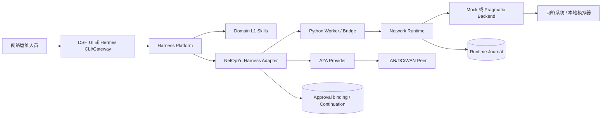
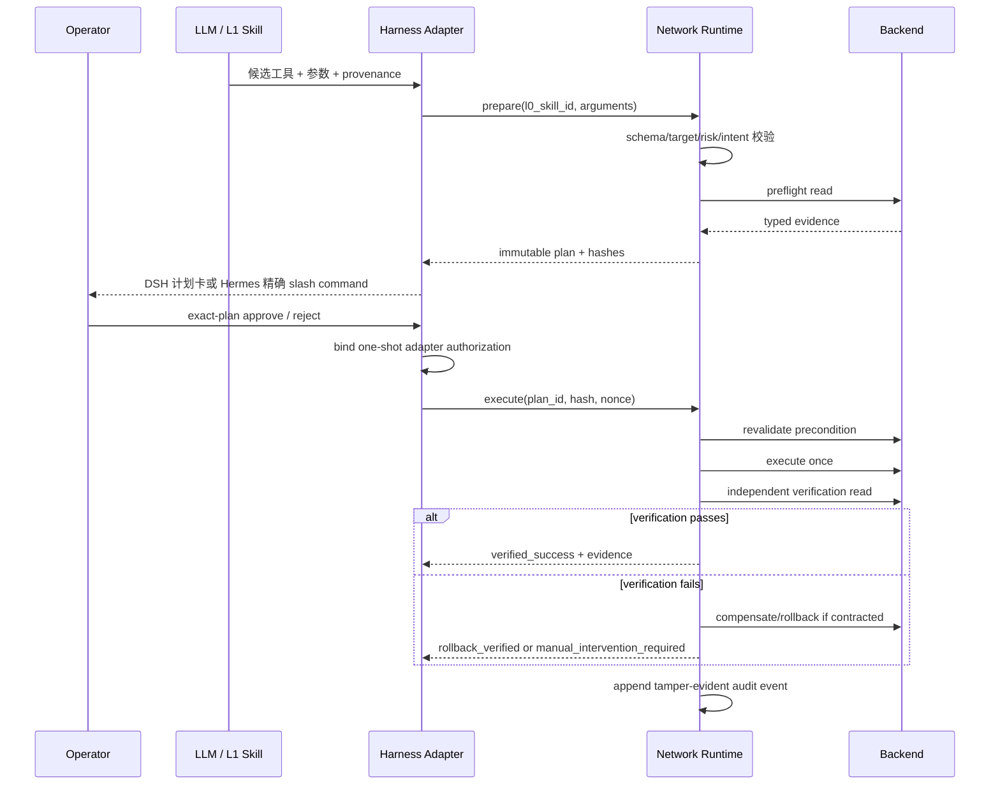

# NetOpYuAgent 高层设计 / High-Level Design

## 中文

### 1. 文档目的

本文描述 NetOpYuAgent 的系统边界、逻辑组件、部署拓扑、关键数据流与非功能设计。实现细节见 [LLD.md](LLD.md)，安全规范见 [SSD.md](SSD.md)，依赖规则见 [ARCHITECTURE.md](ARCHITECTURE.md)。

### 2. 设计目标

1. 使用成熟 Harness 替代历史自建通用 Agent Harness；DSH 为主平台，Hermes 为可选 Adapter，避免维护重复的会话、UI、模型与工具循环。
2. 在网络领域保留比普通 tool call 更严格的确定性效果层。
3. 将模型限制在候选意图、诊断和编排位置，不允许模型绕过 L0 合同直接执行写操作。
4. 对每个变更建立可重放检查但不可重放授权的完整审计证据。
5. 同时支持本地 mock 验证和显式配置的 pragmatic 真实适配器。
6. 支持 LAN、DC、WAN 的能力隔离以及受控 A2A 跨域协作。

### 3. 非目标

- 不重新实现 DSH/Hermes 的会话、模型循环、UI 或通用 Skill 引擎。
- P0.5 不宣称真实网络生产就绪或数学意义上的 100% 正确。
- 不让离线学习结果自动安装为可执行 Skill。
- 不允许 mock 数据静默回退到 pragmatic 路径。
- 不把 LLM 输出、写工具返回文本或“没有报错”视为执行成功。

### 4. 系统上下文

### 5. 逻辑组件

| 组件 | 主要职责 | 信任级别 |
|---|---|---|
| DSH / Hermes Platform | 模型会话、UI/CLI、工具生命周期与 Skill | 平台控制面 |
| NetOpYu Harness Adapters | 工具/Skill 投影、精确计划审批绑定、A2A | 领域控制面入口 |
| Domain L1 Skills | 诊断、澄清、任务分解和跨域编排 | 不可信候选生成器 |
| Shared Python Worker | 持久化 Unix Socket 调用、隔离异常、降低进程开销 | 受控执行入口 |
| Network Runtime | 编译 Intent、生成计划、状态机、执行、验证、补偿和审计 | 领域效果控制面 |
| Network L0 Skill Registry | 固定步骤、目标字段、工具合同、验证/回滚策略 | 版本化策略根 |
| Backend | mock profile，或 pragmatic device/MCP/OpenAPI 路由 | 数据/效果适配层 |
| Scoped Services | 作用域记忆、能力检索、大结果分页 | 只读辅助层 |
| A2A Provider | AgentCard 发现、选择、SSE 委派、continuation | 跨域边界 |
| SQLite Stores | 计划、事件、审批、grant、continuation、轨迹和大结果 | 持久化证据层 |

### 6. 写操作主流程

任何一步失败都不得“尽力继续”写入。准备失败、拒绝、过期、授权不匹配和状态漂移在写前关闭；写可能已发送后的异常进入验证、补偿或人工介入，不允许模型猜测结果。

### 7. 只读流程

只读工具仍进行 profile 隔离、参数编译和 backend 选择，但不需要破坏性开关或审批。大于阈值的输出写入 durable `ToolResultStore`，模型只收到 `[STORED:tool:id]` 引用，再通过分页工具读取。

### 8. 跨域 A2A 流程

1. Harness L1 Skill 形成自包含委派任务，不发送父会话历史。
2. A2A provider 拉取配置 peer 的 AgentCard 并按明确 target/capability 选择。
3. 委派链记录 agent id；超过最大深度或检测到循环时拒绝。
4. peer 通过 SSE 返回消息、失败或 `input-required`。
5. `input-required` 被保存为 continuation；DSH 使用新卡片，Hermes 使用包含远端 plan hash 的用户 slash command。
6. 本地 DC peer 仅绑定 loopback、仅允许 mock，用于协议与工作流验证，不代表生产多 Agent 部署。

### 9. 部署设计

#### 9.1 本地开发

- DSH Web：`127.0.0.1:3080`；
- Hermes：可选 CLI/Gateway 插件，通过 `scripts/netopyu-hermes` 管理；
- Python Worker：Unix Domain Socket；
- 本地 DC peer：`127.0.0.1:8765`；
- Ollama：默认 `127.0.0.1:11434`；
- mutable state：`~/Library/Application Support/NetOpYuAgent/dsh-runtime`。
- Hermes Adapter state：`~/Library/Application Support/NetOpYuAgent/hermes-runtime`；待审批 nonce 仅在 Hermes 插件进程内。

#### 9.2 生产目标形态（P1）

- 每个网络域独立 Harness/NetOpYu 部署与身份；
- 受管密钥系统和企业 SSO/RBAC；
- 外部受管数据库或具备备份/恢复的 SQLite volume；
- 明确 egress allowlist、mTLS 和服务身份；
- 审批系统、CMDB、变更窗口和工单系统集成；
- 指标、日志、trace、告警和人工处置 runbook。

### 10. 数据与持久化

| 数据 | 默认存储 | 内容约束 |
|---|---|---|
| Network plans/events | `network_runtime.sqlite` | 规范化参数、hash、状态、证据摘要 |
| HITL/grants | `hitl.sqlite` | 审批状态、token digest、绑定和 continuation |
| Hermes pending approval | 插件进程内存 | execution nonce 不进入模型或磁盘；重启失效 |
| Local DC state | `local_dc_peer.sqlite` | mock peer continuation 与模拟状态 |
| Tool results | `tool_results.sqlite` | 超大工具输出，TTL 清理 |
| Memory | profile/operator/session scoped SQLite | 仅显式 recall，不自动注入 |
| Trajectory | HITL store | 事件、工具名、参数键和结果；不保存 prompt/参数值 |

### 11. 非功能设计

- **安全**：fail closed、最小工具暴露、一次性授权、独立验证、密钥外置。
- **可靠性**：持久化 Worker、状态机、幂等领取、重启恢复、结果不确定终态。
- **可审计性**：每计划独立事件哈希链、固定合同 hash、完整状态迁移。
- **可扩展性**：profile、backend、L1 Skill、L0 Skill、verifier、compensator 均独立注册。
- **性能**：Worker 常驻；大结果外置；本地门禁 24 请求/8 并发的 p95 小于 1 秒。
- **隐私**：A2A 不继承会话；轨迹最小化；日志不得包含凭据和完整敏感参数。

### 11.1 Hermes Adapter 对 Network Runtime 的影响

| 项目 | 影响 |
|---|---|
| L0 Skill/ToolContract | 无；使用同一注册表和 contract hash |
| 参数、Intent、风险、preflight | 无；Hermes 只转发候选输入到同一 `prepare` |
| Plan schema/状态机 | 无；仍为 schema v4 和同一状态迁移 |
| verifier/compensator | 无；Adapter 不能替换或跳过 |
| journal/audit | 无；同一 SQLite schema 与事件哈希链 |
| 用户审批交互 | 有；DSH 为 plan card + Tool Guard，Hermes 为用户 slash command + 进程内 nonce binding |
| L1 workflow | Adapter 补齐；`netopyu_skill_view`/Skill hook 启动模板，read handler 记录 observation |
| 可用性 | Hermes 重启会安全丢弃 pending nonce，需要重新 prepare；DSH 具备更完整的 durable HITL 恢复、batch 和 deferred UX |
| 性能 | Runtime 算法不变，只增加一次 Harness→Worker IPC；当前单次功能时序不是平台性能基准 |

本地 A/B 门禁验证相同请求的稳定计划字段完全一致、两端均为 `verified_success`、audit 有效、Hermes nonce 未暴露且重复命令被拒绝。该结论证明“Adapter 没有削弱 Runtime 合同”，不等于 Hermes Gateway、模型或真实网络生产认证。

### 12. P0.5 验收结论

P0.5 在本地 mock 范围完成；新增 Hermes Adapter 后，DSH 与 Hermes 的等价写请求具有相同 L0/Intent/风险/验证/回滚合同，并都达到 `verified_success` 与有效 hash-chain audit。Hermes 模型不可见 nonce，错误 hash、重复命令和进程重启后的旧批准均 fail closed。仍未完成的 P1 工作包括真实网络适配器逐项资格认证、Hermes Gateway 审批人身份不可抵赖、企业审批、生产故障注入、HA/DR、长期负载、真实 rollback 演练和变更治理。

---

## English

### 1. Purpose

This document defines the system boundary, logical components, deployment topology, primary data flows, and non-functional design. See [LLD.md](LLD.md) for implementation details, [SSD.md](SSD.md) for security requirements, and [ARCHITECTURE.md](ARCHITECTURE.md) for dependency rules.

### 2. Goals

1. Replace the historical custom harness with mature platforms: DSH is primary and Hermes is an optional adapter.
2. Preserve a deterministic network effect layer that is stricter than ordinary tool calling.
3. Restrict the model to candidate intent, diagnosis, and orchestration; it cannot bypass L0 contracts.
4. Produce replay-checkable evidence without replayable authorization.
5. Support local mock validation and explicitly configured pragmatic adapters.
6. Isolate LAN, DC, and WAN capabilities while enabling controlled A2A collaboration.

### 3. Non-goals

- Reimplementing DSH/Hermes sessions, model loops, UI, or general Skill engines.
- Claiming production readiness or mathematical 100% correctness at P0.5.
- Automatically installing learned workflows as executable Skills.
- Silently falling back from pragmatic sources to mock data.
- Treating LLM prose, a write response, or the absence of an exception as success.

### 4. Logical components

| Component | Responsibility | Trust level |
|---|---|---|
| DSH / Hermes Platform | Sessions, models, UI/CLI, tools, and Skills | Platform control plane |
| NetOpYu Harness Adapters | Tool/Skill projection, exact-plan approval binding, A2A | Domain entry control plane |
| Domain L1 Skills | Diagnosis, clarification, decomposition, orchestration | Untrusted candidate producer |
| Shared Python Worker | Persistent Unix-socket invocation and fault isolation | Controlled execution entry |
| Network Runtime | Intent compilation, plans, state machine, execution, verification, compensation, audit | Domain effect control plane |
| Network L0 Registry | Fixed steps, target fields, tool/verifier/rollback contracts | Versioned policy root |
| Backend | Mock profiles or pragmatic device/MCP/OpenAPI routing | Data/effect adapter |
| Scoped Services | Memory, capability retrieval, large-result paging | Read-only auxiliary layer |
| A2A Provider | AgentCard discovery, peer selection, SSE delegation, continuations | Cross-domain boundary |
| SQLite Stores | Plans, events, approvals, grants, continuations, trajectories, results | Persistent evidence layer |
| Hermes pending binding | Process-local nonce and exact plan hash; discarded on restart | Adapter authorization edge |

### 5. Mutation flow

The model proposes a tool, arguments, and provenance. The Runtime validates schema and targets, compiles an immutable intent, reads preflight evidence, and returns a hashed plan. DSH presents an exact plan card; Hermes returns a user-only slash command containing the exact plan id/hash while keeping the nonce process-local. The Runtime revalidates state, sends the effect once, reads an independent postcondition, and either reaches `verified_success`, performs contractual compensation, or escalates to manual intervention. Every transition is appended to a tamper-evident journal.

Preparation, rejection, expiry, authorization mismatch, and state drift close before the write. Once a write may have been sent, uncertainty must enter verification, compensation, or manual intervention; model inference is not accepted.

### 6. Read-only and A2A flows

Read-only calls remain profile-scoped and parameter-compiled but require no mutation flag or approval. Oversized results are stored durably and exposed through bounded references.

A2A sends only a self-contained task and bounded provenance. AgentCard selection, hop limits, loop detection, timeout handling, and SSE parsing fail closed. Remote `input-required` requires a fresh DSH card or a Hermes user slash command bound to the remote plan hash. The bundled DC peer is loopback-only and mock-only.

### 7. Deployment

Local development runs DSH Web on `127.0.0.1:3080` or an optional Hermes CLI/Gateway plugin, the shared Python Worker on an owner-only Unix socket, the optional DC peer on `127.0.0.1:8765`, and Ollama on `127.0.0.1:11434`. Mutable state lives outside the repository by default; Hermes pending nonces are process-local and disappear safely on restart.

The P1 production target uses independent domain deployments, enterprise identity and approval, managed secrets, mTLS and egress allowlists, backed-up storage, CMDB/change-window integration, observability, and manual-response runbooks.

### 8. Non-functional design

- **Security:** fail closed, least exposure, one-shot authorization, independent verification, externalized secrets.
- **Reliability:** persistent Worker, explicit state machine, atomic claims, restart recovery, indeterminate outcomes.
- **Auditability:** per-plan event hash chain and versioned contract hashes.
- **Extensibility:** independent registries for profiles, backends, L1 Skills, L0 Skills, verifiers, and compensators.
- **Performance:** persistent transport and durable large-result paging; the local reliability gate requires p95 below one second for 24 requests at concurrency eight.
- **Privacy:** no inherited A2A history and minimized trajectory fields.

### 8.1 Hermes impact on Network Runtime

Hermes does not change the L0 registry, ToolContracts, compilation, intent/risk/preflight, schema-v4 plan state machine, verifier, compensator, journal, or audit. It changes only the human-interaction edge: DSH uses a plan card and Tool Guard, while Hermes uses a user slash command and a process-local hidden nonce binding. `netopyu_skill_view` and the Skill hook start reviewed workflows, and read handlers record prerequisite observations. Restart loses pending Hermes authorization safely; DSH still has richer durable HITL recovery, batch, and deferred UX. The local A/B gate proves equal stable plan fields, `verified_success`, valid audit, hidden nonces, and duplicate blocking. It is a contract test, not a Hermes Gateway, model-quality, real-network, or performance certification.

### 9. P0.5 acceptance

P0.5 is complete for local simulation. Equivalent DSH and Hermes requests retain the same L0, intent, risk, verifier, rollback, terminal-state, and audit invariants. Hermes hides the nonce from the model and blocks wrong hashes, duplicates, and approvals lost on restart. P1 still requires real-adapter qualification, non-repudiable Hermes gateway identity, enterprise approval, HA/DR, long-duration load, real rollback exercises, and formal change governance.
