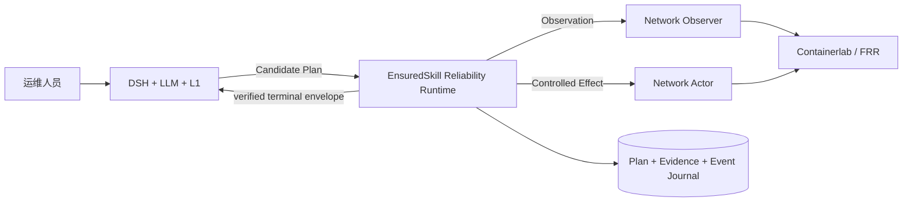
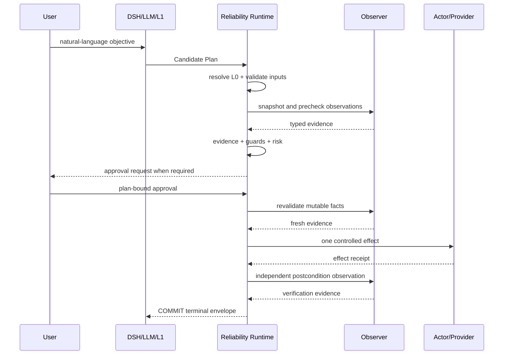

# EnsuredSkill 高层设计 / High-Level Design

## 中文

### 1. 目标

本阶段只回答一个问题：**概率性 Agent 如何在没有直接写权限的前提下，借助可执行合同、事实证据和近似事务安全地操作网络。**

目标：

- DSH + LLM + L1 产生诊断、追问和 Candidate Plan；
- Runtime 将候选绑定到受审 L0 Contract；
- 写前验证参数、Evidence、Guard、Risk 和审批；
- 写后通过独立 Observation 验证结果；
- 失败或不确定时对账、补偿、验证恢复或升级人工；
- 用真实 Harness 配对、故障注入和消融量化收益。

非目标：

- 生产级企业 IAM、审批系统、Provider 供应链或多团队治理；
- Hermes/A2A 产品化、HA/DR、WORM、生产 SLO；
- 更多非网络业务域；
- 宣称绝对安全、100% 生产成功率或形式化正确性。

### 2. 系统上下文



网络以 Containerlab/FRR 和本地 Provider 为当前实验锚点。MCP、API、CLI、NETCONF 只是 Infrastructure Adapter，不改变 Runtime 语义。

### 3. 逻辑组件

| 组件 | 输入 | 输出 | 权威边界 |
|---|---|---|---|
| DSH Harness | 用户自然语言、L1 Skill、只读观测 | Candidate Plan / clarification / refusal | 无 Effect 权限 |
| L1 Semantic Skill | 场景知识、诊断顺序、候选 Capability | 人可读工作流建议 | 不是可执行合同 |
| Promotion Compiler | L1 + 显式锚点 + Catalog | L0.5、L0 proposal、语义映射报告 | 只离线生成；不自动激活 |
| L0 Registry | 人工审查并激活的 compiled contract | 精确合同版本与摘要 | 执行语义权威 |
| Contract/Plan Compiler | Candidate + L0 + Provider contract | 不可变 PreparedPlan + Typed Graph | 不猜测缺失参数 |
| Graph Scheduler | 已审 Typed Graph + 节点结果 | commit / abort / escalate 图轨迹 | 分支门禁、Effect/Compensate one-shot；崩溃不重放写 |
| Evidence Manager | 独立 Observation | typed/fresh/scoped Evidence | 普通上下文和模型 confidence 不算 Evidence |
| Provenance Projector | Evidence + graph events | Evidence→Observation→Capability/Collector→Object DAG | 只证明记录的来源关系；标识符最小化 |
| Guard/Risk Engine | 合同、Evidence、影响范围、可逆性 | execute / ask_human / reject | 分数不能覆盖结构失败 |
| Transaction Manager | approved plan | commit / abort / escalate | Effect 只发送一次；不确定时先对账 |
| Verification Manager | post-effect Observation | postcondition verdict | 不信任写工具成功文本 |
| Compensation Manager | snapshot + compensation contract | recovery evidence | 补偿失败必须升级人工 |
| Journal | plan、状态、证据、摘要 | 可验证执行轨迹 | 不包含模型密钥或原始凭据 |

### 4. 正常执行流



### 5. 失败与不确定流

- 写前失败：`ABORT`，Effect 未发送；
- 写调用明确失败：按合同决定补偿或 `ESCALATE`；
- 写后断连/超时：进入 `RECONCILE`，先只读查询实际状态，不盲重试；
- 后置条件不满足：执行显式 `COMPENSATE`；
- 补偿后独立验证恢复：`ABORT`；
- 无补偿、补偿失败或恢复无法证明：`ESCALATE`。

### 6. Contract-Governed Skill

每个可写 L0 至少固定：

- operation/version；
- typed inputs 与 provenance；
- preconditions；
- Evidence Requirements；
- Guards；
- read/write resources；
- risk 与 approval policy；
- postconditions；
- idempotency、timeout 和可逆性；
- snapshot、compensation 和 recovery verification；
- contract digest 和 Typed Execution Graph。

L1→L0.5→L0 是 **authoring compilation**。它解决人可读 Skill 如何形成待审执行合同，但不等同于材料中未来的 Agent-to-Automation/Experience Compilation。后者需要多条真实成功轨迹、失败案例验证和独立 Promotion，当前不实施自动下沉。

### 7. 部署与运行边界

当前参考部署：

```text
macOS/local host
  DSH Web + local LLM
  owner-only Python Worker
  Reliability Runtime + SQLite journal

Linux/Docker host or VM
  Containerlab + FRR
  Network Observer / Actor adapters
```

单机 SQLite、进程内测试身份和本地审批只服务原型复现。它们不代表多实例一致性、企业不可抵赖身份或生产可用性。

### 8. 高层验收

原型至少覆盖六类网络事务：正常可逆变更、缺 Evidence、高风险、结果不确定、验证不一致、多步骤部分失败。每类场景必须保留 Contract、Plan、Evidence、状态迁移、Effect receipt、Verification 和 Compensation/Recovery 证据。

核心指标：

- Unsafe Execution Rate；
- False Commit Rate；
- Invalid Action Rate；
- Compensation Success Rate；
- Autonomous Coverage / Human Escalation Rate；
- Task Completion Rate；
- Runtime overhead、token 和 tool calls。

评测必须包含 DSH 原生 L1 Control 与 DSH + L0 auto Runtime Treatment，保持模型、Skill、工具、输入、审批、Provider 和故障条件一致。Treatment 中不可信转换只能安全停机，不能回退原生写入。

### 9. 冻结扩展

Hermes、A2A、企业 OIDC/PDP/Change Authority、Provider 签名供应链、Catalog 治理、Evidence dashboard、HA/DR/WORM/SLO 均从当前主图和完成判据移除。代码保留作未来实验；核心 Runtime 默认不加载企业身份、Provider release 或 L1 canary binding，DSH Adapter 也只在显式历史命令下延迟加载 A2A、轨迹学习和 L1 shadow。

---

## English

### 1. Goal and non-goals

This phase answers one question: how can a probabilistic Agent operate a network without direct write authority, using executable contracts, factual evidence, and transaction-like execution?

DSH, the LLM, and L1 produce diagnosis, clarification, and Candidate Plans. The Runtime binds a candidate to a reviewed L0 contract, validates inputs/evidence/guards/risk, revalidates before mutation, independently verifies afterward, and reconciles or compensates failures. Real Harness pairs, fault injection, and ablation quantify the result.

Enterprise IAM, provider supply chains, multi-team governance, Hermes/A2A productization, HA/DR, WORM, production SLOs, extra non-network domains, and absolute-safety claims are not current goals.

### 2. Components

The Reasoning Plane contains DSH, L1 semantic guidance, and proposal-only model output. The offline Promotion Compiler creates readable L0.5 and L0 proposals but cannot activate them. The L0 Registry owns reviewed execution semantics. The Runtime compiles immutable plans and typed graphs; a journal-backed graph scheduler gates each branch, while a cross-step provenance DAG links evidence to observations, capabilities/collectors, and network objects. The Runtime evaluates guards and risk, manages approval and transaction state, verifies postconditions, compensates failures, and journals terminal evidence. Infrastructure adapters expose observation and effect capabilities without owning Runtime truth.

### 3. End-to-end behavior

The normal path is resolve L0 → validate inputs → snapshot → precheck → evidence/guard/risk → optional approval → revalidate → controlled effect → independent verify → commit.

A pre-effect failure aborts without mutation. A post-send timeout enters reconciliation rather than blind retry. Verification failure invokes explicit compensation and recovery verification. Missing compensation, failed recovery, or unresolved state escalates to a human.

### 4. Skill and deployment boundary

Every writable L0 binds typed inputs and provenance, preconditions, evidence requirements, guards, resources, risk, approval, postconditions, idempotency, timeouts, reversibility, snapshot, compensation, recovery verification, and immutable digests.

L1-to-L0.5-to-L0 is authoring compilation, not automatic Experience Compilation. The reference deployment is local DSH/LLM/Worker/Runtime plus a Linux Containerlab/FRR provider. SQLite and local identity are reproducibility mechanisms, not production architecture.

### 5. Acceptance and frozen work

The prototype must exercise six network transaction classes and report unsafe execution, false commit, invalid action, compensation success, autonomous coverage, escalation, task completion, and overhead. Control and treatment use the same DSH, model, L1 Skill, inputs, provider, approvals, and faults. An unqualified treatment conversion stops safely; it does not regain native write authority.

Hermes/A2A, enterprise identity, signed provider supply chains, governance control planes, HA/DR/WORM/SLO work, and additional domains remain frozen optional experiments outside the core dependency graph. The DSH adapter lazily imports A2A, trajectory learning, and historical L1 shadow only for their explicit commands.
