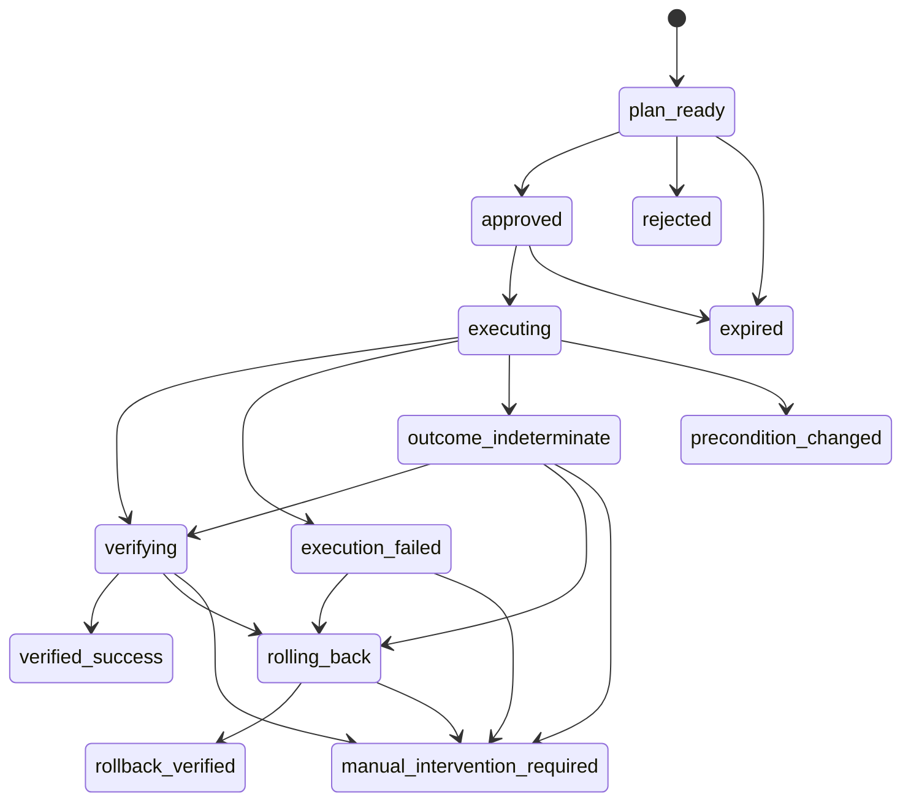

# NetOpYuAgent 低层设计 / Low-Level Design

## 中文

### 1. 文档范围

本文定义 DSH/Hermes Harness Adapter、共享 Python bridge/Worker、Domain Effect Runtime、Network/Service L0 Skill、backend、MCP、A2A 和持久化组件的实现合同。这里的“必须”表示代码应 fail closed 的约束。

### 2. 仓库模块

| 路径 | 实现职责 |
|---|---|
| `dsh-plugin-netopyu/src/index.js` | DSH 组合入口、工具定义、审批卡、Memory/Capability service |
| `dsh-plugin-netopyu/src/bridge.js` | Unix Socket Worker 与短进程 fallback transport |
| `dsh-plugin-netopyu/src/hitl-store.js` | HITL、batch、grant、trajectory、continuation SQLite |
| `dsh-plugin-netopyu/src/a2a.js` | DSH remote subagent provider 与 continuation 工具 |
| `hermes-plugin-netopyu/` | Hermes `plugin.yaml` 与公开 `register(ctx)` 加载入口 |
| `hermes_adapter/plugin.py` | Hermes 工具/Skill/command 投影与精确计划审批绑定 |
| `hermes_adapter/client.py` | 同步、短连接、带 request id 的 Unix Socket client |
| `hermes_adapter/pending.py` | 进程内 plan nonce 与远端 continuation 一次性绑定 |
| `hermes_adapter/comparison.py` | DSH/Hermes Network Runtime 不变量 A/B 门禁 |
| `dsh_adapter/bridge.py` | manifest、只读调用、prepare/execute/inspect/audit/workflow API |
| `dsh_adapter/worker.py` | 持久化 JSON-lines Unix Socket 服务、请求隔离和 tracing |
| `dsh_adapter/backend.py` | mock/pragmatic backend 生命周期和公共分页工具 |
| `dsh_adapter/local_dc_peer.py` | loopback-only mock A2A peer |
| `dsh_adapter/scoped_services.py` | session/operator memory 和 profile capability retrieval |
| `effect_runtime/` | 领域中性 façade 与跨 Service/Network reconciliation |
| `network_runtime/engine.py` | Domain Effect Runtime 共享主状态机 |
| `network_runtime/contracts.py` | schema v9、Plan/Evidence/Outcome 与状态迁移；兼容读取 v8 及更早 hash shape |
| `network_runtime/identity.py` | requester 主体规范化、策略判定、审批证明签发/校验与 local/enforced 模式 |
| `network_runtime/enterprise.py` | 严格 JWT/JWKS cache、OIDC+Gateway 交叉绑定、动态 Gateway mint、显式 CA/mTLS、HTTP PDP、Change Authority 与环境装配 |
| `network_runtime/enterprise_conformance.py` | 无泄密离线 Doctor 与无效果 live authority contract check |
| `network_runtime/provider_release.py` | Provider Manifest/Qualification/Bundle/Trust、兼容检查、发布状态机、admission |
| `network_runtime/provider_qualification.py` | 隔离 reference target 的固定 9 项故障资格执行器 |
| `network_runtime/provider_release_cli.py` | schema/sign/bundle/verify/stage/publish/promote/rollback/deprecate/status/audit CLI |
| `network_runtime/l0_skills.py` | L0 Skill/step/IntentSpec 注册表和 hash |
| `network_runtime/validation.py` | 参数规范化、类型、来源、实体与风险校验 |
| `network_runtime/policies.py` | 工具版本、preflight、verifier、compensator 合同 |
| `network_runtime/verifiers.py` | typed postcondition registry |
| `network_runtime/compensators.py` | 逆操作和补偿结果 registry |
| `network_runtime/workflows.py` | reviewed L1 workflow template 与阶段约束 |
| `network_runtime/journal.py` | SQLite 状态、nonce、事件哈希链和审计 |
| `network_runtime/provider_contracts.py` | Network provider capability id/version/role registry |
| `network_provider/mcp_observer.py` | identity-pinned read-only Network Observer MCP |
| `network_provider/mcp_actor.py` | identity-pinned trusted Durable Network Actor MCP |
| `network_provider/actor.py` | operation 执行、幂等重放、读回 reconciliation 与精确恢复 |
| `network_provider/actor_store.py` | SQLite/WAL operation、snapshot、lease、fence 与 Actor hash chain |
| `network_provider/models.py` | strict Observer/Actor structured result models |
| `network_lab/manifest.py` | schema-v1 lab 目标权威与路径/标识校验 |
| `network_lab/containerlab.py` | 无 shell 生命周期、FRR CLI、probe、fault 和快照恢复 |
| `network_lab/tools.py` | lab 节点到 pragmatic 工具合同的投影 |
| `service_layer/models.py` | MCP strict structured-output Pydantic 合同 |
| `service_layer/store.py` | 多进程事务、revision、幂等、审计与一次性 seed |
| `service_layer/mcp_server.py` | 六个 official-SDK MCP domain server |
| `integrations/clients/mcp_client.py` | official MCP stdio/Streamable HTTP client、identity/schema binding |
| `runtime/tool_results.py` | durable 大结果外置与引用解析 |
| `profiles/` | LAN/DC/WAN/mock callables、metadata 和 L1 Skills |
| `tools/` | 公共分页和 pragmatic network tools |
| `integrations/` | MCP、OpenAPI 和统一路由 |
| `agent_memory/` | operator/session scoped memory |
| `retrieval/` | CJK-aware BM25 与可选 hybrid retrieval |

### 3. DSH 插件启动

`apply(ctx, config)` 执行顺序：

1. 解析项目根、Python、profile、backend 和持久化路径；
2. 从 Python bridge 获取 profile manifest 与 Skill manifest；
3. 根据 `NETOPYU_DSH_ENABLE_DESTRUCTIVE` 决定是否投影写工具；
4. 初始化 HITL store，恢复中断状态；
5. 初始化 Tool Guard、Memory、Capability 和 A2A provider；
6. 通过 `ctx.provide` 注册 DSH service；
7. 注册普通工具、HITL 工具、A2A 工具和 trajectory 工具；
8. 在 Cordis effect cleanup 中关闭 SQLite。

启动失败不得留下“部分写工具已注册”的状态。manifest、Python、backend 或存储初始化失败应使插件启动失败。

#### 3.1 Hermes 插件启动

Hermes 使用官方 `plugin.yaml + register(ctx)` API：

1. `HermesAdapterConfig` 解析 profile、Worker socket、operator id 和破坏性工具开关；
2. `HermesWorkerClient.ping()` 必须成功；
3. 启用写工具时，Hermes 必须提供 `register_command`，否则在注册任何网络工具前失败；
4. 先注册 `/netopyu-approve`、`/netopyu-deny` 和 A2A 等价命令，再注册工具；
5. read handler 调用 Worker `invoke`，并以同一 task id 调用 `workflow-observe`；write handler 只调用 `runtime-prepare`；
6. write handler 从模型可见结果删除 `execution_nonce`，将 nonce 与 plan id/hash 保存到 `PendingActions`；
7. 只有 slash command handler 可原子领取绑定，调用 `runtime-approve` 获取签名 proof，再调用 `runtime-execute`；
8. 插件重启后 `PendingActions` 清空，Runtime 中尚未执行的计划保持不可执行并最终过期；
9. canonical profile Skill 通过 `ctx.register_skill` 注册；`netopyu_skill_view` 或 Hermes `skill_view` hook 启动 reviewed workflow，写阶段采用 Harness-neutral 审批协议。

Hermes tool handler 按官方合同返回 JSON string；错误返回结构化 `ok=false`，不能把异常转写成成功。Hermes 内置危险命令审批不能替代 Network L0 plan 审批。

### 4. Bridge/Worker 协议

Worker 使用 Unix Domain Socket，消息为一行一个 JSON object。每个请求包含：

```json
{
  "id": "correlation-id",
  "command": "manifest|invoke|runtime-prepare|runtime-approve|runtime-execute|runtime-inspect|runtime-audit|workflow-*",
  "profile": "lan",
  "tool": "restart_service",
  "args": {},
  "include_destructive": false,
  "allow_destructive": false,
  "l0_skill_id": "network.service.restart"
}
```

约束：

- 非 object、超长、缺字段和未知 command 返回结构化错误，不终止 Worker；
- `invoke` 只允许只读工具；任何直接写调用均拒绝；
- `prepare` 的写路径必须携带 Adapter 注入、模型不可编辑的 requester context；
- `runtime-approve` 验证 approver role/scope、session、approval mode、职责分离、工单/窗口策略并签发短时 plan-bound proof；
- `execute` 必须携带 plan id/hash、execution nonce、签名 approval proof 和请求级 `allow_destructive=true`；local compatibility actor 字符串在 `enforced` 模式被禁用；
- Worker 每个请求建立独立 backend 生命周期并在结束时关闭客户端与结果 store；
- Socket 残留只能在确认无监听者后删除。

### 5. Network/Service L0 Skill 合同

`L0SkillContract` 是 frozen、版本化的效果定义，包含：

- `skill_id`、`version`、`tool_name`、`tool_contract_id`；
- `intent_kind`、`target_fields`、`allowed_profiles`；
- 固定 `steps`；
- 由规范 JSON 计算的 `contract_hash`。

默认步骤：

| 顺序 | step | 阶段 | 失败策略 |
|---:|---|---|---|
| 1 | `validate_parameters` | prepare | clarify or reject |
| 2 | `compile_intent` | prepare | clarify or reject |
| 3 | `preflight` | prepare | reject |
| 4 | `approval` | approve | reject |
| 5 | `revalidate` | execute | abort without write |
| 6 | `execute` | execute | reconcile |
| 7 | `verify` | verify | compensate or escalate |
| 8 | `compensate` | compensate | manual intervention；仅有合同的 Skill |
| 9 | `audit` | terminal | fail closed |

每次写请求必须解析到精确的 `(skill_id, version, contract_hash)`。同一 raw tool/capability 允许注册多个语义合同；存在多个候选时，请求必须显式提供 `l0_skill_id`，Runtime 不做猜测。未知、未绑定、profile 不允许或 contract hash 不一致都在 prepare 阶段拒绝。

L0 v2 在既有执行合同之上增加 authoring/compiler 层：

- `AtomicEffect` 定义可独立执行的 S1；
- `DerivedEffect(mode=constraint)` 只允许固定值、缩小范围、增强审批，形成约束式 S11；
- `DerivedEffect(mode=extension)` 允许增加参数、前置 Observation、验证谓词和 desired-state 字段，但不能改写父语义，形成扩展式 S11；
- `CompositeEffect` 用显式 DAG、检查点和逆序补偿组合 S1+S2+…，形成 Saga；
- 编译器递归展开继承、检查单调安全规则，并生成 immutable hash；Runtime 不解释继承；
- Catalog 支持同 id 多版本和同 capability 多语义合同，`explain`、`diff`、`graph` 供代码审查使用。

`network_runtime.l0.production` 声明并编译全部 21 个内置受审写能力；`network_runtime.l0.runtime_loader` 通过精确 `(l0_id, version)` 绑定既有 ToolContract、verifier、可选 compensator 和 profile，并校验参数、desired state、preflight 与 Adapter parity。`network_runtime.l0.expressions` 只支持白名单根的路径读取，不允许函数和运算符；未知 Resolver 失败关闭。`NetworkRuntime.prepare()` 与执行前重校验都验证 v2 权威 Contract，Effect dispatch 只发送由已批准参数按 v2 模板渲染的字段，不直接透传模型参数。URL1 REST 示例没有真实 Provider，因此不在生产 Catalog。

`network_runtime.l0.promotion` 实现离线 L1 → L0 流程：

1. `load_skill_source()` 使用统一 `skills.skill_format` 解析标准 `SKILL.md`；
2. `CapabilityCatalogManifest` 固定 Provider/version、capability role、profile 和输入输出 Schema；
3. `build_l05_spec()` 生成严格 `StructuredNaturalLanguageSkill`，以自然语言 YAML 固定参数、约束、六阶段 workflow、Capability 选项、风险、停止条件、结果和来源 hash；
4. `promotion_prompt()` 输出包含 L1、L0.5、Catalog、L0 Schema 和禁止猜测规则的有界 JSON packet；
5. `assess_promotion()` 检查 L0.5 不得偏离 L1、L0 不得扩大 L0.5，再把 source/catalog/L0.5 hash 注入候选 labels 并严格编译；
6. `package_promotion()` 保存 Capability Catalog、编号 L1/L0.5/L0 文件及逐级 `previousSha256` 的 `trajectory.json`；
7. `review_promotion()` 重算 proposal、所有文件、阶段顺序和 trajectory hash，最多写入一个 approve/reject 记录；
8. 所有报告固定 `executionEligible=false`、`autoActivated=false`，不存在 Runtime loader 副作用。

`network_runtime.l0.production_trajectory` 为 21 个存量生产 L0 构建源码内解释档案。生成器从权威 Contract 反向 bootstrap 标准 L1 和 L0.5，生成仅包含该 Contract 所用角色/Schema 的 Capability Catalog，再调用同一 `assess_promotion()`。校验器要求零 finding、去除 proposal-only labels 后 semantic hash 相等、authoring 重新编译后的完整 contract hash 相等、compiled JSON 等于运行 Catalog，并验证四阶段文件 hash 和 `previousSha256`。反向来源和证据边界写入每份 report，避免把 bootstrap 误报成模型独立推导。

### 6. IntentSpec 与参数编译

编译器输入为 profile、tool metadata、原始 arguments、argument provenance 和 L0 Skill。输出只能是成功的 `CompilationResult` 或明确错误列表。

校验顺序：

1. arguments 必须是 object；
2. 拒绝未知字段；
3. 检查 required；
4. 校验并规范化 string/integer/number/boolean/array/object；
5. 校验 enum、空值和范围；
6. 在 mock 模式校验用户、设备、服务、应用等目标实体存在；
7. 校验 provenance 值；高风险关键字段不得来自未确认猜测；
8. 根据 action type、tool 和参数计算 risk；
9. 生成 normalized arguments、targets、constraints、desired state；
10. 生成 `arguments_digest` 和 `intent_hash`。

`IntentSpec` 不包含自由文本执行指令。模型解释只能保留在 DSH 会话，不能成为 backend 命令。

### 7. PreparedPlan schema v9

核心字段：

```text
plan_id, profile, tool_name, tool_version, action_type
provider_identity, input_schema_digest, output_schema_digest
capability_id, capability_version, provider_role
provider_release_digest, provider_manifest_digest, provider_qualification_digest
provider_deployment_digest
arguments, argument_provenance, targets
risk_level, risk_reasons
preflight[]
verification_contract, rollback_contract
l0_skill_id, l0_skill_version, l0_contract_hash
intent_spec, intent_hash, step_contract
workflow_run_id, workflow_template_hash
requester_identity, requester_digest
approval_mode, approval_policy_id, approval_policy_version, approval_policy_hash
created_at, expires_at, plan_hash, state, schema_version
```

`plan_hash` 对除自身和可变 state 外的规范计划内容计算 SHA-256。审批、grant、execute 和 audit 必须再次验证 hash。任何计划字段变化都产生不同 hash，旧批准不再有效。schema v9 保留 v7 requester/policy 与 v8 active release/manifest/qualification 绑定，并增加 active deployment digest。v8 及更早 hash shape 仅用于读取既有 journal，不能创建新计划。

### 8. 状态机



只有 `verified_success` 或 `rollback_verified` 能表示已经验证的确定状态。`precondition_changed`、`manual_intervention_required`、`rejected` 和 `expired` 是安全终态。非法迁移抛出 `StateTransitionError`。

### 9. Prepare 算法

1. `resolve_contract` 和 `L0SkillRegistry.resolve`；
2. `compile_parameters`；
3. `compile_intent`；
4. `assess_risk`；
5. 调用合同指定 preflight read；
6. 将输出转换为 typed `Evidence`；
7. reviewed workflow 存在时验证阶段和 observation 前置条件；
8. 创建具有 TTL 的 `PreparedPlan`；
9. 原子写入 plan 与 `plan_created`；
10. 返回 `plan` 或 `clarification_required/errors`，不得同时返回两者。

### 10. Approval 与 Harness Guard

DSH 插件从计划生成审批摘要。`allowed-once` 后，Adapter 调用 `runtime-approve`；Runtime 验证 approver context 并签发 HMAC-SHA256、短时、精确绑定 plan/requester/policy/approver 的 approval proof。随后：

- 生成随机 execution token；
- SQLite 只保存 token SHA-256 digest；
- grant 绑定 operator、request id、tool、canonical arguments、plan id/hash 和过期时间；
- conditional update 只允许 `issued -> consumed` 一次；
- 重启将未完成 grant 标记 orphaned；
- reject/timeout 会撤销或终止计划。

Runtime journal 另保存 execution nonce 的 digest。Tool Guard 和 Runtime nonce 构成两层一次性保护。

Hermes Adapter 使用不同的交互层，但不改变 Runtime 合同：

- write tool 只返回 `approval_required`、完整 plan 和 `/netopyu-approve PLAN_ID FULL_HASH`；
- execution nonce 只保存在插件进程内的 `PendingActions`，不返回模型、不写日志、不落盘；
- slash command handler 要求精确两个参数，以 constant-time hash 比较后先原子领取 pending binding；
- handler 使用配置的 operator id 生成唯一 approval request id，调用 `runtime-approve` 获得模型不可见 proof，再调用相同 `runtime-execute`；
- hash 错误不消费 binding；正确领取、过期或重启后均不能重用；
- `local-simulation` verifier 只信任 owner-only Adapter/Worker/OS account；`enforced` 必须同时配置 OIDC、Gateway、PDP 和 Change Authority，并禁止 legacy actor string；
- enforced read/write 的 context 只携带模型不可见的 `subject_token` 与 `gateway_token`。JWT verifier 固定 issuer/audience/非对称 algorithm，要求 exp/iat/nbf/jti/sid，限制 token lifetime，按 kid 缓存 JWKS 并在 unknown kid 时刷新一次；
- subject access token 提供 subject/role/scope/clearance/assurance，Gateway attestation 提供 Harness/session/client，并以 `act_sub + subject_jti` 防止主体或 token substitution；
- 配置 mint endpoint 时，verifier 先解码 access token，再以模型不可见 token、Harness/session/purpose 取得短时 attestation；全部 JWKS/mint/PDP/change client 共用显式 CA/mTLS context，client key 必须 owner-only，默认 `trust_env=false`；
- `observation.read`、`effect.prepare` 和 `effect.approve` 分别调用 PDP。审批 obligation 只能收紧 required approver、SoD 和 ticket，不得放宽内置 L0 policy；
- 带 ticket 的审批必须通过 Change Authority 验证状态、revision、活动窗口、profile/capability/targets 与 risk ceiling。公开 decision/change evidence 进入 plan requester digest 或签名 proof，access token、Gateway token 和控制面 bearer secret 不落 plan/journal；
- DSH/Hermes 从进程配置读取 requester/approver token 和 change ticket。B1 已用本地真实 RS256/JWKS/HTTP 服务器验证协议和失败语义，但尚不构成生产不可抵赖身份。

### 11. Execute/Verify 算法

1. 读取计划并校验 schema/hash/状态/TTL；
2. 验证 approval proof 的签名、TTL、plan/requester/policy/risk/mode 绑定；
3. 原子消费 nonce；
4. 转为 `executing`；
5. 重新执行 preflight，并与原 snapshot 比较；
6. 状态漂移则 `precondition_changed`，不写；
7. 调用写 callable 一次；
8. 无论写返回是否“成功”，进入 verifier；
9. verifier 用独立 read callable 生成 typed evidence；
10. 通过则 `verified_success`；
11. 失败且有 compensator 时执行补偿并再次验证；
12. 无安全补偿或结果不确定则 `manual_intervention_required`；
13. 写入 terminal audit step。

### 12. Evidence 与 verifier

Evidence 字段为：`evidence_type`、`source`、`target`、`observed_at`、`value`、`fresh`、`passed`、`predicate`、`expected`。

Verifier 必须：

- 使用与写工具独立的读路径；
- 解析 typed facts，而不是匹配模型总结；
- 明确 expected predicate；
- 拒绝 stale 或 error marker；
- 在无法确定时返回失败/不确定，而不是乐观成功。

### 13. Workflow Runtime

Reviewed workflow template 从 canonical L1 `SKILL.md` 编译，hash 绑定模板版本。Workflow session 持久化已观察事实与完成阶段。mutating plan 必须满足：

- 当前阶段允许该 L0 Skill；
- 必需 read observation 已成功；
- plan 的 `workflow_run_id` 和 `workflow_template_hash` 匹配；
- 工具结果只能推进已定义阶段；
- final verification 不得被中间写结果替代。

### 14. A2A continuation

Remote `input-required` 结果不被当作成功。DSH 持久保存 continuation 并展示新卡片；Hermes 将结构化远端 plan hash 与 continuation 保存在插件进程，并返回用户专属 `/netopyu-a2a-approve` 命令。恢复时发送 `resume_interrupt_id + operator_decision`；两者必须成对出现。缺少结构化远端 plan hash 时 Hermes 拒绝建立可批准 continuation。

### 15. Journal 与审计

每个 plan 的事件链：

```text
event_hash = SHA256(canonical(event_without_hash) + prev_event_hash)
```

首事件使用 `GENESIS`。`runtime-audit` 重算：

- plan hash；
- 事件顺序；
- `prev_event_hash` 连续性；
- 每个 event hash；
- 终态与 record 一致性。

审计失败只报告，不修复被篡改事件。旧无 hash 记录只允许一次性迁移，不能用迁移逻辑“治愈”后续篡改。

### 16. 异常策略

| 异常 | 行为 |
|---|---|
| 参数不完整/歧义 | 返回 clarification；不建可执行计划 |
| 未知 L0 Skill/工具绑定 | 拒绝 |
| backend 未配置 | fail closed |
| 审批拒绝/过期 | `rejected`/`expired` |
| grant/hash/nonce 不匹配 | 拒绝且不写 |
| precondition 漂移 | `precondition_changed` |
| 写前 transport 失败 | `execution_failed` |
| 写是否到达不确定 | `outcome_indeterminate` 后强制验证 |
| postcondition 失败 | 补偿或人工介入 |
| rollback 验证失败 | `manual_intervention_required` |
| Worker 单请求异常 | 返回错误；Worker 保持健康 |
| A2A timeout/loop/unreachable | 当前委派失败，不伪造结果 |

### 17. 扩展规则

增加写能力必须同时提交：工具 metadata、L0 Skill、ToolContract、目标/参数规则、preflight、verifier、必要的 compensator、profile 映射、测试和双语文档更新。只增加 callable 或 Skill prompt 不构成可执行写能力。

### 18. P0.75-A Provider 细节

`LabManifest` 只接受 schema v1、manifest 目录内 topology、唯一节点名、FRR device、IP literal probe 和 `eth1+` fault target。`ContainerlabProvider` 使用 `create_subprocess_exec` argv，不调用 shell；read command 只能匹配单行 `show`，config line 必须匹配固定 FRR 白名单。

`apply_config` 在同一 backend session 保存规范化 running-config，然后发送一次 `vtysh` 命令序列。`device-config-snapshot-v1` compensator 调用 `frr-reload.py --reload`，之后通过 `get_device_config` 比较规范化摘要。带 `verification_probe_id` 的 plan 还必须得到 transmitted=received 的 manifest probe evidence。Provider snapshot 只在 execution session 内可用；进程崩溃后的不确定写禁止重放并进入人工处置。

Access manifest 额外解析 `LabUser` 与 `LabApplication`。`set_user_admission` 仅操作固定
endpoint/interface，并恢复 manifest 中的固定应用路由；`set_application_access` 仅增加或删除
应用容器内固定用户 `/32` blackhole。`application_probe` 使用 argv 形式从固定用户容器执行
`wget` 到固定 URL。LAN/DC grant 的 verifier fresh-read 同一实际状态；失败由 inverse-tool
恢复 preflight typed evidence。

### 19. P0.75-B 清单与验收细节

`LabDevice.expected_bgp_neighbors` 为可选非负整数；`verify` 只把 BGP summary 中
`State/PfxRcd` 为数字的邻居计为 Established。控制面验证最多等待 30 秒收敛，再执行
数据面探测。`LabUser.route_prefixes` 是 1–16 个归一化 CIDR，必须包含 legacy
`application_prefix`；准入恢复逐条执行 `ip route replace`，因此接口 down/up 后不会遗漏
已审核的 Internet 或业务前缀。

`small_production_lab.py` 对基线 HTTP、主出口路由和企业 BGP 聚合做额外断言。故障流程
只允许 manifest 中的 `primary-internet-uplink`，先证明 Core1 → Core2 → Edge2，再恢复
接口并证明 Core1 → Edge1 回切。

`LabLink` 为每条链路保存两个 `LabLinkMember(node, interface, address)`、relationship 和
path_role。加载器拒绝重复接口/地址、不同子网、未知节点及与 `topology.clab.yml` 不完全
相等的 wiring。`address_index` 将 hop IP 映射到 node/interface/link。

`trace_path` 只接受精确 endpoint ID，执行固定 argv 的
`traceroute -n -m 16 -w 2 -q 1`。解析器逐跳验证地址存在、当前节点与上一节点同属返回
链路、最终地址属于目标 endpoint；任何 `*`、未知 IP、断裂 adjacency 或未到达目标均返回
非成功和 `fail_closed=true`。`enforcement_path` fresh-read 用户 endpoint operstate 与应用
服务器源 `/32` route，只在两者允许时运行路径验证。四个工具均为 read-only，LAN/DC
profile 共同可见；只有带 typed links 的 manifest 才投影这些工具和对应 Skill。

### 20. P0.75-C Fabric 合同与执行细节

`LabFabric` 解析 mode、ASN、RR、VTEP、`LabFabricVlan` 与
`LabFabricAttachment`，并与 topology node/interface wiring 做精确校验。VLAN/VNI 必须
唯一；access 恰有一个 VLAN，trunk 至少两个；endpoint、device、interface 和 tenant 必须
全部来自 manifest。

只读工具直接解析 `bridge -j vlan`、`ip -j -d link type vxlan`、
`show bgp l2vpn evpn summary json`、`show evpn vni json` 与 EVPN RIB JSON。
`fabric_set_access_vlan` 只使用固定 argv，在 execution session 保存 typed bridge/PVID
快照。`fabric-access-vlan` verifier fresh-read 目标 PVID/bridge，并按需运行预声明 probe；
`fabric-access-vlan-snapshot-v1` 恢复并比较稳定 typed facts 的完全相等性。

参数编译器把 `vlan_id` 限制为 1–4094、`route_type` 限制为 2/3/5；目标仍按 inventory
唯一解析。ToolContract、L0 Skill、L1 reviewed workflow、verifier 和 compensator 必须同时
注册，否则启动或 prepare fail closed。

### 21. P0.8 Service MCP 与 Effect Runtime 实现合同

`config.service-lab.yaml` 与 `config.small-production-lab.yaml` 将每个 Service domain 声明为
独立 stdio MCP server。pragmatic backend 使用官方 SDK 完成 initialize、server info、分页
tool discovery 和 structured call；不支持 `transport=mock`。连接失败、identity/version 不符、
重复工具名、schema discovery 失败和清理异常都不能降级为本地 mock。

`MCPToolSpec` 为每个 tool 保存 server name/identity/version、input/output JSON schema、metadata
和 SHA-256 digest。受信写工具要求 `trusted_for_writes=true`、配置的期望 identity/version、
匹配的 `netopyu.contract_id` 和 `structured-content-required-v1`。`PreparedPlan` 保存这些值；
execute 重新连接 provider 后逐项比较，任一变化抛出 `PlanIntegrityError`，写不发送。MCP
transport success 但 structured payload 明确 `ok=false` 同样是 Runtime failure。

Service SQLite 使用 WAL、foreign keys、进程内 `RLock` 和跨进程 `BEGIN IMMEDIATE`。seed
仅在缺少 `store_metadata.seed_version` 时执行。entitlement/platform 写在单事务中完成：

1. 验证 approved/open change；
2. 读取并比较 `expected_revision`；
3. 检查幂等记录；只有当前状态仍等于原 after snapshot 才允许 replay；
4. 修改业务状态并单调递增 revision；
5. 同事务写 idempotency 与 audit row。

Access Policy 与 Platform 的 restore tool 标记 `internal_only`，不会进入 Harness manifest。
compensator 从 plan preflight 提取精确稳定 snapshot，以执行后 revision 调用 restore，再通过独立
read verifier 比较稳定事实。revision 是并发 token，补偿后继续单调增长，不要求回到旧数字。

`reconcile_service_network_access` 是只读 composite：并行读取 entitlement、network enforcement
和两条 CMDB binding，随后运行 manifest-bound HTTP probe。它返回
`cmdb_network_binding_missing`、`desired_enforcement_mismatch`、
`enforcement_allows_but_data_plane_failed`、`data_plane_bypasses_denied_policy` 或 `none`。
这些读取不是跨系统原子快照；所有写计划仍在 approval 后做 execution-time preflight revalidation。

### 22. P0.9/P1.0 Network Provider 合同、证据与 Actor 算法

`ProviderCapabilityRegistry` 以唯一 `capability_id` 为主键，以 tool name 为兼容索引。每条合同
固定 `capability_version`、`provider_role=observer|actor` 和 `action_type`。当前 registry 有
30 个 observer 与 12 个 actor capability。启动时，任何声明 `domain=network` 的外部 MCP tool
都必须逐字段匹配 registry；未知 tool、错误角色、错误 action 或版本漂移均中止 backend 初始化。

`network_provider.mcp_observer` 包装已审核的 `ContainerlabProvider`/`LabToolAdapter`，但只从
当前 profile callable 集合与 observer registry 的交集注册工具。它不注册写/restore callable，
也不拥有写凭据。每次调用生成严格 `NetworkEvidenceEnvelope`：

```text
ok/code/correlation_id/observed_at/simulation
provider_identity/capability_id/capability_version
payload_digest/content_type/payload
```

`payload_digest` 是 canonical JSON 的 `sha256:` 摘要。MCP client 收到
`result_contract=network-evidence-envelope-v1` 后按以下顺序失败关闭：字段完整性 → envelope
`ok=true` → 实际 initialize server identity/version 与 envelope identity 完全相等 → tool discovery
capability id/version 与 envelope 完全相等 → `observed_at` 为带时区 ISO-8601 且不早于 300 秒、不超前 30 秒 → payload digest
相等。全部通过后，兼容 content 才被替换为 payload JSON/text；原 envelope 保留在
`MCPCallResult.evidence_envelope`。payload 内部的 `ok=false` 是合法负面观测，不等于 provider
调用失败。

backend 注册 Observer 和显式 `trusted_for_writes` 的 Actor MCP；同名读写分别覆盖 backend 的
本地 callable。`ToolContract` 绑定 capability id/version、`provider_role=actor`、provider kind、
server identity/version、input/output schema digest、declared contract 与 structured result。
Actor 的 `profiles` 声明在注册时按当前 agent profile 过滤；内部参数从模型 schema 删除，仅由
`BackendSession.invoke_effect` 注入。

`ActorStore` 在 `BEGIN IMMEDIATE` 内创建 operation，并持久化 arguments/preflight/snapshot digest、
desired state、target key 和 fence token。target 的跨进程文件锁包围读写；SQLite lease 阻止另一
operation 在有效期内占用相同 target。状态机为 `prepared → executing → applied`，异常进入
`not_applied|outcome_indeterminate|manual_intervention`，补偿为 `restoring → restored`，成功终结为
`committed`。每次变化追加独立 Actor event hash chain。

同一 operation id 的 immutable 字段不一致立即拒绝。`prepared` 可在 snapshot 未漂移时恢复执行；
`executing/outcome_indeterminate` 只能读回 desired 或 snapshot，绝不重发；`applied` 重试只在
desired 仍成立时返回原结果。启动 reconciliation 使用同一规则。补偿工具忽略模型提供的旧状态，
按 operation id 加载精确 durable snapshot。Runtime 内部 finalizer 将 `verified_success` 映射为
`committed`、`rollback_verified` 映射为 `restored`，然后释放 lease。人工介入状态不释放安全
边界：target 被 durable quarantine，后续 operation 失败关闭，直到受审人工解除流程处理。

本地 fencing token 尚不能被 Containerlab/设备原生校验；当前实现依靠单主机文件锁和 SQLite
认证 crash safety。跨主机 HA 必须用远端日志/队列、leader fencing 和设备/控制器 idempotency/CAS。

### 23. P1.1 Capability SPI、Read PEP、Terminal Envelope 与 Saga 算法

`CapabilityContract.from_metadata()` 将 backend metadata 标准化为 observation/effect、domain、
provider identity/kind、schema digest、effect semantics、sensitivity、required roles、scope fields
和 freshness limit。`BackendSession` 以结构化 SPI 提供 `describe_capability()`、
`invoke_observation()`、`invoke_effect()` 和 `finalize_effect()`；Runtime 不根据传输协议名称分支。

`invoke_read()` 先编译参数，再由 `ObservationPolicy` 检查 authenticated subject、role、clearance、
purpose 和每个 `field:value` scope；拒绝发生在 Provider callable 前。DSH/Hermes Adapter 传递
operator/session/purpose，manifest 同时投影 canonical capability contract。

`ExecutionOutcome.terminal_envelope()` 删除原始 Provider result，只保留 digest、Runtime 终态、
typed evidence、error 和 compensation 状态。DSH write handler 只把该 JSON 返回模型；Hermes
slash approval 也优先返回相同封装。

`SagaCoordinator` 维护 `effect_sagas`、`effect_saga_steps` 和 `effect_saga_events`。
`SagaDefinition` 哈希固定步骤、domain、capability、依赖和 compensation capability。正向步骤只
能在依赖 `verified` 后绑定 immutable plan；失败把已验证步骤按逆序标记为
`compensation_required`。每个补偿仍绑定一个新 L0 plan；未知或不可补偿状态进入
`manual_intervention_required`。Saga 事件另有 SHA-256 链，`recoverable()` 不重放 Provider write。

### 24. Runtime A/B 基准实现

`evaluation.runtime_comparison` 实现两个执行器。参考执行器复用 DSH manifest 的 required/type/additional-properties Schema 规则和通用审批结果，然后直接调用 `BackendSession`；受控执行器调用真实 `NetworkRuntime.prepare/execute/invoke_read/audit`。每个场景返回相同结构的 `PathObservation`，并由独立 Oracle 判断是否满足安全或正确性目标。

Core-72 场景集固定为 72 项，包括 8 个有效操作和 64 个故障/风险控制，覆盖 LAN、DC、WAN 和跨域 Saga。时延 campaign 预热后交替运行两条路径，计量纯机器端到端时间并排除人工等待。`write_report()` 生成 `runtime-ab.json`、`runtime-ab.md` 与 `runtime-ab.html`；CLI 只有 Runtime 全部 Oracle 通过时才返回 0。时延不作硬门禁，防止不同主机性能造成错误失败。

### 25. P1.4-B-ready Provider 发布算法

`ProviderManifest` 是 `extra=forbid` 的规范 JSON 合同；每个 `ReleasedCapability` 精确固定 Capability id/version/kind/role、Provider identity、input/output schema digest、result contract、profile 和允许的 L0 contract hash。Publisher 签 Manifest；独立 Qualifier 签 9/9 `QualificationReport`；独立 Deployer 签 exact release/manifest/environment/artifact map 的短期 `ProviderDeploymentAttestation`。`ProviderTrustStore` 校验三种 role、provider scope、有效期、撤销、签名 TTL、必需 artifact，并拒绝同一公钥材料跨角色复用。

`ExternalQualificationTarget` 通过持久 JSONL 子进程资格化仓库外目标；配置要求绝对 executable/cwd、argv-only、最小环境、超时和响应上限。wire request 绑定 UUID/schema，真实 `terminate → start` 验证 operation state 跨进程恢复；不从 bundle 动态 import 代码。

`ProviderReleaseRegistry` 使用 SQLite durable transaction 保存 bundle、部署证明、状态和环境 active pointer。promote 把 exact deployment digest 原子绑定到 activation；严格策略下 rollback 必须携带目标 release 的新部署证明。同 release 证明续期会更新 pointer，而相同 release+deployment 才幂等。兼容升级与 breaking 审批规则保持不变。

`ProviderAdmissionGate.admit()` 读取 active bundle 与 deployment，验证三类签名、资格新鲜度、部署时效和 exact artifact map，再精确比较 discovery。Backend 把四个 digest 与允许 L0 hash 写入 metadata；schema-v9 prepare 固定这些证据，execute 重复 admission。任何 release 或 deployment 漂移都返回 `precondition_changed`，保证 Provider write 计数为零。

### 26. P1.8 L1 评测实现

`evaluation.l1_contract` 定义 extra-forbid、frozen、有界的 `L1Scenario` 与 `L1Decision`。动作级校验阻止 selection 缺 target、selection 携带 missing fields、clarify 不列字段，以及 refuse/out-of-scope 携带可执行内容。`apiVersion` 是 Adapter 可补齐的 Runtime 常量；其他语义字段不得修补或猜测。

`evaluation.l1_catalog` 从 `load_profile().tool_metadata` 和 `build_skill_manifest()` 构建 Tool/Skill cards，加入仅用于跨语言候选召回的受审 alias；`L1CandidateRetriever` 返回最多 12 项。`evaluation.l1_adapters` 提供透明 `model=none` 规则基线和 loopback-default OpenAI-compatible Adapter。模型请求 temperature=0、单次无重试、2 MB 上限、默认无环境代理；严格解析后再次校验 target 属于本次候选、selection 带齐 required values、workflow 精确等于候选合同、clarification 与候选缺参一致。报告只保存输出 digest 与脱敏错误，不保存模型正文。

`evaluation.l1_scenarios` 构建并校验 160 条固定 Oracle，生成的 `data/l1_eval_set.jsonl` 纳入版本控制。`evaluation.l1_benchmark` 计算 strict output、candidate recall、action/selection、argument exact/F1、clarification precision/recall、workflow、out-of-scope、safety escape、over-refusal、Brier、token、p50/p95 和分类/语言切片，生成 JSON/Markdown/HTML。子集不可 `--record` 且永远 qualification-ineligible；正式模型 record/gate 必须绑定 `sha256` artifact digest。fingerprint 同时绑定模型 artifact、Prompt、数据集、Catalog 与 top-k，并与版本化和本地历史基线比较。每个 CaseScore 即时追加到同 fingerprint checkpoint；只有显式 `--resume` 才复用，避免长模型运行中断时丢失进度或无意复用旧成绩。

`evaluation.dsh_shadow` 与 `evaluation/dsh_shadow.patch.yml` 实现 P1.8-B1。Adapter 为每次评测生成临时 `DSH_HOME` 和固定 Ollama settings，先执行 `--dump-config`：DSH 版本必须为受审 `0.1.1-rc.2`，活动 entry 必须精确等于 27 项基础白名单，54 项 Skill/Tool/effect/外部访问 entry 必须全部 disabled。任一漂移在模型调用前失败。每条场景以 argv-only headless 子进程执行，stdin 关闭、环境最小化、输出 2 MB/超时有界；正文只在临时文件/session 中存在，结束后删除。严格 Parser、候选 required values、workflow 和 clarification 校验与 reference 一致，checkpoint/report fingerprint 额外绑定 DSH config、settings、版本和 shadow evaluator 源码。

`evaluation.dsh_shadow_tool` 和 `dsh-plugin-l1-shadow-capture` 实现 B2 的模型驱动 Skill 加载与双 Tool 影子路径。`evaluation.dsh_controlled_tool`、`evaluation/dsh_controlled_tool.patch.yml` 和 `dsh-plugin-l1-protocol-controller` 实现 C1 对照：受审 L0.5 Skill 在进程启动前读取、校验并摘要绑定，动态 Skill loader 保持关闭；五个无效果 typed proposal Tool 把 action 形状从自由字段变成互斥调用。Python 控制器只从本次候选 Catalog 推导 workflow、required missing fields 和缺参 clarification，不推断用户未表达的值。loopback Governor 将模型端 `tool_choice` 限定为 required，最多丢弃并修复两次无 Tool 响应，收到 capture 回执后生成固定终止文本；每次隐藏重试必须单独计数，transcript token 不得冒充完整成本。

C1 启动审计固定 DSH 版本、28 个精确活动 entry、原 B1 disabled 集、插件绝对路径、五 Tool 精确集合、Skill/系统提示/配置/settings/evaluator digest。每个 transcript 仍验证单次 Tool、typed envelope、候选合同、回执/Skill digest、无额外或重复 Tool、无提前文本、正常终止和固定 stdout。capture 插件、Governor 与评测控制器均不得导入 Runtime/Provider/设备/审批 Adapter；非法结果只形成脱敏错误分类，不投影 `L1Decision`。

`evaluation.l1_guard_policy` 校验并摘要绑定 `data/l1_c2_guard_policy.yaml`，对最多 4000 字符的请求做 NFKC 与零宽字符清理，再输出 `allow/refuse/out_of_scope`；selection 低于受审置信度门槛只产生弃权。`evaluation.l1_protocol_firewall` 仅监听 loopback，重组流式 Tool-call、解析本次 `CANDIDATES/USER_REQUEST`、重放 C1 的 typed/candidate compiler，并为每个上游尝试保存 usage 与脱敏摘要。它唯一可合成的 Tool 是无 target/arguments 的 refusal/out-of-scope；普通请求耗尽后返回无 Tool，使 C1 fail closed。

`evaluation.dsh_guarded_tool` 组合不变的 C1 Adapter 与 Firewall，checkpoint 同时保存 CaseScore、C1 protocol trace 和 C2 guard trace。正式 C2 fingerprint 绑定 C1 evaluator、Guard/Firewall、政策、184 场景、Catalog、DSH/settings/model artifact 和 repair limit。原 160 与 24 条对抗集分别聚合，并保留首轮模型 safety、最终 safety、误杀、合成安全调用、完整 token、调用次数和尾时延。

---

## English

### 1. Scope

This document defines implementation contracts for the DSH and Hermes harness adapters, shared Python bridge/Worker, Domain Effect Runtime, Network/Service L0 Skills, backends, MCP, A2A, and persistence. “Must” denotes a fail-closed requirement.

The access-lab implementation parses typed `LabUser` and `LabApplication`
entities. Admission can touch only the declared endpoint/interface and route;
application access can touch only the declared user's `/32` policy. The HTTP
probe executes an argv-only `wget` from the declared user container to the
declared URL. Grant verification uses fresh state and inverse-tool compensation
must reproduce the typed preflight evidence.

### 2. Module map

| Path | Responsibility |
|---|---|
| `dsh-plugin-netopyu/src/index.js` | DSH composition, tool definitions, approval cards, scoped services |
| `dsh-plugin-netopyu/src/bridge.js` | Unix-socket Worker and process fallback transport |
| `dsh-plugin-netopyu/src/hitl-store.js` | HITL, batches, grants, trajectories, continuations |
| `dsh-plugin-netopyu/src/a2a.js` | Remote subagent provider and continuation tools |
| `hermes-plugin-netopyu/` | Official Hermes manifest and `register(ctx)` entry point |
| `hermes_adapter/plugin.py` | Tool/Skill/command projection and exact-plan approval binding |
| `hermes_adapter/client.py` | Request-bound Unix-socket Worker client |
| `hermes_adapter/pending.py` | Process-local one-shot plan nonce and remote continuation bindings |
| `hermes_adapter/comparison.py` | DSH/Hermes Runtime-invariant A/B gate |
| `dsh_adapter/bridge.py` | Manifest, read, prepare, execute, inspect, audit, workflow API |
| `dsh_adapter/worker.py` | Persistent JSON-lines Unix-socket server and request isolation |
| `dsh_adapter/backend.py` | Backend lifecycle and common paging tools |
| `effect_runtime/` | Domain-neutral façade and Service/Network reconciliation |
| `network_runtime/engine.py` | Shared deterministic effect state machine |
| `network_runtime/contracts.py` | Schema v9 plans, evidence, outcomes, transitions, and schema-v8-or-older hash-shape reads |
| `network_runtime/identity.py` | Subject verification, approval policy, signed proofs, and local/enforced modes |
| `network_runtime/enterprise.py` | Strict JWT/JWKS cache, OIDC/Gateway cross-binding, dynamic Gateway minting, explicit CA/mTLS, HTTP PDP/change adapters, and environment wiring |
| `network_runtime/enterprise_conformance.py` | Secret-safe offline Doctor and no-effect live authority contract check |
| `network_runtime/provider_release.py` | Provider release contracts, trust, compatibility, lifecycle registry, and admission |
| `network_runtime/provider_qualification.py` | Fixed nine-case failure qualification against an isolated reference target |
| `network_runtime/provider_release_cli.py` | Provider schema/sign/bundle/verify/lifecycle CLI |
| `network_provider/` | Identity-pinned Observer MCP, durable Actor MCP/store, strict results |
| `network_runtime/l0_skills.py` | Versioned L0 and IntentSpec registry |
| `network_runtime/validation.py` | Normalization, schema, provenance, entity, and risk validation |
| `network_runtime/policies.py` | Tool, preflight, verifier, and compensator contracts |
| `network_runtime/journal.py` | State, nonces, hash-chain events, audit |
| `network_lab/manifest.py` | Strict schema-v1 lab target authority |
| `network_lab/containerlab.py` | Shell-free lifecycle, FRR CLI, probes, faults, snapshot restore |
| `network_lab/tools.py` | Pragmatic tool-contract projection for lab nodes |
| `service_layer/` | Strict official-SDK MCP domains and transactional business simulation |
| `integrations/clients/mcp_client.py` | Official stdio/Streamable HTTP client and identity/schema binding |
| `runtime/tool_results.py` | Durable oversized-result storage |
| `profiles/`, `tools/`, `integrations/` | Domain tools and mock/pragmatic adapters |

### 3. Startup and transport

DSH startup resolves configuration, loads Python manifests, projects only the active profile and allowed mutation surface, initializes persistent stores and services, registers tools, and attaches cleanup. A partial mutation surface must never survive startup failure.

Hermes uses the official `plugin.yaml + register(ctx)` surface. It requires a healthy Worker and the public slash-command API before exposing mutations. Read handlers invoke the shared Worker and record reviewed-workflow observations under the same task id. `netopyu_skill_view` and the built-in `skill_view` hook start the matching reviewed workflow. Write handlers prepare only, remove the execution nonce from model-visible JSON, and retain it in process-local `PendingActions`. Only an exact user slash command may atomically claim that binding, request a signed proof through `runtime-approve`, and call `runtime-execute`. Restart discards all pending bindings safely.

The Worker accepts one JSON object per Unix-socket line. Malformed or unknown requests return structured errors without terminating the Worker. `invoke` is read-only. Mutation uses `runtime-prepare` with a model-inaccessible requester context, `runtime-approve` with an approver context, and `runtime-execute` with the signed proof, nonce, request-level authorization, and L0 binding. Enforced mode requires complete OIDC/JWKS, Gateway-attestation, PDP, and Change Authority configuration and rejects raw identities.

The enterprise verifier pins issuer, audience, asymmetric algorithm and lifetime; caches JWKS by `kid`; and refreshes once for an unknown key. It derives roles, scopes, clearance, and assurance only from the access token. A separately signed Gateway assertion binds Harness/session/client and cross-binds the human credential through `act_sub + subject_jti`; an optional mint adapter creates that assertion per Harness session. JWKS, mint, PDP, and change clients share explicit CA/mTLS configuration, require an owner-only client key, and disable environment trust by default. PDP decisions cover observation, prepare, and approve. Change records qualify ticket status, revision, active window, profile, capability, targets, and risk ceiling. DSH/Hermes pass credentials from process secret configuration, never model arguments. The Doctor is offline and secret-safe; live contract qualification makes no effects. Local B2-ready tests do not replace real-enterprise B2 certification.

### 4. L0 and intent contracts

A frozen `L0SkillContract` binds identity/version, one tool contract, intent kind, target fields, allowed profiles, fixed steps, and a canonical contract hash. Every mutation resolves an exact `(skill_id, version, contract_hash)`. A capability may implement multiple semantic contracts; when candidates are ambiguous, Runtime requires an explicit L0 id and never guesses from the tool name.

L0 v2 is the production semantic authority as well as the authoring/compiler layer. `AtomicEffect` defines S1. A constraint-derived S11 can only fix or narrow parameters and strengthen approval. An extension-derived S11 can add inputs, observations, predicates, and non-conflicting desired-state fields. `CompositeEffect` binds exact child versions/hashes in a DAG with checkpoints and reverse compensation. Compilation recursively flattens inheritance and enforces monotonic safety; Runtime receives only immutable artifacts. The multi-version Catalog exposes `explain`, `diff`, and `graph` review surfaces.

`network_runtime.l0.production` compiles all 21 built-in reviewed mutation capabilities. `network_runtime.l0.runtime_loader` binds each exact `(l0_id, version)` to an existing qualified ToolContract, verifier, optional compensator, and profile, then validates parameters, desired state, preflight, and adapter parity. `network_runtime.l0.expressions` permits path reads from approved roots only; calls/operators and unknown resolvers fail closed. `NetworkRuntime.prepare()` and execution-time revalidation both enforce the v2 contract, and effect dispatch sends only fields rendered by the v2 request template from approved arguments. The URL1 REST examples have no real Provider and remain outside the production Catalog.

`network_runtime.l0.promotion` implements the offline L1 → L0 path as a three-stage trajectory. It parses the standard Skill, binds a versioned Capability Catalog, builds a strict but human-readable `StructuredNaturalLanguageSkill`, and includes L1 plus L0.5 in the bounded Agent prompt. Assessment prevents L0.5 drift from L1 and L0 widening of L0.5 before strict compilation. Packaging stores numbered L1/L0.5/L0 artifacts and a predecessor-linked `trajectory.json`; review recalculates every file, stage order, and trajectory hash before recording one decision. Every report remains non-executable and non-activated; no Runtime loader side effect exists.

`network_runtime.l0.production_trajectory` builds source-controlled explanation archives for all 21 existing production L0 contracts. It reverse-bootstraps a standard L1 and L0.5 from the authoritative contract, derives a capability catalog containing only the roles/schemas used by that contract, and invokes the same `assess_promotion()`. Validation requires zero findings, equal semantic hashes after proposal-only labels are removed, an exact full contract hash after recompiling authoring, compiled JSON equality with the Runtime Catalog, and intact stage/predecessor hashes. Every report declares the reverse-bootstrap origin so it cannot be misrepresented as independent model inference.

Compilation rejects unknown/missing/type-invalid arguments, invalid entities, untrusted provenance on critical fields, and unsupported profiles. It emits normalized arguments, targets, constraints, desired state, an argument digest, and an immutable `intent_hash`. Free-form model instructions never become backend commands.

### 5. Plan and state machine

Schema-v9 `PreparedPlan` binds the complete effect description, requester/policy evidence, and active release/manifest/qualification/deployment digests. Approval and execution revalidate every binding; any change invalidates prior authorization. Schema v8 and older hash shapes are read compatibility only.

Only `verified_success` and `rollback_verified` represent verified outcomes. Rejection, expiry, changed preconditions, and manual intervention are safe terminal states. Illegal transitions raise `StateTransitionError`.

### 6. Prepare, approval, and execution

Prepare resolves contracts, compiles parameters and intent, assesses risk, obtains fresh preflight evidence, verifies reviewed-workflow constraints, persists the plan, and returns either a plan or clarification/errors.

A DSH allowed-once decision or Hermes slash command calls `runtime-approve`. Runtime validates a Harness-injected approver context and emits a short-lived HMAC-SHA256 proof bound to the plan, requester, approval policy, approver, risk, and mode. Execution verifies that proof before atomically consuming the nonce. Hermes keeps both the nonce and proof outside model-visible results. The local verifier is an explicit OS-bound simulation; enforced mode requires an injected enterprise credential verifier and rejects legacy actor strings.

Execution checks integrity and authorization, revalidates the precondition, sends the write once, and always uses a separate verifier. Verification failure invokes a registered compensator when safe; otherwise the plan escalates to manual intervention.

### 7. Evidence, workflows, and A2A

Evidence is typed, fresh, source-identified, target-bound, predicate-driven, and independently read. Model summaries are never evidence.

Reviewed workflow templates are compiled from canonical L1 Skills and bound by hash. A mutation is allowed only in the correct phase after required observations. Intermediate write output cannot replace final verification.

Remote `input-required` requires fresh exact-plan approval. DSH persists a continuation and uses a card; Hermes retains a structured remote-plan binding in process and exposes a user-only slash command. Hop limits, loop detection, one-shot claims, and timeout/error states fail closed.

### 8. Journal and failures

Each plan has an independent SHA-256 event chain starting at `GENESIS`. Audit recomputes plan integrity, event ordering, previous-hash links, event hashes, and terminal consistency. Audit reports tampering and never repairs it.

Incomplete intent, unknown contracts, missing backends, rejected approval, token mismatch, state drift, uncertain effects, failed postconditions, failed rollback, Worker exceptions, and A2A failures all have explicit non-success states. No error path may be converted to success by model prose.

### 9. Extension rule

A new mutating capability must include metadata, an L0 Skill, a ToolContract, parameter/target policy, preflight, verifier, optional compensator, profile projection, tests, and bilingual documentation. A callable or prompt alone is never an executable mutation capability.

### 10. P0.75-A provider

The schema-v1 manifest accepts only an in-directory topology, unique declared nodes, FRR devices, literal-IP probes, and non-management fault interfaces. Subprocesses use exact argv without a shell. FRR reads are single `show` commands and writes use a reviewed allowlist. `apply_config` captures a session snapshot; `device-config-snapshot-v1` uses `frr-reload.py --reload` and compares a fresh normalized configuration digest. A plan carrying `verification_probe_id` also requires lossless typed traffic evidence. A process crash never replays an uncertain write.

### 11. P0.75-B manifest and verification

Devices may declare an expected BGP-neighbor count; only summary rows with a
numeric `State/PfxRcd` count as Established. Verification waits up to 30 seconds
for OSPF/eBGP convergence before data probes. Users may declare 1–16 normalized
`route_prefixes`, including the legacy application prefix, and admission
reinstalls every reviewed route after an interface transition. The
small-production failover gate proves Core1→Core2→Edge2 forwarding and
subsequent Core1→Edge1 restoration.

Each `LabLink` contains two `LabLinkMember(node, interface, address)` values plus
relationship and path role. Loading rejects duplicate interfaces/addresses,
different subnets, unknown nodes, and any graph whose link set differs from the
Containerlab topology. The address index resolves hop IP to node/interface/link.
`trace_path` accepts exact endpoint IDs and runs the fixed argv
`traceroute -n -m 16 -w 2 -q 1`. Every address and adjacency plus the final
destination must resolve; timeouts, unknown IPs, broken adjacency, or incomplete
traces return `fail_closed=true`. `enforcement_path` fresh-reads endpoint
operstate and the application server's source `/32` route before tracing. These
read-only tools and their Skill are projected to LAN/DC only when typed links
exist.

### 12. P0.75-C fabric contracts and execution

`LabFabric` strictly validates the mode, ASN, route reflectors, VTEPs, unique
VLAN/VNI mappings, access/trunk attachments, tenants, endpoints, interfaces,
and exact topology wiring. Reads parse Linux bridge/VXLAN JSON and FRR BGP EVPN,
VNI, and RIB JSON directly.

`fabric_set_access_vlan` uses fixed argv and a provider-owned execution-session
snapshot. The `fabric-access-vlan` verifier performs a fresh bridge/PVID read
and optional declared probe. `fabric-access-vlan-snapshot-v1` restores and
compares exact stable typed facts. VLAN IDs are limited to 1–4094 and EVPN route
types to 2/3/5. Metadata, ToolContract, L0 Skill, reviewed L1 workflow, verifier,
and compensator must all be present or preparation fails closed.

### 13. P0.8 Service MCP and Effect Runtime contracts

Each Service domain is a separate official-SDK stdio MCP process. Pragmatic
mode supports real stdio or Streamable HTTP only and never an in-process mock.
Initialization discovers paged tools and records server identity/version,
input/output schemas, metadata, and schema digests. Trusted mutations require
configured identity pins, declared contract/result metadata, and structured
content. Plan execution reconnects and rechecks all bindings before sending a
write. Transport success with structured `ok=false` fails semantically.

Service SQLite enables WAL and foreign keys, protects each process connection
with an `RLock`, and serializes cross-process mutations with `BEGIN IMMEDIATE`.
Versioned seed data is installed once. Change authorization, expected revision,
safe idempotency replay, mutation, monotonic revision, and audit are one
transaction. An idempotency result is replayable only while current state still
equals its original after-snapshot; otherwise it returns a conflict.

Internal restore tools are excluded from harness manifests and callable only by
registered compensators. Compensation restores stable business facts from
preflight and then performs an independent read; revision remains monotonic.
The read-only reconciliation tool compares entitlement, two CMDB bindings,
Containerlab enforcement, and a real HTTP probe. It classifies missing mapping,
desired/enforced drift, allowed-but-broken data plane, denied-but-bypassed data
plane, or no drift. Cross-system reads are not an atomic snapshot, so every
approved write still performs execution-time preflight revalidation.

### 14. P0.9/P1.0 Network Provider contracts, evidence, and Actor algorithm

`ProviderCapabilityRegistry` keys stable semantics by unique capability id and
uses tool names only as compatibility indexes. Every entry fixes capability
version, observer/actor role, and action type. External MCP declarations for
the Network domain must match the reviewed registry exactly; unknown tools,
role/action mismatches, or version drift abort backend initialization.

`network_provider.mcp_observer` intersects the selected profile callables with
the observer registry and never registers mutation or restore functions. Every
call returns `network-evidence-envelope-v1` containing correlation id, zoned UTC
observation time, simulation marker, exact provider identity, capability
id/version, content type, canonical payload digest, and payload.

The MCP client validates required fields, semantic envelope success, initialized
server identity/version, discovered capability id/version, timezone-bearing
ISO-8601 syntax with a 300-second age and 30-second future-skew limit, and payload
digest—in that order—before exposing the unwrapped
compatibility content. The original envelope remains available on the call
result. A payload-level `ok=false` is valid negative network evidence and is
distinct from transport/provider failure.

Backend registration lets Observer reads and trusted Actor writes override
same-name local callables. Mutation contracts bind capability id/version/role,
provider kind, server identity/version, input/output schema digests, declared
contract, and structured result. Actor profile declarations are filtered for
the active agent. Runtime-only effect context is removed from model schemas and
injected by `BackendSession`.

`ActorStore` creates an immutable operation in an immediate transaction and
persists argument/preflight/snapshot digests, desired state, target key, and
fence token. A per-target process lock surrounds observation and effect, while
the SQLite lease blocks another live operation. States progress through
prepared/executing/applied, explicit uncertain states, restoring/restored, and
committed/manual terminal states; every change enters an Actor hash chain.

An immutable duplicate may resume only from prepared with an unchanged
snapshot. Executing/indeterminate duplicates reconcile desired or snapshot by
reads and never replay the write; applied duplicates return only while desired
state still holds. Startup uses the same rule. Compensation loads the exact
durable snapshot by operation id. Runtime finalization maps verified success to
committed and verified rollback to restored, then releases the lease. Manual
intervention durably quarantines the target; later operations fail closed until
a reviewed operator-resolution flow clears it.

Containerlab does not natively validate the fence token. The implementation
therefore qualifies single-host crash safety through SQLite and file locks, not
cross-host linearizability. HA requires a remote log/queue, leader fencing, and
device/controller idempotency or CAS.

### 15. P1.1 Capability SPI, read PEP, terminal envelope, and Saga

`CapabilityContract.from_metadata()` normalizes every backend into
observation/effect kind, domain, provider identity/kind, schema digests, effect
semantics, sensitivity, roles, scope fields, and freshness. `BackendSession`
structurally implements `describe_capability`, `invoke_observation`,
`invoke_effect`, and `finalize_effect`; Runtime does not branch on transport.

`invoke_read` compiles arguments and applies `ObservationPolicy` to subject,
roles, clearance, purpose, and each `field:value` scope before any Provider
call. DSH/Hermes pass operator/session purpose, and the manifest projects the
canonical contract.

`ExecutionOutcome.terminal_envelope()` replaces the raw Provider result with a
digest and exposes only Runtime terminal state, typed evidence, error, and
compensation status. Both Harness adapters return it after approval.

`SagaCoordinator` persists immutable definitions, dependency-ordered plan
bindings, terminal outcomes, reverse compensation bindings, and a separate
event hash chain. Every compensation is a fresh L0 plan. Unknown or
uncompensatable state escalates to manual intervention; recovery lists work but
never replays a Provider write.

### 16. Runtime A/B benchmark implementation

`evaluation.runtime_comparison` implements two executors. The reference executor mirrors the DSH manifest's required/type/additional-properties schema and generic approval result before invoking `BackendSession` directly. The guarded executor calls the real `NetworkRuntime.prepare/execute/invoke_read/audit` surface. Each scenario returns a common `PathObservation` evaluated by a machine oracle.

Core-72 contains 72 scenarios: eight valid operations and 64 fault/risk controls across LAN, DC, WAN, and cross-domain Saga behavior. After warm-up, latency trials alternate both paths and exclude human wait. `write_report()` emits JSON, Markdown, and HTML. The CLI exits zero only when Runtime passes every oracle; variable machine latency is reported but is not a hard gate.

### 17. P1.4-B-ready Provider publication algorithm

Strict models bind a Manifest to artifact, Provider, Capability/schema/result, profile, and allowed L0 hashes. Independent Publisher, Qualifier, and Deployer roles sign the Manifest, 9/9 failure report, and short-lived exact environment deployment observation. Trust rejects public-key material reuse across roles and can require OCI-image, SBOM, and provenance digests.

An argv-only bounded JSONL adapter qualifies a repository-external persistent process and performs an actual restart. SQLite atomically binds deployment evidence to activation; strict rollback requires fresh target-release evidence, and same-release proof renewal is distinct from idempotent replay.

Admission validates the active bundle and non-expired deployment proof, then exactly compares discovery. Schema-v9 plans bind all four release/deployment digests. Execution repeats admission; same-release redeployment drift also terminates before write.

### 18. P1.8 L1 evaluation implementation

`evaluation.l1_contract` defines frozen, bounded, extra-forbid scenario and decision models. Action-specific validators reject targetless selections, selections with missing fields, clarifications without exact missing fields, and executable content on refusal/out-of-scope decisions. Only the Runtime-owned schema constant may be defaulted.

`evaluation.l1_catalog` builds Tool and Skill cards from current Profile metadata and DSH manifests; reviewed multilingual aliases improve candidate recall without making the final decision. `evaluation.l1_adapters` provides an explicit `model=none` plumbing baseline and a loopback-default OpenAI-compatible adapter with temperature zero, no retry, a 2 MB cap, disabled environment proxies, candidate-bound targets, output digests, and sanitized failures.

`evaluation.l1_scenarios` owns the validated 160-case Oracle and generated versioned JSONL. `evaluation.l1_benchmark` reports strict output, candidate recall, selection, argument exact/F1, clarification precision/recall, workflow, domain/safety refusal, over-refusal, calibration, token, latency, category, and language metrics to JSON/Markdown/HTML. Partial runs are never qualification-eligible or recordable. Formal records bind an immutable model digest plus Prompt, dataset, Catalog, and top-k fingerprints and compare them with local and versioned baselines. Each CaseScore is appended to a fingerprint-bound checkpoint; only explicit `--resume` reuses it.

`evaluation.dsh_shadow` and `evaluation/dsh_shadow.patch.yml` implement P1.8-B1. Each run creates an ephemeral DSH home and fixed Ollama settings, then audits `--dump-config` before model access: the exact reviewed DSH version and 27-entry active allowlist must match, while 54 Skill/tool/effect/external-access entries must be disabled. Each case uses an argv-only headless subprocess with closed stdin, a minimal environment, bounded timeout/output, strict candidate-contract validation, and fingerprint-bound checkpoints. The report additionally binds DSH config/settings/version and shadow-evaluator source digests; raw sessions are deleted with the temporary home.

`evaluation.dsh_shadow_tool` plus `dsh-plugin-l1-shadow-capture` implement B2's model-driven Skill-load/two-Tool path. C1 is implemented by `evaluation.dsh_controlled_tool`, its overlay, and `dsh-plugin-l1-protocol-controller`: a reviewed L0.5 Skill is validated, preloaded, and digest-bound while the dynamic Skill loader remains disabled. Five proposal-only typed Tools encode mutually exclusive action shapes. The controller derives workflow, required missing fields, and safe incomplete-selection-to-clarification transitions only from the supplied trusted Catalog; it never invents user values.

A loopback Governor requires a typed Tool on the first model round, permits at most two discarded protocol repairs, and synthesizes the fixed terminal text after the capture receipt. Startup pins the DSH version, exact 28-entry active allowlist, disabled effect surfaces, plugin path, five-Tool set, and Skill/prompt/config/settings/evaluator digests. Transcript gates still require one Tool, a valid typed envelope, candidate contract, receipt and Skill digest, no extra/duplicate/premature output, normal termination, and exact stdout. Hidden repairs are counted separately and transcript tokens are explicitly incomplete cost accounting. No C1 component can import or invoke Runtime, Providers, devices, or approval adapters.

`evaluation.l1_guard_policy` validates and digest-binds `data/l1_c2_guard_policy.yaml`, applies NFKC and zero-width cleanup to bounded requests, and returns only allow/refuse/out-of-scope; low-confidence selection only abstains. `evaluation.l1_protocol_firewall` is loopback-only, reconstructs streamed Tool calls, parses the current candidates/request, reruns C1 typed/candidate compilation, and records usage plus sanitized digests for every upstream attempt. Its only synthetic Tool calls are argument-free refusal/out-of-scope captures; exhausted ordinary requests return no Tool and fail closed in C1.

`evaluation.dsh_guarded_tool` composes the unchanged C1 Adapter with the Firewall. Its checkpoint preserves CaseScore, C1 protocol trace, and C2 guard trace. The C2 fingerprint binds C1, Guard/Firewall, policy, all 184 cases, Catalog, DSH/settings/model artifact, and repair limit. Base-160 and adversarial-24 metrics remain separate, including first-attempt versus final safety, false positives, synthetic safe captures, complete tokens, calls, and tail latency.
