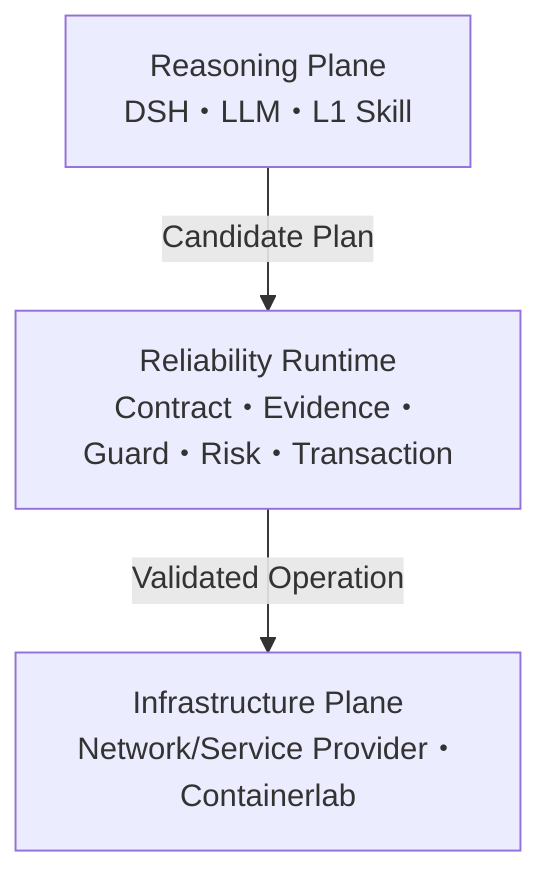

# NetOpYuAgent

EnsuredSkill 是一个网络优先的可靠执行 Runtime 原型。DSH、LLM 和 L1 Skill 负责理解、诊断与提出 Candidate Plan；Runtime 依据 Contract、Evidence、Guard、Risk 和事务状态决定哪些操作真正允许作用于网络。

> 当前是本地参考实现和仿真验证环境，不是生产网络认证。固定测试集的 100% 仅表示对应 Oracle 全部通过，不是生产成功概率。
>
> **当前权威范围已经重置为研究原型。** 企业身份、Provider 供应链、多人治理、Hermes/A2A、HA/DR、WORM 和生产 SLO 均为冻结的未来工程，不是当前架构主线或完成条件。详见 [EnsuredSkill 原型权威准则](docs/ENSUREDSKILL-PROTOTYPE.md)。

## 中文

### 项目设计

项目遵循三个原则：**概率推理与确定执行分离；No evidence, no action；LLM 决定尝试什么，Runtime 决定允许发生什么。**



| 层 | 权威职责 | 明确边界 |
|---|---|---|
| Reasoning Plane | 会话、开放式理解、诊断、追问、计划和 L1 编排 | 只能提出候选；产品路径没有直接写权限 |
| Reliability Runtime | Contract、journal-backed Typed Graph、跨步骤 Evidence、Guard、Risk、事务、验证和补偿 | 不做开放式语言推理，不把模型 confidence 当权限 |
| Infrastructure Plane | 通过 MCP/API/CLI/NETCONF 提供事实和效果 | 不判断上层业务意图，不自报成功终态 |

### 两项核心能力

1. **Contract-Governed Skill**：L1→L0.5→L0 是 authoring compilation；最终 L0 固定输入、证据、Guard、资源、风险、后置条件和补偿。模型只能生成待审 proposal。
2. **Evidence-Gated Transaction Runtime**：把 L0 编译为不可变计划和 Typed Execution Graph；写前 Snapshot/Precheck/Revalidate，写后独立 Verify；失败时 Reconcile/Compensate/Verify Recovery。

当前结论是：**ES-P0 本地研究原型证据闭环完成**。这表示六场景、五项消融、9B/7B 三次真实 DSH 配对和全量回归已经产生一致证据；不表示生产成功概率、隐藏集泛化或真实厂商设备认证。

### 已实现能力

| 能力域 | 当前范围 |
|---|---|
| Harness | DSH 主路径；模型/L1 只输出 Candidate Plan，经窄 Worker bridge 进入 Runtime |
| L1 | LAN/DC/WAN Skill，缺参追问，多步 workflow，领域外和高风险拒绝 |
| L0 | 21 个激活合同；原子、约束、扩展、组合 Saga；21/21 三阶段可解释轨迹 |
| Promotion | L1/L0.5/L0 并排审查、语义映射、低置信告警、合同图、严格安全门禁 |
| Runtime | ReliabilityContract、journal-backed Typed Graph gate、跨步骤 Evidence provenance、Guard、Risk、写前重校验、独立验证、补偿、恢复和分阶段时延 |
| Provider | 协议无关 Observation/Effect Capability；Network Observer、Actor 和本地 Adapter |
| 网络仿真 | Containerlab + FRR：OSPF、eBGP、VLAN、EVPN/VXLAN L2VPN、故障切换和真实容器转发 |
| 评测 | 六类 ES-P0 事务场景、独立安全 scorer、五机制消融矩阵和真实 DSH 配对协议 |

Hermes/A2A、跨域业务 Lab、企业身份与审批、Provider 供应链、治理工作台、HA/DR、远端不可变审计和生产 SLO 的已有代码统一冻结，不计入当前能力或完成度。真实厂商设备、EVPN L3VPN、MPLS L2VPN/L3VPN 也不在当前原型覆盖内。

### 可量化结果

真实主实验只改变一个变量：Control 为 `DSH + 同一模型/L1 Skill + 原生工具编排`；Treatment 在相同输入、审批、工具、Provider 和故障上加入 L0 资格门禁与 Runtime，不合格转换安全停机。

| 模型与指标 | DSH + L1 原生 | DSH + L0 auto Runtime |
|---|---:|---:|
| 9B Task Completion | 50.00% | **86.67%** |
| 9B Unsafe / False Commit / Invalid Action | 20.00% / 13.33% / 33.33% | **0 / 0 / 0** |
| 9B Execution Precision / Autonomous Coverage | 59.09% / 43.33% | **100% / 76.67%** |
| 9B p50 / p95 | 90.693 / 158.397 秒 | **44.405 / 72.173 秒** |
| 7B Task Completion | 20.00% | **36.67%** |
| 7B Unsafe / False Commit / Invalid Action | 10.00% / 3.33% / 20.00% | **0 / 0 / 0** |
| 7B Execution Precision / Autonomous Coverage | 50.00% / 20.00% | **100% / 36.67%** |

9B 转译严格通过 58/60，7B 为 38/60，两者误接受均为 0。7B 两臂各有 18/30 次 DSH `EMPTY_RESPONSE`，因此只支持安全边界跨模型稳定，不代表 7B 可用性合格。完整实验矩阵、消融贡献、进程失败、复现命令和摘要见 [ES-P0 本地证据报告](docs/ES-P0-EVIDENCE.md)。固定集结果不是生产概率。

仓库外自动数据通道已封存 240 条模型合成用例，覆盖 6 类 Anthropic Skill、10 类事务/故障、6 个 MCP 域和 3 类语言。qwen3.5:9b 转译协议有效 240/240，可信 Oracle 合格 235/240、fallback 5、false accept 0；10 场景×3 次真实 DSH 配对中，Treatment 将 Task Completion 从 76.67% 提升至 93.33%，unsafe 从 4/30 降至 0/30，p50 从 103.6 秒降至 64.3 秒。它用于在正式人工 ES-P1 前发现价值和边界，**不冒充独立人工 holdout 或生产概率**。方法、完整指标和命令见[仓库外合成 Holdout](docs/SYNTHETIC-HOLDOUT.md)。

### 支持的典型场景

- 新员工应用访问开通：身份、应用、审批、权限 MCP 与网络 L0 Saga 联动；
- LAN 用户接入诊断、授权、撤销和回滚；
- DC 应用访问、Fabric 配置、EVPN/VXLAN L2 路径诊断；
- OSPF/eBGP 路径查询、链路故障切换和恢复；
- 设备配置 edit/push、部署 rollback、节点 drain、服务 restart/rollback；
- L1 Skill 转 L0.5/L0 的 proposal、语义审查和离线资格工作流；
- REST/MCP/SSH/NETCONF/Controller Provider 接入前的合同检查。

### 快速开始

依赖：Python 3.11/3.12、Node.js 22.19+ 或 24+、pnpm、Ollama。Containerlab 场景另需 Linux/Docker/Containerlab。

```bash
git clone https://github.com/kevinyjk25/NetOpYuAgent.git
cd NetOpYuAgent
python3 -m venv .venv
source .venv/bin/activate
pip install -r requirements.txt -r requirements-dev.txt

ollama pull qwen3.5:9b
scripts/netopyu-dsh install
scripts/netopyu-dsh settings-sync
scripts/netopyu-dsh model qwen3.5:9b
scripts/netopyu-dsh doctor
scripts/netopyu-dsh start
```

打开 <http://127.0.0.1:3080/>。若该端口已被占用，使用 `NETOPYU_DSH_PORT=3081 scripts/netopyu-dsh restart`，并始终以 `scripts/netopyu-dsh status` 输出为准。

### 如何使用

先看三条 Golden Path 和本机就绪状态：

```bash
scripts/netopyu doctor
scripts/netopyu journeys
scripts/netopyu agent-usecases
scripts/netopyu evaluate
```

`agent-usecases` 会给出三个可直接粘贴到 DSH 页面、真正包含 LLM Tool loop 的用例：Runtime L1→L0、L1→L0.5→L0 authoring、四类 MCP 外部系统集成。详细 Prompt 与预期证据见[真实 LLM Agent 用例](docs/AGENTIZED-USE-CASES.md)。

验证自己的外部系统接入包，不连接或激活目标系统：

```bash
scripts/netopyu integration-check \
  --pack examples/integration-rest-mcp/pack.yaml
```

开发和审查 L0：

```bash
scripts/netopyu-l0 validate
scripts/netopyu-l0 list
scripts/netopyu-l0 explain network.lan.user-access.grant
scripts/netopyu-l0 runtime-trajectories-validate
scripts/netopyu-l0 workbench-export \
  --proposal /path/to/proposal --output /tmp/semantic-review.html
```

创建仓库外、角色隔离的正向资格工作区：

```bash
scripts/netopyu-l0 forward-eval-study-kit --output-root /private/forward-study
scripts/netopyu-l0 forward-eval-study-doctor --root /private/forward-study
```

没有独立业务团队时，可先自动生成明确标记为 synthetic、且不能通过正式 ES-P1 门禁的封存用例：

```bash
scripts/netopyu-synthetic-study export /private/synthetic-study --cases 240
cd /private/synthetic-study
env -u PYTHONPATH python3 generate.py --model qwen3.5:9b --resume
```

检查通用 Anthropic Skill 包及其安全路由：

```bash
scripts/netopyu-effect inspect-package --skill /path/to/my-skill
python -m evaluation.progressive_skill_suite
python -m evaluation.general_effect_model \
  --dataset-root /private/synthetic-study \
  --model qwen3.5:9b --output-root artifacts/es-p0-9b-translation
scripts/netopyu-harness-ab \
  --dataset-root /private/synthetic-study \
  --model qwen3.5:9b \
  --translation-report artifacts/es-p0-9b-translation/model-translation.json \
  --output-root artifacts/es-p0-dsh-9b \
  --stratified-patterns --repetitions 3
scripts/netopyu-synthetic-study report /private/synthetic-study \
  --translation-report artifacts/es-p0-9b-translation/model-translation.json \
  --dsh-report artifacts/es-p0-dsh-9b/real-harness-ab.json \
  --output-root artifacts/es-p0-synthetic-evidence
```

Containerlab 实验、审批卡、回滚证据和 Provider 接入的完整操作见[使用与系统接入](docs/getting-started-integration.md)。

### 文档入口

- [文档导航与权威边界](docs/README.md)
- [项目进展与路线图](docs/PROJECT-STATUS.md)
- [架构与 ADR](ARCHITECTURE.md)
- [高层设计](HLD.md)、[低层设计](LLD.md)、[安全设计](SSD.md)
- [ES-P0 本地证据报告](docs/ES-P0-EVIDENCE.md)
- [仓库外合成 Holdout](docs/SYNTHETIC-HOLDOUT.md)
- [通用渐进式确定化与跨域验证](docs/progressive-determinization.md)
- [真实 Harness 自动 Runtime A/B](docs/general-effect-ab.md)
- [L1 → L0 Promotion](docs/l1-to-l0-promotion.md)
- [正向资格协议](docs/promotion-forward-qualification.md)
- [Runtime A/B 基线](docs/benchmarks/runtime-ab-baseline.md)

---

## English

EnsuredSkill is a network-first Reliability Runtime research prototype. DSH, the LLM, and L1 Skills produce hypotheses and Candidate Plans; Contract, Evidence, Guard, Risk, and transactional state determine what is allowed to reach the network.

The [authoritative prototype charter](docs/ENSUREDSKILL-PROTOTYPE.md) supersedes conflicting production-engineering plans. Enterprise identity, provider supply chain, multi-team governance, Hermes/A2A productization, HA/DR, WORM audit, and production SLOs are frozen future work rather than current architecture or exit criteria.

### Design

The design has three rules: separate probabilistic reasoning from deterministic execution; no evidence means no action; the LLM decides what to attempt while the Runtime decides what is allowed to happen.

| Layer | Authority | Boundary |
|---|---|---|
| Reasoning Plane | DSH, LLM, L1 understanding, diagnosis, clarification and planning | proposes only; the product path has no direct write authority |
| Reliability Runtime | Contract, typed graph, Evidence, Guard, Risk, transaction, verification and compensation | performs no open-ended reasoning; confidence grants no authority |
| Infrastructure Plane | network/service Providers over MCP/API/CLI/NETCONF and labs | owns facts and effects, but cannot self-declare a verified terminal outcome |

The two core capabilities are:

1. **Contract-Governed Skill authoring.** L1→L0.5→L0 preserves readable intent while producing an executable contract. It creates review proposals only and is distinct from trace-based Experience Compilation.
2. **Evidence-Gated transactional execution.** An active L0 becomes an immutable plan and typed graph. Runtime snapshots, prechecks, revalidates, executes, verifies, commits, reconciles uncertainty, compensates, verifies recovery, and audits terminal evidence.

The ES-P0 local research-prototype evidence loop is complete: provenance-aware execution, mechanism ablation, three repeated real-Harness pairs, and cross-model safety evidence are now available. This does not imply hidden-set generalization, real-device qualification, or production readiness.

### Capabilities and evidence

The active prototype includes 21 reviewed L0 contracts and readable three-stage trajectories, LAN/DC/WAN L1 guidance, the DSH path, a journal-backed Typed Graph gate, cross-step evidence provenance and stage latency, network Observation/Effect providers, Containerlab/FRR labs, and the ES-P0 evaluation protocol. Hermes/A2A, enterprise controls, supply-chain admission, governance, and extra domains are frozen experimental code rather than active capability claims.

The local ES-P0 evidence loop is complete. In 30 real paired DSH sessions with `qwen3.5:9b`, treatment improved task completion from 50.00% to 86.67%, execution precision from 59.09% to 100%, and autonomous coverage from 43.33% to 76.67%; unsafe execution, false commits, and invalid actions fell from 20.00%/13.33%/33.33% to zero. With `qwen2.5:7b`, the same safety metrics also fell to zero, but 18/30 sessions in both arms failed at the DSH/model availability layer, so 7B is not availability-qualified. Translation false accepts were zero for both models. See the [ES-P0 local evidence report](docs/ES-P0-EVIDENCE.md).

These are transparent local development results, not production probability, hidden-set generalization, or vendor-device certification. Historical one-shot and native-fallback experiments remain component/exploratory evidence only.

A repository-external synthetic path has sealed 240 model-authored cases across six Anthropic Skill feature families, ten transaction/fault patterns, six MCP domains, and three language groups. qwen3.5:9b produced 240/240 schema-valid proposals; 235 passed every trusted Oracle, five remained fallback-only, and no rejected proposal received Runtime authority. Across ten stratified scenarios and three real-DSH repetitions, Treatment improved task completion from 76.67% to 93.33%, reduced unsafe executions from 4/30 to 0/30, and reduced p50 latency from 103.6 to 64.3 seconds. This remains model-authored pre-ES-P1 evidence, not independent human qualification or a production probability. See the [synthetic holdout guide](docs/SYNTHETIC-HOLDOUT.md).

For public-market coverage, a static-only SkillsMP/GitHub pilot accepted 20 pinned packages and exported 45 independent-author slots from the 15 packages that passed the strict Runtime package gate. A qwen3.5:9b helper produced 42 non-authoritative task drafts; one inconsistent package draft remained fail-closed. Human-authored Gold and Oracles are still required. Browse the versioned [tested-Skill index](docs/benchmarks/es-p1-wild-skill-index.json), or generate the full offline content browser as documented in the [ES-P1 public Skill-market corpus](docs/ES-P1-PUBLIC-SKILL-CORPUS.md).

Production qualification remains open for vendor devices, enterprise identity/change systems, independently owned signing roots, distributed HA/DR, remote immutable audit, and production SLOs. EVPN L3VPN and MPLS L2/L3 VPN are outside the current lab coverage.

### Quick start

```bash
python3 -m venv .venv
source .venv/bin/activate
pip install -r requirements.txt -r requirements-dev.txt
ollama pull qwen3.5:9b
scripts/netopyu-dsh install
scripts/netopyu-dsh settings-sync
scripts/netopyu-dsh model qwen3.5:9b
scripts/netopyu-dsh doctor
scripts/netopyu-dsh start
```

Open <http://127.0.0.1:3080/>. Use `scripts/netopyu-dsh status` as the authoritative URL/process check.

```bash
scripts/netopyu doctor
scripts/netopyu journeys
scripts/netopyu agent-usecases
scripts/netopyu evaluate
scripts/netopyu integration-check --pack examples/integration-rest-mcp/pack.yaml
```

The Agent use-case command prints three paste-ready real-LLM DSH journeys: L1-to-L0 Runtime execution, proposal-only L1-to-L0.5-to-L0 authoring, and four-system MCP integration. See the [Agent use cases](docs/AGENTIZED-USE-CASES.md) and [integration guide](docs/getting-started-integration.md).

For L0 development and external qualification:

```bash
scripts/netopyu-l0 validate
scripts/netopyu-l0 runtime-trajectories-validate
scripts/netopyu-l0 forward-eval-study-kit --output-root /private/forward-study
scripts/netopyu-l0 forward-eval-study-doctor --root /private/forward-study
scripts/netopyu-effect inspect-package --skill /path/to/my-skill
```

### Documentation

Start with the [documentation map](docs/README.md), [project status](docs/PROJECT-STATUS.md), [architecture](ARCHITECTURE.md), [HLD](HLD.md), [LLD](LLD.md), [SSD](SSD.md), the [ES-P0 local evidence report](docs/ES-P0-EVIDENCE.md), and the [repository-external synthetic holdout](docs/SYNTHETIC-HOLDOUT.md).
