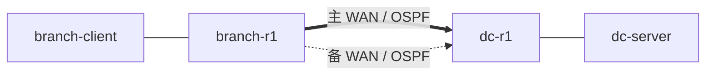
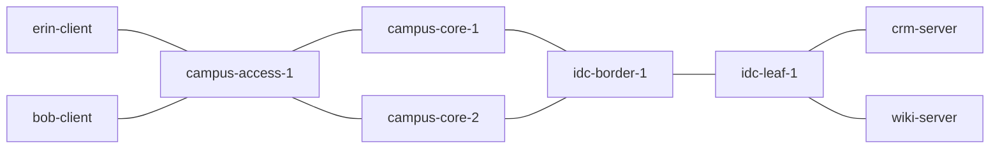
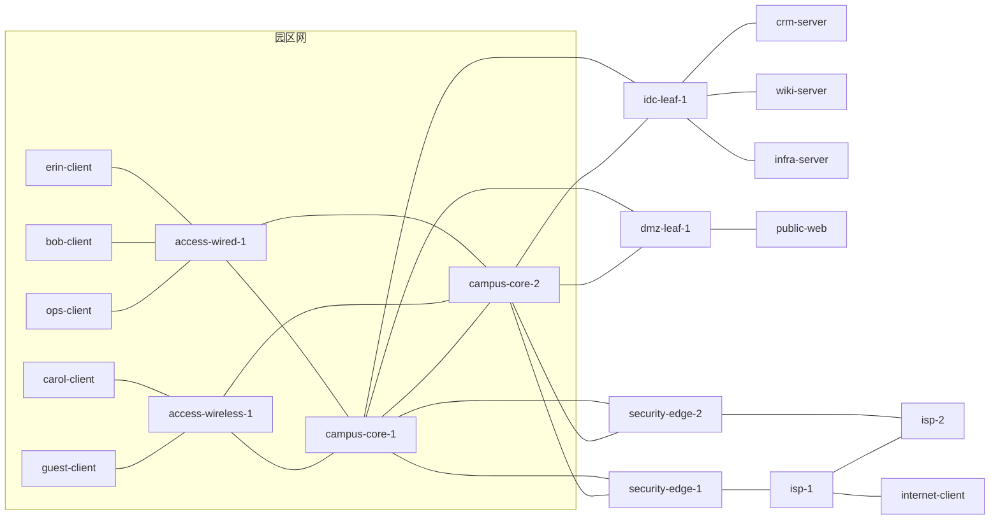
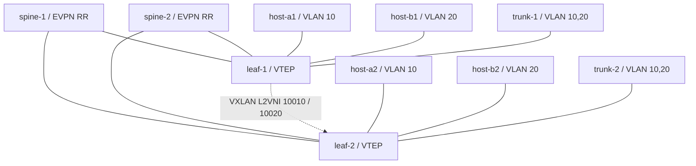
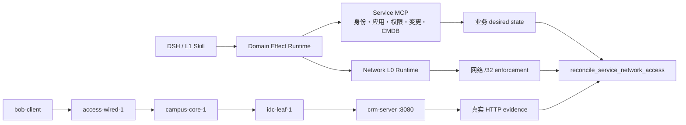
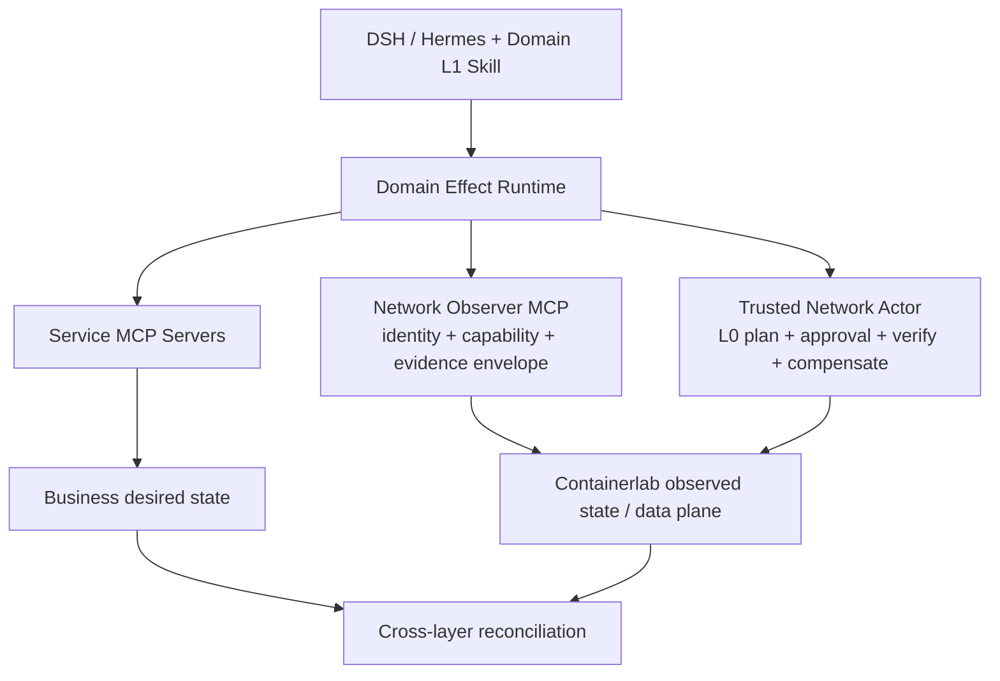
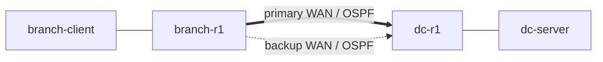
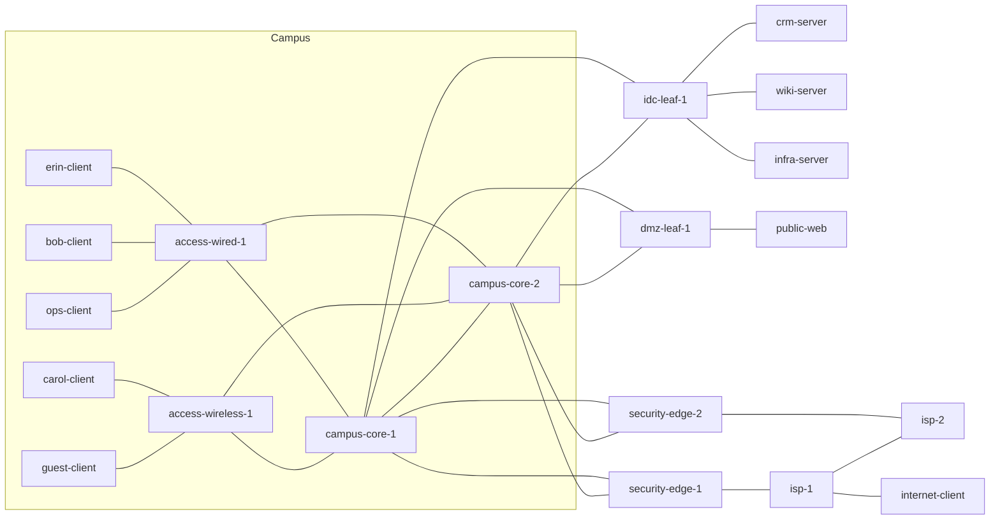
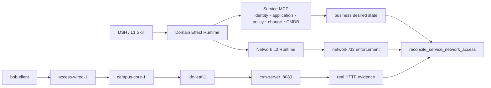

# NetOpYuAgent

## 中文

### 项目定位

NetOpYuAgent 是可接入多个通用 Agent Harness 的网络与业务运维领域插件，以及确定性 Domain Effect Runtime。当前主平台是 [DeepSeek Harness（DSH）](https://github.com/deepseek-ai/deepseek-harness)，并提供基于公开插件 API 的 [Hermes Agent](https://github.com/NousResearch/Hermes-Agent) Adapter。

DSH 或 Hermes 负责会话、模型调用、工具调用、UI/CLI、Skill 生命周期和通用编排。NetOpYuAgent 不实现第二套通用 Agent Harness，而是提供网络领域必须保留的可靠能力：

- Domain L1 Skills：诊断、追问、跨域协作和业务流程编排；
- Network/Service L0 Skills：参数校验、风险计算、预检、审批绑定、单次执行、结果验证、补偿/回滚和审计；
- LAN、DC、WAN 与 pragmatic 网络工具；
- 标准 MCP Provider Layer：只读 Network Observer、durable Network Actor，以及身份、应用目录、权限策略、变更、CMDB 和服务平台；
- DSH/Hermes Harness Adapter、共享 Python Worker、A2A provider、作用域记忆、能力检索和离线评测。

> 当前状态：P0 迁移、P0.5 Effect Runtime、P0.75-A/B/C Containerlab、P0.8 Service MCP、P0.9 Observer Boundary、P1.0 Durable Actor、P1.1 Capability/Read Policy/Terminal Envelope/Durable Saga 本地原型，以及 21/21 内置写能力的生产 L0 v2 升级均已完成。网络读写分别经过身份固定的 Observer/Actor MCP；真实 Containerlab 已验证成功提交、独立读回、故障后精确补偿和现场恢复。它仍不等于生产环境“绝对 100% 正确”；厂商控制器/设备、企业身份与审批、分布式 HA、远端不可变审计、备份恢复和生产 SLO 仍需 P1 后续资格认证。

### 分层术语

为避免 L0/L1 歧义，本项目统一使用以下名称：

| 名称 | 职责 |
|---|---|
| Harness Platform Layer | DSH 或 Hermes；管理模型、会话、UI/CLI、工具与交互 |
| Harness Adapter | 将同一领域能力投影到 DSH 或 Hermes，不拥有网络效果语义 |
| NetOpYu Domain Layer | Harness 之下共享的网络与业务运维领域能力总层 |
| Domain L1 Skill | 允许模型参与的泛化业务 Skill；负责理解、诊断、追问和编排 |
| Network L0 Skill | 不依赖模型推理的版本化执行合同；负责确定性网络效果 |
| Service L0 Skill | 不依赖模型推理的版本化执行合同；负责确定性业务系统效果 |
| Domain Effect Runtime | Network/Service L0 共用的计划、审批、验证、补偿与审计内核；`NetworkRuntime` 是兼容名称 |

### P0.5 完成范围

本地 mock 范围已经具备：

- DSH Web UI 主路径和 Hermes CLI/Gateway 插件路径；
- 版本化 Network L0 Skill 注册表；
- 严格参数类型、必填字段、目标存在性与参数来源校验；
- 不可变 `IntentSpec`、`plan_hash`、`intent_hash` 与 L0 合同哈希；
- DSH `allowed-once` 卡片审批，或 Hermes 用户专属 slash command 审批；
- 执行前状态重校验，阻止 TOCTOU 状态漂移；
- 独立 typed postcondition 验证；
- 合同化补偿/回滚与人工介入终态；
- SQLite 状态机及防篡改事件哈希链；
- 持久化 Python Worker 和故障恢复；
- A2A 发现、委派、深度/循环保护和持久化 continuation；
- 本地 loopback-only DC peer，用于真实 A2A/SSE 协议模拟；
- 作用域记忆、大结果分页、能力检索和隐私最小化轨迹；
- DSH/Hermes 使用同一 Worker、L0 注册表、Effect Runtime、验证器和审计；
- 标准 MCP SDK 的 stdio/Streamable HTTP client、服务身份/version pinning 与 schema hash 绑定；
- 完整 Python 门禁：239 个测试和 81 个子测试；另有 Containerlab 实际端到端演练。

### DSH only 与 DSH + Runtime 定量对比

项目包含可重复运行的 A/B 故障基准。两个路径接收完全相同的工具、参数、Provider 和注入故障：

- `DSH only` 保留工具 JSON Schema 与通用一次性 HITL，然后直接调用 Provider；
- `DSH + Runtime` 在相同边界上增加领域参数、不可变计划、审批绑定、执行前重校验、独立结果验证、补偿和防篡改审计；
- 固定 L1 决策，不测 LLM 意图提取或 Skill 选择，因此结果只表示 Runtime 的确定性增量。

当前本机 50 次时延样本与 **Core-72** 固定场景的基线。Core-72 包含 8 个有效操作和 64 个风险/故障控制，覆盖 LAN、DC、WAN 与跨域 Saga：

| 指标 | DSH only | DSH + Runtime |
|---|---:|---:|
| 有效请求完成率 | 100%（8/8） | 100%（8/8） |
| 参数与意图收口率 | 16.7%（2/12） | 100%（12/12） |
| 读取权限控制率 | 25%（2/8） | 100%（8/8） |
| 审批绑定控制率 | 8.3%（1/12） | 100%（12/12） |
| 结果判定与恢复率 | 0%（0/12） | 100%（12/12） |
| 补偿与回滚正确率 | 0%（0/8） | 100%（8/8） |
| 跨域 Saga 控制率 | 0%（0/6） | 100%（6/6） |
| 终态与审计完整率 | 0%（0/6） | 100%（6/6） |
| **故障/风险控制有效率** | **7.8%（5/64）** | **100%（64/64）** |
| 本地机器 p50 | 0.314 ms | 7.893 ms |
| 本地机器 p95 | 0.381 ms | 8.871 ms |

这里的百分比是“通过固定机器判定 Oracle 的场景数/场景总数”，不是生产成功概率。Runtime 本机 p50 增量为 7.579 ms；人工审批等待不计入时延，时延随机器负载变化。72 个场景都有唯一 ID、可执行故障注入和机器 Oracle；不以同一请求改名来增加数量。完整口径和逐项证据见 [定量基线](docs/benchmarks/runtime-ab-baseline.md)。复现并生成 JSON、Markdown 和浏览器 HTML：

```bash
scripts/netopyu-dsh compare-runtime --iterations 50
open artifacts/runtime-ab/runtime-ab.html   # macOS
```

后续迭代使用版本化基线 [data/runtime_ab_baseline.json](data/runtime_ab_baseline.json) 做趋势判断：

- 任一 Runtime Oracle 或有效请求完成率下降，立即标记 `regressed`；
- 性能必须同时恶化超过基线 25% 且绝对增加超过 3 ms，才标记时延回退；
- 最近 3 个不同执行代码指纹取中位数；相同代码重复测量不计为新迭代；
- 时延改善超过 15% 且至少减少 1 ms，或在保持 100% 通过时增加控制场景，标记 `improved`；其余为 `stable`。

每个实质性 Runtime 版本完成后记录一次：

```bash
scripts/netopyu-dsh compare-runtime --iterations 50 --record --label P1.2-iteration-1
```

结果中的 `trend.status` 会显示 `collecting`、`improved`、`stable` 或 `regressed`。历史位于忽略提交的 `artifacts/runtime-ab/history.jsonl`；达到 3 个不同实现版本后才给出趋势结论，避免单次机器抖动误报。

### L0 v2 Skill SDK

项目已将全部 21 个内置受审写能力升级为 L0 v2 权威契约，并保留声明式 SDK 来构建原子 S1、约束式 S11、扩展式 S11，以及组合式 S1+S2+… Saga。继承只在编译期发生；准备、审批、重校验和执行只使用完全展开、带版本和哈希的不可变 Contract。既有 ToolContract、verifier 和 compensator 只作为与精确 v2 契约绑定的合格执行 Adapter，不再是独立的语义真相源。详见 [L0 v2 设计](docs/l0-v2-design.md)和[生产迁移说明](docs/l0-v2-runtime-migration.md)。

```bash
scripts/netopyu-l0 validate
scripts/netopyu-l0 list
scripts/netopyu-l0 explain network.privileged-access.grant
scripts/netopyu-l0 diff network.access.grant network.guest-access.grant
scripts/netopyu-l0 graph employee.application-access.provision
scripts/netopyu-l0 compile --output artifacts/l0-v2/catalog.json
scripts/netopyu-l0 runtime-validate
scripts/netopyu-l0 runtime-list
scripts/netopyu-l0 runtime-export --output artifacts/l0-v2/runtime-catalog.json
scripts/netopyu-l0 runtime-trajectories-validate
# 生产 Contract 变更后，由维护者显式重建并审查：
scripts/netopyu-l0 runtime-trajectories-build
```

生产 Catalog 位于 `network_runtime/l0/production.py`，21/21 个现有写工具在导入时编译为 `netopyu.io/l0-effect-compiled/v2`，并在 prepare 与执行前重校验阶段做契约/Adapter 一致性门禁；实际 Effect 参数由受限表达式引擎从已批准参数渲染，不能把模型原始参数直接透传给 Provider。`network_runtime/l0/examples/` 中的 URL1 REST Capability 仍是 SDK/Promotion 教学示例，尚无真实 Provider，因此不会自动注册到生产 Runtime。

全部存量 L0 另有一份源码内可读档案，索引见 [生产 L0 轨迹](network_runtime/l0/production_trajectories/INDEX.md)。每个目录保存 Capability Catalog、L1 自然语言 Skill、L0.5 结构化自然语言 Skill、L0 authoring/compiled Contract、逐级 hash trajectory 和报告。主 `runtime-validate` 同时要求 21/21 Promotion 检查通过、21/21 精确 round trip，并验证所有文件和前后级 hash。存量 L1/L0.5 明确标注为从已受审 L0 反向 bootstrap 的解释基线：它验证可读投影和转换闭环，不冒充独立的模型语义推导。

### L1 → L0 辅助下沉

离线 Promotion Pipeline 保存完整的 `L1 自然语言 SKILL.md → L0.5 结构化自然语言 YAML → L0 authoring/compiled Contract` 轨迹。L0.5 先固定参数、约束、步骤、风险、停止条件、结果语义和可用 Capability，再让人/Agent 生成严格 L0。每阶段及前后关系都绑定 SHA-256；任一漂移会阻断 review。Agent 只能生成候选，批准也不会自动注册或执行。完整说明见 [L1 → L0 下沉设计](docs/l1-to-l0-promotion.md)。

```bash
scripts/netopyu-l0 promote-inspect --skill network_runtime/l0/promotion_examples/url1-network-access/SKILL.md
scripts/netopyu-l0 promote-l05 --skill network_runtime/l0/promotion_examples/url1-network-access/SKILL.md --capabilities network_runtime/l0/promotion_examples/url1-network-access/capabilities.yaml --output artifacts/l0-promotion/url1-L0.5.yaml
scripts/netopyu-l0 promote-prompt --skill network_runtime/l0/promotion_examples/url1-network-access/SKILL.md --capabilities network_runtime/l0/promotion_examples/url1-network-access/capabilities.yaml --output artifacts/l0-promotion/url1-prompt.json
scripts/netopyu-l0 promote-assess --skill network_runtime/l0/promotion_examples/url1-network-access/SKILL.md --candidate network_runtime/l0/examples/s1-network-access-grant.yaml --capabilities network_runtime/l0/promotion_examples/url1-network-access/capabilities.yaml
```

### 快速开始

依赖：

- macOS 或 Linux；
- Python 3.11 或 3.12；
- Node.js 22.19+ 或 24+；
- pnpm；
- Ollama 和本地模型。

```bash
cd /Users/steven/NetOpYuAgent
python -m venv .venv
source .venv/bin/activate
pip install -r requirements.txt -r requirements-dev.txt

ollama pull qwen3.5:27b
ollama pull qwen2.5:7b

scripts/netopyu-dsh install
scripts/netopyu-dsh doctor
scripts/netopyu-dsh start
```

打开 <http://127.0.0.1:3080/>。

### Hermes Adapter 本地运行

Hermes 不取代 Domain Effect Runtime，只增加一个 Harness 入口。先按 Hermes 官方说明安装 `hermes` CLI，然后运行：

```bash
scripts/netopyu-hermes install
hermes plugins enable netopyu
scripts/netopyu-hermes worker-start
scripts/netopyu-hermes doctor

NETOPYU_HERMES_PROFILE=lan \
NETOPYU_HERMES_ENABLE_DESTRUCTIVE=1 \
NETOPYU_HERMES_OPERATOR_ID=local:steven \
scripts/netopyu-hermes run
```

写工具只返回 `approval_required`，其中不包含 execution nonce。模型必须停止；操作员核对完整计划后，亲自输入返回的精确命令：

```text
/netopyu-approve PLAN_ID FULL_PLAN_HASH
```

拒绝使用 `/netopyu-deny PLAN_ID FULL_PLAN_HASH`。Hermes 重启会丢弃待审批 nonce，旧计划因此无法执行，需要重新 prepare。可在没有 Hermes CLI 的情况下验证 Adapter 与 Runtime 一致性：

Hermes 插件同时提供 `netopyu_skill_catalog`、`netopyu_skill_view`、`netopyu_capability_search` 和显式作用域 Memory。复杂业务先调用 `netopyu_skill_view`，Adapter 会启动 reviewed workflow；后续只读工具结果被记录为 L0 写入的前置 evidence。

```bash
scripts/netopyu-hermes compare
scripts/netopyu-hermes test
```

当前机器尚未安装 Hermes 时，`doctor` 会明确报告该项；这不会影响纯本地 Adapter 合同测试。

完整运行时依赖按用途拆分：

| 文件 | 用途 |
|---|---|
| `requirements-core.txt` | DSH bridge 核心依赖 |
| `requirements-pragmatic.txt` | Netmiko/NAPALM/Nornir 等真实网络适配器 |
| `requirements-observability.txt` | OpenTelemetry 可观测性 |
| `requirements-dev.txt` | 本地/CI 测试门禁 |
| `requirements.txt` | 生产能力全集 |

### 本地 L1 + L0 + A2A 演练

以下流程只改变本地模拟状态，不连接真实设备：

```bash
scripts/netopyu-dsh stop
scripts/netopyu-dsh worker-stop
scripts/netopyu-dsh dc-peer-start

NETOPYU_PROFILE=lan \
NETOPYU_DSH_BACKEND=mock \
NETOPYU_DSH_ENABLE_DESTRUCTIVE=1 \
NETOPYU_DSH_A2A_PEERS=http://127.0.0.1:8765 \
scripts/netopyu-dsh start
```

在 DSH 新会话中使用 `qwen3.5:27b`，输入：

```text
这是本地 mock 网络演练。请调用 lan-new-employee-onboarding-access Skill，
为新员工 erin 开通 CRM 的端到端访问。严格实际调用工具；所有写入都让我在
DSH 的 Network L0 Skill 计划审批卡中审批，不要使用通用提问代替审批。
```

审批卡必须显示精确参数、目标、风险、plan hash、intent hash、L0 Skill 版本与哈希、验证合同和回滚合同。执行后检查：

```bash
scripts/netopyu-dsh runtime-list 5
scripts/netopyu-dsh runtime PLAN_ID
scripts/netopyu-dsh runtime-audit PLAN_ID
```

### P0.75-A FRR + Containerlab 实验室

P0.75-A 使用两个 FRR 路由器、主备 OSPF WAN 链路和两个 Alpine 终端，把 L1/L0
从进程内 mock 推进到真实 CLI、真实协议收敛与真实容器转发。版本化
`labs/p075-a-frr/lab.yaml` 固定设备、探测和故障接口；模型不能扩展目标范围。

基础 OSPF 主备链路用例的组网如下，实线为首选路径，虚线为备份路径：



在 Linux/Containerlab 环境中运行：

```bash
python scripts/netopyu_lab.py preflight
python scripts/netopyu_lab.py deploy --approve-local-lab
python scripts/netopyu_lab.py verify
python scripts/netopyu_lab.py exercise-failover --approve-local-lab
```

Apple Silicon 推荐使用仓库内 `.devcontainer/devcontainer.json`。先启动 Docker
Desktop，再进入 Dev Container，并在容器内执行：

```bash
sudo containerlab deploy --topo labs/p075-a-frr/topology.clab.yml
```

若 macOS 没有原生 `containerlab`，`scripts/netopyu_lab.py` 会在本地已有固定版本
Dood 镜像时自动通过 Docker Desktop 运行同一命令，不会回退 mock。

部署完成后，在 macOS 上用实验配置启动 DSH：

```bash
scripts/netopyu-dsh stop
scripts/netopyu-dsh worker-stop
NETOPYU_CONFIG_PATH=config.lab.yaml \
NETOPYU_DSH_BACKEND=pragmatic \
NETOPYU_DSH_ENABLE_DESTRUCTIVE=1 \
scripts/netopyu-dsh start
```

页面测试请求示例：

```text
这是 netopyu-p075a 本地实验，不是真实设备。请使用
lab-ospf-path-remediation Skill 检查 branch-r1 到 DC 的主备 OSPF 路径，
将 branch-r1 的 eth2 OSPF cost 从 20 调整为 10。
必须先读取配置、确认两个 Full 邻居并执行 branch-to-dc 基线探测；
写入时 verification_probe_id 必须为 branch-to-dc，并等待我审批 L0 计划。
```

园区 + IDC 扩展位于 `labs/p075-a-campus-idc/`：5 台 FRR、Erin/Bob 两个终端、
CRM/Wiki 两个 HTTP 应用。它把新员工用例落到真实容器数据面；接口状态表示 NAC
enforcement，应用服务器的精确源 `/32` 策略表示 RBAC enforcement，最终验证必须得到
员工终端实际 HTTP 响应。部署 topology 后运行：



```bash
NETOPYU_CONFIG_PATH=config.campus-idc-lab.yaml \
NETOPYU_DSH_BACKEND=pragmatic \
python scripts/campus_idc_e2e.py
python scripts/campus_idc_e2e.py --exercise-rollback
python scripts/campus_idc_e2e.py --reset-only
```

常驻 DSH 还需启动 pragmatic DC peer，并把 peer URL 提供给 DSH。脚本默认在测试后恢复
Erin 的初始拒绝状态；`--leave-provisioned` 才保留授权。该机制验证真实 Linux 路由和
HTTP 数据面，但不冒充真实 RADIUS、802.1X、IAM 或厂商设备。

```bash
export NETOPYU_CONFIG_PATH="$PWD/config.campus-idc-lab.yaml"
export NETOPYU_DSH_BACKEND=pragmatic
export NETOPYU_DSH_ENABLE_DESTRUCTIVE=1
export NETOPYU_DSH_LOCAL_DC_PORT=8766
scripts/netopyu-dsh dc-peer-start
scripts/netopyu-dsh start
```

### P0.75-B 典型小型现网

`labs/p075-b-small-production/` 是当前推荐的完整本地实验：10 台 FRR 网络设备与
10 个终端/服务，覆盖有线办公、企业无线、访客无线、双园区核心、双安全出口、双 ISP、
IDC、运维基础设施、DMZ 和模拟 Internet。企业内部运行 OSPF，出口运行 eBGP；11 条
清单探测同时验证允许路径与拒绝路径，HTTP 探测验证应用层结果。

下图是逻辑组网；每条边都对应 `topology.clab.yml` 中的真实容器链路，双核心同时连接
两个接入域、两个安全出口、IDC 和 DMZ：



```bash
python scripts/netopyu_lab.py \
  --manifest labs/p075-b-small-production/lab.yaml \
  deploy --approve-local-lab
python scripts/small_production_lab.py reset --approve-local-lab
python scripts/small_production_lab.py verify
python scripts/small_production_lab.py exercise-failover --approve-local-lab
python scripts/campus_idc_e2e.py \
  --manifest labs/p075-b-small-production/lab.yaml \
  --config config.small-production-lab.yaml \
  --exercise-rollback
```

DSH UI 使用 `config.small-production-lab.yaml`。该实验实际验证协议收敛、容器转发、
HTTP、L0 审批、独立后置验证与回滚；FRR 的 `secure-wan-edge` 只表示安全域路由角色，
不冒充真实状态防火墙、NAT、IPS、无线 RF、802.1X、ASIC 或厂商 CLI。

拓扑和路径查询不再从设备配置推断。`lab.yaml` 额外声明 7 个安全域、20 个节点的角色、
26 条双端链路及 52 个接口地址，并在加载时与 Containerlab wiring 做集合精确匹配。
DSH 中的 `lab-deterministic-path-query` Skill 只允许使用以下只读工具：

- `lab_get_topology_graph`：返回审核后的节点、接口、地址、区域、链路和模拟真实性边界；
- `lab_get_endpoint`：区分 endpoint 与 device，并返回唯一接入关系；
- `lab_trace_path`：执行 manifest-bound traceroute，逐跳解析节点、入接口和链路；
- `lab_get_enforcement_path`：合并用户准入、应用策略和实际路径证据。

任一跳点地址未知、相邻关系无法由清单证明或目标未到达时，路径返回 `fail_closed=true`，
模型不得补全。Erin→CRM 的当前主路径应为
`erin-client → access-wired-1 → campus-core-1 → idc-leaf-1 → crm-server`；
内部路径不经过 `security-edge-*`。

L0 成功要求 fresh running-config 和预声明流量探测同时通过。失败时 provider 使用
执行会话快照差异恢复，并由 Runtime 独立重读配置证明恢复；否则进入
`manual_intervention_required`。厂商 CLI、ASIC、性能与无线 RF 不属于本阶段。

### P0.75-C 真实 EVPN/VXLAN Fabric

`labs/p075-c-evpn-vxlan/` 是 2 Spine + 2 Leaf 的 Clos Fabric，包含 6 个 endpoint。
Spine 为双 EVPN Route Reflector，Leaf 为 VTEP；VLAN 10/20 分别映射到
L2VNI 10010/10020。接入口和 802.1Q trunk、Linux bridge/VXLAN 数据面、OSPF underlay、
MP-BGP EVPN type-2/type-3 路由与跨 VTEP 转发都在容器中真实运行，不是工具返回 mock。



```bash
python scripts/netopyu_lab.py \
  --manifest labs/p075-c-evpn-vxlan/lab.yaml \
  deploy --approve-local-lab --reconfigure
python scripts/netopyu_lab.py \
  --manifest labs/p075-c-evpn-vxlan/lab.yaml verify
python scripts/netopyu_lab.py \
  --manifest labs/p075-c-evpn-vxlan/lab.yaml \
  exercise-fabric-failover --approve-local-lab
python scripts/evpn_vxlan_runtime_e2e.py --approve-local-lab
```

最后一个命令运行完整 `lab-fabric-access-vlan-change` L1 +
`network.fabric.access-vlan.set` L0 用例：建立端口与流量基线、生成高风险审批计划、实际
切换接入口、fresh-read 验证、故意触发业务探测失败、自动恢复精确 bridge/PVID 快照并验证
恢复后的流量和审计链。

DSH UI 使用 Fabric 专用配置，建议与现有 3080 实例使用不同端口：

```bash
NETOPYU_CONFIG_PATH=config.evpn-vxlan-lab.yaml \
NETOPYU_DSH_BACKEND=pragmatic \
NETOPYU_DSH_ENABLE_DESTRUCTIVE=1 \
NETOPYU_DSH_PORT=3082 scripts/netopyu-dsh start
```

页面中可先提问“使用 `lab-evpn-vxlan-operations` 检查全网 EVPN/VXLAN 状态”，再要求
“使用 `lab-fabric-access-vlan-change` 将 leaf-1 eth3 从 VLAN 10 改到 VLAN 20，原因是
本地回滚演练，并用 tenant-a-l2vpn 验证；等待我审批”。

当前 Docker Desktop Linux 内核明确显示 `CONFIG_NET_VRF is not set`，所以本实验只声明
EVPN L2VPN。EVPN L3VPN、MPLS L2VPN/L3VPN、厂商 CLI/ASIC、防火墙会话与无线 RF 均未
实现；需要支持 NET_VRF 的 Linux 主机或独立网络 NOS 镜像后才能扩展。

### P0.8 Service MCP + Domain Effect Runtime

`service_layer/` 不再把 Alice/Bob、应用权限或变更工单伪装成网络工具返回值。它通过官方
MCP Python SDK 启动六类独立服务进程，并共享一个仅用于本地仿真的事务型 SQLite：

- Identity：权威用户与生命周期状态；
- Application：应用目录、owner、endpoint 与合法角色；
- Access Policy：业务资格与 desired-state entitlement；
- Change：工单审批与执行窗口；
- CMDB：业务实体到 Containerlab endpoint 的显式映射；
- Platform：服务健康、restart/rollback 与 revision。

Service Layer 只拥有业务期望状态；Containerlab 只拥有网络 enforcement 和数据面。二者
不读取同一个“万能 mock”值。`reconcile_service_network_access` 会并行读取 MCP desired
state、CMDB binding、网络实际 `/32` enforcement 和真实 HTTP probe，并明确分类 drift。
Service/Network 写操作都必须经过同一 Effect Runtime，但使用各自的 L0、provider identity、
input/output schema hash、preflight、verifier 和 compensator。

跨层用例把同一个业务意图投影到两个独立事实域；以 Bob 访问 CRM 为例，网络侧实际路径
落在 P0.75-B 的容器数据面中：



先部署 P0.75-B 网络，再运行完整的撤销/恢复演练：

```bash
python scripts/service_network_runtime_e2e.py --approve-local-lab
```

该命令不会直接调用 provider 写接口。它依次执行 Service revoke、Network revoke、Service
grant、Network apply 四个独立计划，验证中间 HTTP 阻断和最终恢复，并检查每条审计链。
仅测试 Service MCP 时使用 `config.service-lab.yaml`；DSH 与网络联动使用
`config.small-production-lab.yaml`。

### P0.9/P1.0 Network Provider Boundary 与 Durable Actor

Network Runtime 是端到端事务和安全控制面；MCP 是下层系统的标准协议边界，不替代
Runtime 的意图、计划、审批、验证、补偿和审计职责。P0.9 将 Containerlab 只读能力迁入
身份固定的 `netopyu.network-observer@1.0.0` MCP 进程。P1.0 又将写能力迁入身份固定、显式
trusted 的 `netopyu.network-actor@1.0.0`。注册表现有 42 个版本化 provider capability
（30 个 observer、12 个 actor，包含内部 finalizer）。模型只能看到当前 profile 的公开参数；
operation/plan/intent hash、审批 preflight 和 effect phase 由 Runtime 内部注入，restore/finalize
工具不投影给模型。



Observer 的每个响应都携带 provider identity、capability id/version、UTC observation time、
correlation id 和 canonical payload digest；client 验证后才向旧 verifier 解包 payload。provider
失败与“观测到策略拒绝/探测失败”是两个不同状态，后者不会被误判为 MCP 故障。配置中的
server identity/version 或 capability 声明不匹配时，工具发现即失败关闭。

Actor 在发送效果前把 immutable operation、参数/审批摘要、desired state 和精确 rollback
snapshot 写入权限收紧的 SQLite/WAL；按 target 使用跨进程文件锁、租约和单调 fencing token，
状态事件另有 SHA-256 哈希链。响应丢失的重复 operation 不会重放写入，而是读回并返回原结果；
启动时只做 desired/snapshot reconciliation。补偿使用 operation id 读取 durable snapshot，
不信任模型传入的旧状态。Runtime 终态通过内部 finalizer 提交或释放租约。配置使用 Actor
声明的 `profiles` 做 LAN/DC 精确投影。工具名仅为兼容别名，稳定绑定键是 capability id/version。

当前 fencing 是单机 SQLite + 文件锁语义，Containerlab 设备本身不原生校验 token；因此该阶段
证明的是本地 crash safety 原型，不是跨主机线性一致。生产化还需要远端事务存储/队列、设备或
控制器侧 idempotency/CAS、独立 Observer/Actor 凭据和故障域、HA leader fencing 与不可变审计。

### P1.1 Capability、Read Policy、Terminal Envelope 与 Durable Saga

Runtime 现在通过协议无关的 `CapabilityContract` 和窄 `CapabilityProviderGateway` 理解下层
observation/effect；MCP、OpenAPI、SSH、NETCONF 或本地 callable 只是 Provider 实现。合同固定
domain、provider identity、schema digest、effect semantics、数据敏感度、角色、scope 字段和
freshness budget。只读 PEP 在调用 Provider 前验证主体、角色、资源 scope、用途和 clearance；
本地旧调用使用显式标记的 owner-only system principal，不能视作生产认证。

写结果进入模型/UI 前转换为 `netopyu.effect-runtime-terminal@1.0.0`，只公开 Runtime 终态、独立
evidence、补偿状态和 provider result digest，不暴露 Actor 的 `prepared/applied` 中间态。
`SagaCoordinator` 将多个独立审批 L0 计划绑定到不可变跨 Service/Network 步骤图，按依赖推进，
失败后逆序请求新的受审补偿计划，并通过 SQLite/WAL 与事件哈希链重启续跑。Saga 不直接调用
Provider、不制造审批，也不宣称分布式原子事务。

### 模型使用策略

- 默认使用 `qwen3.5:27b` 进行网络工具会话。
- `qwen2.5:7b` 的本地资格测试未通过自主变更要求：它会跳过指定 Skill、错误选择子代理、在成功后重复发起相同破坏性调用，并错误解释审批拒绝。
- 7B 可以用于只读查询、分类或候选意图生成，但不能独立驱动可变更网络流程。
- 模型只提出候选意图；Domain Effect Runtime 决定该意图能否安全进入效果层。

Network L0 Skill 能保证“已校验并经审批的具体计划”按合同执行和验证，不能保证模型提出的计划天然等于用户真实业务意图。

### 安全默认值

- 默认 backend 为 `mock`；pragmatic 模式缺少真实来源时 fail closed。
- 默认只暴露只读工具。
- DSH 写工具必须显式设置 `NETOPYU_DSH_ENABLE_DESTRUCTIVE=1`；Hermes 使用 `NETOPYU_HERMES_ENABLE_DESTRUCTIVE=1`。
- 环境变量不能绕过 DSH 的单次卡片审批或 Hermes 的用户 slash command。
- 批准绑定到完整计划哈希；参数、目标或合同变化都会使批准失效。
- 授权 grant 最多消费一次，重放和并发重复调用会失败。
- 成功只能由新的独立 postcondition evidence 判定，不能由模型文本或写工具返回值直接判定。
- 真实凭据只允许通过环境或部署密钥系统注入，不写入仓库、计划摘要或轨迹。

### 常用命令

```bash
scripts/netopyu-dsh doctor
scripts/netopyu-dsh start
scripts/netopyu-dsh stop
scripts/netopyu-dsh status
scripts/netopyu-dsh logs
scripts/netopyu-dsh models
scripts/netopyu-dsh model qwen3.5:27b
scripts/netopyu-dsh backend
scripts/netopyu-dsh worker-status
scripts/netopyu-dsh dc-peer-start
scripts/netopyu-dsh dc-peer-status
scripts/netopyu-dsh peers
scripts/netopyu-dsh l0-skills
scripts/netopyu-dsh demo-l1-l0
scripts/netopyu-dsh parity
scripts/netopyu-dsh reliability
scripts/netopyu-dsh compare-runtime --iterations 50
scripts/netopyu-dsh retirement
scripts/netopyu-hermes doctor
scripts/netopyu-hermes compare
scripts/netopyu-hermes test
python scripts/service_network_runtime_e2e.py --approve-local-lab
python scripts/netopyu_lab.py preflight
python scripts/netopyu_lab.py verify
```

可变运行时数据默认位于 `~/Library/Application Support/NetOpYuAgent/dsh-runtime`，可用 `NETOPYU_DSH_RUNTIME` 覆盖。运行时 SQLite、日志、虚拟环境和 IDE 文件不会提交到 Git。

### 验证

```bash
scripts/netopyu-dsh retirement
```

该命令是项目主门禁，覆盖 Python、Node 插件语法、Harness 边界、HITL、A2A、Domain Effect Runtime、Skill 投影、检索质量、Worker 并发/恢复和破坏性操作策略。`scripts/netopyu-hermes test` 额外覆盖 Hermes 官方 PluginContext 表面、slash 审批、nonce 隐藏、A2A continuation 与 DSH/Hermes Runtime 不变量一致性。

### 文档

- [ARCHITECTURE.md](ARCHITECTURE.md)：权威架构边界、依赖规则与架构决策；
- [HLD.md](HLD.md)：高层设计、组件、部署和端到端数据流；
- [LLD.md](LLD.md)：模块、接口、状态机、合同与异常处理；
- [SSD.md](SSD.md)：系统规格、安全设计、威胁模型和验收标准。

---

## English

### Project scope

NetOpYuAgent is a harness-adaptable network/service-operations domain plugin and deterministic Domain Effect Runtime. [DeepSeek Harness (DSH)](https://github.com/deepseek-ai/deepseek-harness) remains the primary platform, with an additional public-API adapter for [Hermes Agent](https://github.com/NousResearch/Hermes-Agent).

DSH or Hermes owns sessions, model calls, tools, UI/CLI, Skills, and general orchestration. NetOpYuAgent does not implement another general-purpose harness. It contributes the network capabilities that must remain reliable:

- Domain L1 Skills for diagnosis, clarification, cross-domain collaboration, and workflow orchestration;
- Network and Service L0 Skills for validation, risk assessment, preflight, approval binding, one-shot execution, verification, compensation/rollback, and audit;
- LAN, DC, WAN, and pragmatic network tools;
- standard MCP providers for a read-only Network Observer, a durable Network Actor, and identity, application, access policy, change, CMDB, and platform state;
- DSH/Hermes adapters, a shared Python Worker, A2A provider, scoped memory, capability retrieval, and offline evaluation.

> Status: P0 migration, P0.5 Effect Runtime, P0.75-A/B/C Containerlab, P0.8 Service MCP, P0.9 Observer Boundary, P1.0 Durable Actor, the local P1.1 Capability/Read Policy/Terminal Envelope/Durable Saga prototype, and the production L0 v2 migration of all 21 built-in mutation capabilities are complete. Network reads and writes cross separate identity-pinned Observer/Actor MCP boundaries. Real Containerlab runs qualified commit, independent readback, exact compensation, and baseline restoration. This is not absolute production correctness; vendor controllers/devices, enterprise identity/approval, distributed HA, remote immutable audit, backup/restore, and production SLO certification remain P1 work.

### Layer terminology

| Name | Responsibility |
|---|---|
| Harness Platform Layer | DSH or Hermes for models, sessions, UI/CLI, tools, and interaction |
| Harness Adapter | Projects domain capabilities without owning network effect semantics |
| NetOpYu Domain Layer | Shared network/service-operations capabilities below either harness |
| Domain L1 Skill | Generalized, model-assisted business Skill for reasoning and orchestration |
| Network L0 Skill | Versioned, model-independent effect contract |
| Service L0 Skill | Versioned, model-independent business-system effect contract |
| Domain Effect Runtime | Shared plan/approval/verification/compensation/audit kernel; `NetworkRuntime` is the compatibility name |

### P0.5 completion scope

The local scope includes DSH and Hermes harness adapters, versioned Network/Service L0 Skills, strict parameters and provenance, immutable intent/plan/provider/schema/capability hashes, harness-specific user approval bound to one Runtime nonce, execution-time revalidation, typed independent postconditions, contractual compensation, tamper-evident Runtime and Actor journals, persistent recovery, A2A discovery and continuations, a loopback-only DC peer, scoped memory, large-result paging, capability retrieval, official MCP transports, and a Python gate with 239 tests and 81 subtests.

### DSH only versus DSH + Runtime benchmark

The repository includes a reproducible fault-campaign benchmark. Both paths receive the same tool, arguments, Provider and injected fault. The DSH-only reference retains tool JSON Schema and generic one-shot HITL before directly invoking the Provider; the Runtime path adds domain validation, immutable plans, approval binding, execution-time revalidation, independent verification, compensation and tamper-evident audit. LLM intent extraction and L1 Skill selection are deliberately excluded.

The current Core-72/50-latency-sample local baseline contains eight valid operations and 64 fault/risk controls across LAN, DC, WAN and cross-domain Saga behavior. Both paths complete 8/8 valid operations. DSH only passes 5/64 controls (7.8%); DSH + Runtime passes 64/64 (100%). Local p50 is 0.314 ms versus 7.893 ms. These percentages are fixed-oracle coverage, not production success probabilities. Human approval wait is excluded and latency varies with host load. See the [full quantitative baseline](docs/benchmarks/runtime-ab-baseline.md) and reproduce it with:

```bash
scripts/netopyu-dsh compare-runtime --iterations 50
```

Trend evaluation uses the versioned [baseline](data/runtime_ab_baseline.json). Any Runtime oracle regression is immediate. Latency is regressed only when it is both 25% and 3 ms worse than baseline. The median of three unique execution-code fingerprints suppresses host noise; duplicate code does not count as a new iteration. A material latency reduction or additional 100%-passing controls is `improved`; preserved behavior is `stable`.

Record one sample after each substantive Runtime iteration:

```bash
scripts/netopyu-dsh compare-runtime --iterations 50 --record --label P1.2-iteration-1
```

`trend.status` becomes `collecting`, `improved`, `stable`, or `regressed`. Local history is stored in ignored `artifacts/runtime-ab/history.jsonl`.

### L0 v2 Skill SDK

All 21 built-in reviewed mutation capabilities now use compiled L0 v2 contracts as their semantic authority. The declarative SDK supports atomic S1, constrained S11, extended S11, and S1+S2+… Composite Sagas. Derivation occurs only at compile time; prepare, approval, revalidation, and execution consume fully flattened, versioned, immutable hashes. Existing ToolContracts, verifiers, and compensators remain only as qualified implementation adapters bound to exact v2 contracts. See the bilingual [L0 v2 design](docs/l0-v2-design.md) and [production migration guide](docs/l0-v2-runtime-migration.md).

```bash
scripts/netopyu-l0 validate
scripts/netopyu-l0 list
scripts/netopyu-l0 explain network.privileged-access.grant
scripts/netopyu-l0 diff network.access.grant network.guest-access.grant
scripts/netopyu-l0 graph employee.application-access.provision
scripts/netopyu-l0 compile --output artifacts/l0-v2/catalog.json
scripts/netopyu-l0 runtime-validate
scripts/netopyu-l0 runtime-list
scripts/netopyu-l0 runtime-export --output artifacts/l0-v2/runtime-catalog.json
scripts/netopyu-l0 runtime-trajectories-validate
# Explicitly rebuild and review after a production Contract change:
scripts/netopyu-l0 runtime-trajectories-build
```

The production catalog is defined in `network_runtime/l0/production.py`. All 21 existing mutation tools compile to `netopyu.io/l0-effect-compiled/v2`; prepare and execution-time revalidation enforce contract/adapter parity, and the restricted expression engine renders the exact Provider effect arguments from approved inputs. The URL1 REST capability under `network_runtime/l0/examples/` remains an SDK/Promotion example without a real Provider and is not auto-registered into Runtime.

Every existing L0 also has a source-controlled readable archive indexed in [production L0 trajectories](network_runtime/l0/production_trajectories/INDEX.md). Each directory preserves the Capability Catalog, natural-language L1, structured-natural-language L0.5, L0 authoring/compiled contracts, a predecessor-linked hash trajectory, and a report. The main `runtime-validate` gate requires 21/21 Promotion readiness, 21/21 exact compiler round trips, and file/stage integrity. These existing L1/L0.5 files are explicitly reverse-bootstrapped explanation baselines from reviewed L0; they validate readable projection and conversion closure without pretending to be independent model inference.

### Assisted L1 → L0 promotion

The offline Promotion Pipeline preserves a complete `L1 natural-language SKILL.md → L0.5 structured-natural-language YAML → L0 authoring/compiled contract` trajectory. L0.5 fixes parameters, constraints, workflow phases, risk, stop conditions, outcome semantics, and trusted capability options before a human/Agent drafts strict L0. Every stage and predecessor link is SHA-256-bound; any drift blocks review. Even an approved review does not register or execute the contract. See the bilingual [promotion design](docs/l1-to-l0-promotion.md).

```bash
scripts/netopyu-l0 promote-inspect --skill network_runtime/l0/promotion_examples/url1-network-access/SKILL.md
scripts/netopyu-l0 promote-l05 --skill network_runtime/l0/promotion_examples/url1-network-access/SKILL.md --capabilities network_runtime/l0/promotion_examples/url1-network-access/capabilities.yaml --output artifacts/l0-promotion/url1-L0.5.yaml
scripts/netopyu-l0 promote-prompt --skill network_runtime/l0/promotion_examples/url1-network-access/SKILL.md --capabilities network_runtime/l0/promotion_examples/url1-network-access/capabilities.yaml --output artifacts/l0-promotion/url1-prompt.json
scripts/netopyu-l0 promote-assess --skill network_runtime/l0/promotion_examples/url1-network-access/SKILL.md --candidate network_runtime/l0/examples/s1-network-access-grant.yaml --capabilities network_runtime/l0/promotion_examples/url1-network-access/capabilities.yaml
```

### Hermes adapter

Install Hermes separately, then link and run the repository plugin:

```bash
scripts/netopyu-hermes install
hermes plugins enable netopyu
scripts/netopyu-hermes worker-start
NETOPYU_HERMES_PROFILE=lan \
NETOPYU_HERMES_ENABLE_DESTRUCTIVE=1 \
NETOPYU_HERMES_OPERATOR_ID=local:steven \
scripts/netopyu-hermes run
```

A mutating tool only prepares a plan. The model never receives the execution nonce. The operator must type the exact `/netopyu-approve PLAN_ID FULL_PLAN_HASH` slash command. `netopyu_skill_catalog` and `netopyu_skill_view` expose canonical Skills and start reviewed workflows; read results become prerequisite evidence for guarded writes. Adapter parity can be tested without a Hermes installation through `scripts/netopyu-hermes compare` and `scripts/netopyu-hermes test`.

### Quick start

Requirements: Python 3.11/3.12, Node.js 22.19+ or 24+, pnpm, Ollama, and a local model.

```bash
cd /Users/steven/NetOpYuAgent
python -m venv .venv
source .venv/bin/activate
pip install -r requirements.txt -r requirements-dev.txt

ollama pull qwen3.5:27b
ollama pull qwen2.5:7b

scripts/netopyu-dsh install
scripts/netopyu-dsh doctor
scripts/netopyu-dsh start
```

Open <http://127.0.0.1:3080/>.

### Local L1 + L0 + A2A exercise

This changes local simulator state only:

```bash
scripts/netopyu-dsh stop
scripts/netopyu-dsh worker-stop
scripts/netopyu-dsh dc-peer-start

NETOPYU_PROFILE=lan \
NETOPYU_DSH_BACKEND=mock \
NETOPYU_DSH_ENABLE_DESTRUCTIVE=1 \
NETOPYU_DSH_A2A_PEERS=http://127.0.0.1:8765 \
scripts/netopyu-dsh start
```

Use `qwen3.5:27b` in a new DSH session and ask it to run the `lan-new-employee-onboarding-access` Skill for user `erin` and application `crm`. Approve writes only through the Network L0 plan card, then inspect and audit the plan:

```bash
scripts/netopyu-dsh runtime PLAN_ID
scripts/netopyu-dsh runtime-audit PLAN_ID
```

### Model policy

`qwen3.5:27b` is the default for network tool sessions. Local qualification rejected `qwen2.5:7b` for autonomous mutations because it skipped the required Skill, selected an unrelated subagent path, retried a destructive action after success, and misinterpreted a rejected approval. It may be used for read-only classification or candidate intent generation behind the Runtime boundary.

A Network L0 Skill guarantees the execution properties of a specific validated and approved plan. It does not guarantee that the model selected the correct business plan.

### P0.75-A FRR + Containerlab lab

The reviewed `labs/p075-a-frr/lab.yaml` declares two FRR routers, redundant OSPF
links, endpoints, probes, and fault targets. Lab writes use the same L0 plan and
approval path as pragmatic devices, but add a strict FRR command allowlist,
fresh configuration reads, a predeclared traffic probe, provider snapshot
compensation, and exact normalized restoration evidence.

The base OSPF case uses a preferred and a backup WAN link:



```bash
python scripts/netopyu_lab.py preflight
python scripts/netopyu_lab.py deploy --approve-local-lab
python scripts/netopyu_lab.py verify
python scripts/netopyu_lab.py exercise-failover --approve-local-lab
```

On Apple Silicon, deploy from the included Containerlab Dood devcontainer. The
macOS DSH process can then control the sibling lab containers through its
bounded Docker provider. Start DSH with `NETOPYU_CONFIG_PATH=config.lab.yaml`,
`NETOPYU_DSH_BACKEND=pragmatic`, and the normal destructive-tool switch.

```bash
scripts/netopyu-dsh stop
scripts/netopyu-dsh worker-stop
NETOPYU_CONFIG_PATH=config.lab.yaml \
NETOPYU_DSH_BACKEND=pragmatic \
NETOPYU_DSH_ENABLE_DESTRUCTIVE=1 \
scripts/netopyu-dsh start
```

When native `containerlab` is absent on macOS, `scripts/netopyu_lab.py` can use
the pinned local Dood image through Docker Desktop. It never falls back to mock.

The campus + IDC extension in `labs/p075-a-campus-idc/` contains five FRR
routers, two employee endpoints, and two HTTP applications. Endpoint link state
represents NAC enforcement and an exact source `/32` route on the application
server represents RBAC enforcement. A successful workflow must receive the
actual HTTP response from the employee container.


```bash
NETOPYU_CONFIG_PATH=config.campus-idc-lab.yaml \
NETOPYU_DSH_BACKEND=pragmatic \
python scripts/campus_idc_e2e.py
python scripts/campus_idc_e2e.py --exercise-rollback
python scripts/campus_idc_e2e.py --reset-only
```

The test restores Erin's initial denied state unless `--leave-provisioned` is
specified. This validates real Linux routing and HTTP forwarding, not real
RADIUS, 802.1X, IAM, vendor CLI, or hardware behavior.

For the persistent DSH UI, export `NETOPYU_CONFIG_PATH` pointing to
`config.campus-idc-lab.yaml`, set the pragmatic backend and destructive-tool
projection, start the local DC peer on port 8766, and then start DSH. Every
write remains approval-gated despite the projection switch.

### P0.75-B typical small production network

The recommended complete local lab is `labs/p075-b-small-production/`: ten FRR
devices plus ten endpoints/services across wired, corporate wireless, guest,
dual campus core, dual secure edge, dual ISP, IDC, operations, DMZ, and a
simulated Internet. OSPF and eBGP expectations, eleven positive/negative ICMP
paths, real HTTP results, ISP failover/recovery, L1/L0 execution, and verified
rollback are executable gates. Use `config.small-production-lab.yaml` for DSH.
The secure-edge role models routing and zone boundaries; it is not stateful
firewall, NAT, IPS, RF, 802.1X, ASIC, or vendor-CLI emulation.

Every edge below corresponds to a real container link in `topology.clab.yml`:



Topology and path answers no longer infer wiring from device configuration.
The manifest declares seven zones, typed node roles, 26 exact two-ended links,
and 52 interface addresses; loading proves an exact set match with Containerlab
wiring. `lab-deterministic-path-query` is limited to four read tools:
`lab_get_topology_graph`, `lab_get_endpoint`, `lab_trace_path`, and
`lab_get_enforcement_path`. Traceroute hops are resolved to the manifest node,
ingress interface, and link. An unknown hop, unproved adjacency, or unverified
destination returns `fail_closed=true` and must never be completed by model
inference. The current Erin→CRM primary path is
`erin-client → access-wired-1 → campus-core-1 → idc-leaf-1 → crm-server` and
does not traverse either security-edge node.

### P0.75-C real EVPN/VXLAN fabric

`labs/p075-c-evpn-vxlan/` runs a two-spine/two-leaf Clos with six endpoints,
dual EVPN route reflectors, two VTEPs, VLANs 10/20, and L2VNIs 10010/10020.
Linux access/trunk VLANs, bridge/VXLAN forwarding, OSPF underlay, MP-BGP EVPN
type-2/type-3 routes, and cross-VTEP traffic are live container behavior.


Use `verify`, `exercise-fabric-failover`, and
`scripts/evpn_vxlan_runtime_e2e.py --approve-local-lab`. The last command runs
the reviewed L1 workflow and `network.fabric.access-vlan.set` L0 contract,
forces a protected traffic postcondition failure, then proves exact bridge/PVID
restoration, recovered traffic, and an intact audit chain. Start a DSH instance
with `config.evpn-vxlan-lab.yaml` to expose the two fabric Skills and typed tools.

The current Docker Desktop kernel has `CONFIG_NET_VRF` disabled, so this lab
truthfully claims EVPN L2VPN only. EVPN L3VPN, MPLS L2/L3VPN, vendor CLI/ASIC,
stateful firewall behavior, and wireless RF remain unsupported.

### P0.8 Service MCP + Domain Effect Runtime

`service_layer/` runs six official-SDK MCP domains: identity, application,
access policy, change, CMDB, and platform. They share a transactional local
SQLite simulation but own only business desired state. Containerlab separately
owns observed enforcement and packet/application behavior. The composite
`reconcile_service_network_access` read compares those independent truths and
classifies drift.

Trusted Service mutations require a pinned MCP server name/version, declared
contract, structured output, and input/output schema digests. Both Service and
Network effects then pass through the same Effect Runtime with domain-specific
L0 contracts, preflight, verifier, and compensator. Run the actual local saga
after deploying P0.75-B:



```bash
python scripts/service_network_runtime_e2e.py --approve-local-lab
```

The case executes Service revoke, Network revoke, Service grant, and Network
apply as four independently approved and audited plans; it proves the denied
HTTP checkpoint and final semantic restoration. Use `config.service-lab.yaml`
for Service-only DSH testing and `config.small-production-lab.yaml` for the
combined environment.

### P0.9/P1.0 Network Provider Boundary and Durable Actor

Network Runtime remains the end-to-end transaction and safety control plane;
MCP is a standard provider protocol, not a replacement for intent, planning,
approval, verification, compensation, or audit. P0.9 moves Containerlab reads
behind the identity-pinned `netopyu.network-observer@1.0.0` MCP server. P1.0
moves writes behind the explicitly trusted, identity-pinned
`netopyu.network-actor@1.0.0`. The registry defines 42 versioned capabilities:
30 observer and 12 actor entries, including the internal finalizer. Runtime
injects operation/plan/intent hashes, approved preflight, and effect phase;
restore/finalize tools and internal parameters are hidden from the model.

Every observation carries provider identity, capability id/version, UTC time,
correlation id, and a canonical payload digest. The client validates this
evidence envelope before unwrapping the compatibility payload. A provider
failure is distinct from valid evidence that traffic or policy is denied, and
identity/version/capability mismatches fail during discovery or invocation.

Before dispatch, the Actor durably records immutable operation content,
approved-preflight digest, desired state, and the exact rollback snapshot in a
permission-restricted SQLite/WAL store. Per-target process locks, leases, and
monotonic fencing tokens serialize local effects; Actor events form a SHA-256
chain. Duplicate operations reconcile observed desired/snapshot state and never
blindly replay a write. Startup also reconciles by reads only. Compensation
loads the snapshot by operation id, and an internal finalizer commits the Actor
state or releases its lease. Declared `profiles` preserve LAN/DC projection.

This is single-host crash-safety, not distributed linearizability: Containerlab
devices do not natively validate the fencing token. Production still requires a
remote transactional store/queue, controller-side idempotency or CAS, separated
Observer/Actor credentials and failure domains, HA leader fencing, and immutable
remote audit. Tool names remain compatibility aliases; stable Runtime binding is
capability id/version.

### P1.1 capability, read policy, terminal envelope, and durable Saga

Runtime now consumes a transport-neutral `CapabilityContract` through a narrow
`CapabilityProviderGateway`; MCP, OpenAPI, SSH, NETCONF, and local callables are
Provider implementations. Observation contracts bind domain, identity,
schemas, sensitivity, roles, resource scope, purpose, and freshness. The read
PEP rejects unauthenticated, under-cleared, role-mismatched, or out-of-scope
requests before invoking a Provider. Legacy local calls use an explicitly
marked owner-only system principal and are not production identity.

Mutation output crossing into a model/UI is
`netopyu.effect-runtime-terminal@1.0.0`: Runtime terminal state, independent
evidence, compensation status, and a provider-result digest, never raw Actor
`prepared/applied` states. `SagaCoordinator` durably binds separately approved
Service/Network L0 plans to an immutable dependency graph and resumes reverse
compensation after restart. It never calls a Provider directly, never creates
an approval, and does not claim distributed atomicity.

### Safety defaults

- `mock` is the default backend; an incomplete pragmatic backend fails closed.
- Only read-only tools are exposed by default.
- DSH mutations require `NETOPYU_DSH_ENABLE_DESTRUCTIVE=1`; Hermes mutations require `NETOPYU_HERMES_ENABLE_DESTRUCTIVE=1`. Both require a fresh, exact-plan user decision.
- Approval is bound to the full plan hash and cannot be reused after any parameter, target, or contract change.
- Grants are consumable once and resist replay/concurrent duplication.
- Success requires fresh independent postcondition evidence.
- Credentials must come from environment or deployment secret systems and must not enter plans, trajectories, or Git.

### Verification

```bash
scripts/netopyu-dsh retirement
```

This is the primary local gate for Python tests, Node/plugin syntax, harness boundaries, HITL, A2A, Domain Effect Runtime, Skill projection, retrieval quality, Worker concurrency/recovery, and mutation policy. `scripts/netopyu-hermes test` covers the Hermes PluginContext surface, slash approval, hidden nonces, remote continuations, and DSH/Hermes Runtime invariant parity.

### Documentation

- [ARCHITECTURE.md](ARCHITECTURE.md): authoritative boundaries, dependency rules, and decisions;
- [HLD.md](HLD.md): high-level components, deployment, and end-to-end flows;
- [LLD.md](LLD.md): modules, interfaces, state machines, contracts, and failure handling;
- [SSD.md](SSD.md): system specification, security design, threat model, and acceptance criteria.
