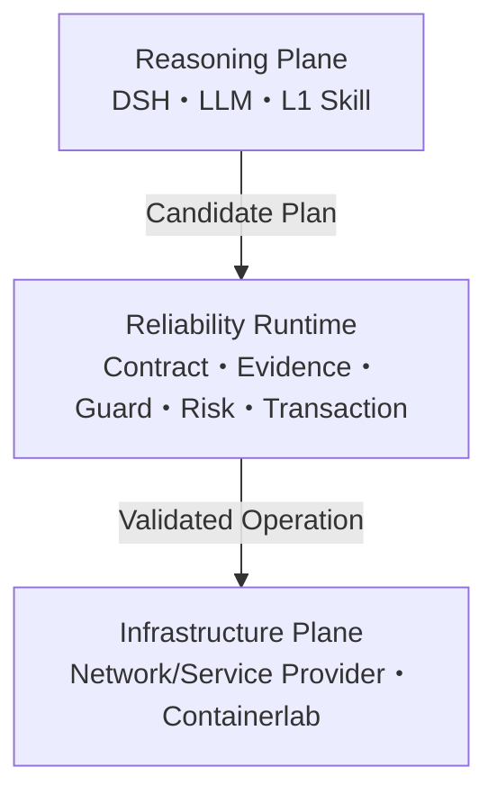

# NetOpYuAgent

EnsuredSkill 是一个网络优先的可靠执行 Runtime 原型。DSH、LLM 和 L1 Skill 负责理解、诊断与提出候选；Runtime 控制哪些操作允许执行。

项目当前聚焦**概率推理与确定执行分离**的研究原型，生产身份、HA/DR、厂商认证等后置。测试通过不等于生产成功概率；语义失败和历史负结果完整保留。见[原型准则](docs/ENSUREDSKILL-PROTOTYPE.md)。

## 中文

**当前：已获授权实施，R0 测量部分已实现，真实模型尚未运行。** [新考核与有限收敛方案](docs/EVALUATION-RESET-20260916.md)已落地预算总账、评分器、输入准备、脚本式计量和本地探针；153 项定向测试通过。已运行的[测量探针](artifacts/bounded-pilot-20260916-r0/report.json)覆盖 12 类／24 个评分 fixtures、10 项预算检查、3 项既有模拟网关机制，模型调用为 0；不代表真实 Agent 收益、自动 Effect 桥接或 36 项机制门槛通过。真实 DSH 全调用计量、可信预先 token 计数、物理 Provider 重置／隔离、预封存标签与 12 任务样本、真实 trace 采集仍待接入，尚无 `run` 命令。旧语义阶段仍为 `paused_unmet`，默认 UI、权限和正式研究门禁不变。

最近一次已知小样本仍为 **2 Skill／3 Task，结构准入3/3、完整任务0/3**。不能用编译率或安全停止冒充业务成功。[原始负结果与成本](docs/SCHEMA-ARTIFACT-CONVERGENCE.md)、[当前实现与使用](docs/GOVERNED-SESSION.md)、[进展及历史](docs/PROJECT-STATUS.md)。

### 项目设计

项目遵循三个原则：**概率推理与确定执行分离；No evidence, no action；LLM 决定尝试什么，Runtime 决定允许发生什么。**



| 层 | 权威职责 | 明确边界 |
|---|---|---|
| Reasoning Plane | 会话、开放式理解、诊断、追问、计划和 L1 编排 | 只能提出候选；产品路径没有直接写权限 |
| Reliability Runtime | Contract、journal-backed Typed Graph、跨步骤 Evidence、Guard、Risk、事务、验证和补偿；调度有界 LLM | 模型仍只给候选，confidence 不构成事实或权限 |
| Infrastructure Plane | 通过 MCP/API/CLI/NETCONF 提供事实和效果 | 不判断上层业务意图，不自报成功终态 |

新增[受控混合流程](docs/GOVERNED-HYBRID-FLOWS.md)：Runtime 按依赖调度原 L0 严格片段与有界 LLM，支持串并行、all-success 汇合和独立候选准入；开放职责可保留原始 L1，不必强行转写成确定性逻辑。LLM 不能改图、直接调用工具或绕过参数/权限校验。**含推理的整图不等于确定性 L0**；新入口为可选本地原型，不自动接入写事务。

### 研究门禁与保留基线

较早的阶段2最终 v7 使用固定的 **10 Skill / 10 仓库 / 9 个开发领域**：6 个结构候选，5 个有用读取前段。真实执行的 5 份草稿只有 **1 完成＋2 局部可用**；交接和 README 草稿仍有未支持的事实/命令。35/35 公开图接线检查、2630 项回归及 81 子测试通过。[逐例审阅与机器摘要](docs/STAGE-2-HYBRID-RESULTS.md)。

含真实 9B 的图执行 p50/p95 为 **30.79 / 46.36 秒**（5 样本，部分并发 pytest）；5 次执行消耗 29,320 输入 / 2,113 输出 token。**不是 SLO、总体准确率或新 DSH A/B**。未见泛化仍未证明；[首批失败](docs/STAGE-2-PUBLIC-TRANSFER.md)和[v65 负结果](docs/STAGE-2-REPRESENTATION-REPAIR.md)完整保留。

阶段 1（43a2b76）在 **3 种已知流程 × 2 次构造**中得到 **6/6 受审只读区域，50/50 本地路径通过**；它只证明多轮调整后的开发流程，不是公开泛化。[阶段 1 原始报告](docs/STAGE-1-RESULTS.md)。两批不能混算提升；默认 DSH 路由未变。库中 **53 Skill／38 仓库**是入库数，不是成功数。

历史修订与负结果见[语义迁移报告](docs/FLOW-SEMANTIC-TRANSFER.md)和[实验索引](docs/FLOW-EXPERIMENTS.md)，不与当前批次混算。

项目的证据顺序是 **L1→L0 泛化证明 → L0 确定性校验 → Runtime 评测**。原 100 个公开 Skill / 72 仓库 / 9 个搜索类别属于已知开发库，不是未见集；搜索类别尚不等于核实的业务领域。小批新验证及后续 ≥3 cohort、≥50 Skill、≥15 仓库、≥8 领域、≥600 case 的完整门禁见[泛化要求](docs/TRANSLATION-GENERALIZATION-GATE.md)。未通过前不扩大 Runtime A/B。

### Skill 与系统怎样交互

L1、L0.5、L0 和 Runtime Plan 不是同一种 Skill 的不同文件格式，而是不同权威等级：

| 对象 | 作用 | 能否执行写操作 |
|---|---|---:|
| L1 `SKILL.md` | 给 LLM 提供领域知识、追问和编排方法 | 否 |
| L0.5 | 把 L1 拆成可审查的参数、条件、风险、验证与补偿语义 | 否 |
| compiled L0 | 人工审查并激活的精确执行合同 | 只能被 Runtime 使用 |
| Candidate Plan | LLM 针对当前请求提出的 Tool/参数候选 | 否 |
| PreparedPlan | Runtime 绑定 Evidence、审批、Provider、TTL 和摘要后的不可变计划 | 是；且只有 Runtime 持有效果能力 |

```text
用户 → DSH/LLM → L1 选择、诊断、追问 → Candidate Plan
     → 唯一 active L0 → 参数/Evidence/Guard/Risk → plan-bound 审批
     → 写前重校验 → 单次 Effect → 独立 Verify
     → verified_success / rollback_verified / manual_intervention_required
```

合法只读请求可以沿 L1 原生读取路径执行，但仍经过 Observation Policy 和参数校验。写候选若没有唯一 active L0、精确参数或足够 Evidence，只能追问、生成 proposal、请求人工或拒绝，不能回退为原生 Agent 写入。完整的离线 authoring、在线执行、示例和证据定位见 [Skill 与系统交互全景](docs/SKILL-SYSTEM-INTERACTION.md)。

### 两项核心能力

1. **Contract-Governed Skill**：L1→L0.5→L0 是 authoring compilation；最终 L0 固定输入、证据、Guard、资源、风险、后置条件和补偿。模型只能生成待审 proposal。
2. **Evidence-Gated Transaction Runtime**：把 L0 编译为不可变计划和 Typed Execution Graph；写前 Snapshot/Precheck/Revalidate，写后独立 Verify；失败时 Reconcile/Compensate/Verify Recovery。

当前结论是：**Runtime 机制原型与接线闭环完成，但项目核心假设尚未通过跨 Skill 泛化门禁。** 历史六场景、消融和 DSH 配对只作为假设形成与机械证据；不表示 L1→L0 已高泛化，更不表示生产成功概率或真实厂商设备认证。

### 已实现能力

| 能力域 | 当前范围 |
|---|---|
| Harness | DSH 主路径；模型/L1 只输出 Candidate Plan，经窄 Worker bridge 进入 Runtime |
| L1 | LAN/DC/WAN Skill，缺参追问，多步 workflow，领域外和高风险拒绝 |
| L0 | 21 个激活合同；原子、约束、扩展、组合 Saga；21/21 三阶段可解释轨迹 |
| Promotion | L1/L0.5/L0 并排审查、语义映射、低置信告警、合同图、严格安全门禁 |
| Runtime | ReliabilityContract、journal-backed Typed Graph gate、跨步骤 Evidence provenance、Guard、Risk、写前重校验、独立验证、补偿、恢复和分阶段时延 |
| Provider | 协议无关 Observation/Effect Capability；Network Observer、Actor 和本地 Adapter |
| 网络仿真 | Containerlab + FRR：OSPF、eBGP、VLAN、EVPN/VXLAN L2VPN、故障切换和真实容器转发 |
| 评测 | 六类 ES-P0 事务场景、独立安全 scorer、五机制消融矩阵和真实 DSH 配对协议 |

Hermes/A2A、跨域业务 Lab、企业身份与审批、Provider 供应链、治理工作台、HA/DR、远端不可变审计和生产 SLO 的已有代码统一冻结，不计入当前能力或完成度。真实厂商设备、EVPN L3VPN、MPLS L2VPN/L3VPN 也不在当前原型覆盖内。

### 历史小样本结果与当前证据边界

历史 DSH 对照、消融、模型成本和失败分布分别见 [ES-P0 本地证据](docs/ES-P0-EVIDENCE.md)、[仓库外合成评测](docs/SYNTHETIC-HOLDOUT.md)、[公开 Skill 角色隔离模拟](docs/ES-P1-WILD-SIMULATED-RESULTS.md)。这些样本参与早期开发，只用于机制研究，不证明当前转译泛化或生产成功概率。当前优先查看[阶段 1 结果](docs/STAGE-1-RESULTS.md)和[当前进展](docs/PROJECT-STATUS.md)。

Runtime 结果不能只看一项 `success`：

| 终态 | 应怎样解释 |
|---|---|
| `verified_success` | 唯一正向成功；独立回读证明批准的后置条件成立 |
| `rollback_verified` | 任务失败，但 Runtime 证明已恢复基线；不能计为任务成功 |
| `precondition_changed` / `rejected` / `expired` | 写前安全停止，Effect 未被允许继续 |
| `manual_intervention_required` | 目标或恢复状态无法证明，需要人工检查，禁止自动重试或宣称成功 |

用 `scripts/netopyu-dsh runtime PLAN_ID` 可查看不可变计划、图节点、分阶段时延和 Evidence provenance；用 `runtime-audit` 验证事件摘要链。

### 支持的典型场景

- 新员工应用访问开通：身份、应用、审批、权限 MCP 与网络 L0 Saga 联动；
- LAN 用户接入诊断、授权、撤销和回滚；
- DC 应用访问、Fabric 配置、EVPN/VXLAN L2 路径诊断；
- OSPF/eBGP 路径查询、链路故障切换和恢复；
- 设备配置 edit/push、部署 rollback、节点 drain、服务 restart/rollback；
- L1 Skill 转 L0.5/L0 的 proposal、语义审查和离线资格工作流；
- REST/MCP/SSH/NETCONF/Controller Provider 接入前的合同检查。

### 快速开始

依赖：Python 3.11/3.12、Node.js 22.19+ 或 24+、pnpm、Ollama。Containerlab 场景另需 Linux/Docker/Containerlab。

```bash
git clone https://github.com/kevinyjk25/NetOpYuAgent.git
cd NetOpYuAgent
python3 -m venv .venv
source .venv/bin/activate
pip install -r requirements.txt -r requirements-dev.txt

ollama pull qwen3.5:9b
scripts/netopyu-dsh install
scripts/netopyu-dsh settings-sync
scripts/netopyu-dsh model qwen3.5:9b
scripts/netopyu-dsh doctor
scripts/netopyu-dsh start
```

打开 <http://127.0.0.1:3080/>。若该端口已被占用，使用 `NETOPYU_DSH_PORT=3081 scripts/netopyu-dsh restart`，并始终以 `scripts/netopyu-dsh status` 输出为准。

### 如何使用

先看三条 Golden Path 和本机就绪状态：

```bash
scripts/netopyu doctor
scripts/netopyu journeys
scripts/netopyu agent-usecases
scripts/netopyu evaluate
```

`agent-usecases` 会给出三个可直接粘贴到 DSH 页面、真正包含 LLM Tool loop 的用例：Runtime L1→L0、L1→L0.5→L0 authoring、四类 MCP 外部系统集成。详细 Prompt 与预期证据见[真实 LLM Agent 用例](docs/AGENTIZED-USE-CASES.md)。

验证自己的外部系统接入包，不连接或激活目标系统：

```bash
scripts/netopyu integration-check \
  --pack examples/integration-rest-mcp/pack.yaml
```

开发和审查 L0：

```bash
scripts/netopyu-l0 validate
scripts/netopyu-l0 list
scripts/netopyu-l0 explain network.lan.user-access.grant
scripts/netopyu-l0 runtime-trajectories-validate
scripts/netopyu-l0 workbench-export \
  --proposal /path/to/proposal --output /tmp/semantic-review.html
```

创建仓库外、角色隔离的正向资格工作区：

```bash
scripts/netopyu-l0 forward-eval-study-kit --output-root /private/forward-study
scripts/netopyu-l0 forward-eval-study-doctor --root /private/forward-study
```

没有独立业务团队时，可先自动生成明确标记为 synthetic、且不能通过正式 ES-P1 门禁的封存用例：

```bash
scripts/netopyu-synthetic-study export /private/synthetic-study --cases 240
cd /private/synthetic-study
env -u PYTHONPATH python3 generate.py --model qwen3.5:9b --resume
```

检查通用 Anthropic Skill 包及其安全路由：

```bash
scripts/netopyu-effect inspect-package --skill /path/to/my-skill
python -m evaluation.progressive_skill_suite
python -m evaluation.general_effect_model \
  --dataset-root /private/synthetic-study \
  --model qwen3.5:9b --output-root artifacts/es-p0-9b-translation
scripts/netopyu-harness-ab \
  --dataset-root /private/synthetic-study \
  --model qwen3.5:9b \
  --translation-report artifacts/es-p0-9b-translation/model-translation.json \
  --output-root artifacts/es-p0-dsh-9b \
  --stratified-patterns --repetitions 3
scripts/netopyu-synthetic-study report /private/synthetic-study \
  --translation-report artifacts/es-p0-9b-translation/model-translation.json \
  --dsh-report artifacts/es-p0-dsh-9b/real-harness-ab.json \
  --output-root artifacts/es-p0-synthetic-evidence
```

Containerlab 实验、审批卡、回滚证据和 Provider 接入的完整操作见[使用与系统接入](docs/getting-started-integration.md)。

### 文档入口

- [文档导航与权威边界](docs/README.md)
- [Skill 与系统交互全景](docs/SKILL-SYSTEM-INTERACTION.md)
- [项目进展与路线图](docs/PROJECT-STATUS.md)
- [架构与 ADR](ARCHITECTURE.md)
- [高层设计](HLD.md)、[低层设计](LLD.md)、[安全设计](SSD.md)
- [ES-P0 本地证据报告](docs/ES-P0-EVIDENCE.md)
- [ES-P1-Wild 角色隔离模拟结果](docs/ES-P1-WILD-SIMULATED-RESULTS.md)
- [仓库外合成 Holdout](docs/SYNTHETIC-HOLDOUT.md)
- [通用渐进式确定化与跨域验证](docs/progressive-determinization.md)
- [真实 Harness 自动 Runtime A/B](docs/general-effect-ab.md)
- [L1 → L0 Promotion](docs/l1-to-l0-promotion.md)
- [正向资格协议](docs/promotion-forward-qualification.md)
- [Runtime A/B 基线](docs/benchmarks/runtime-ab-baseline.md)

---

## English

**Current: implementation authorized; R0 measurement partially implemented, with no real-model run.** The [bounded protocol](docs/EVALUATION-RESET-20260916.md) now has a persistent budget ledger, scorer, input preparation, scripted metering and local probes; 153 targeted tests pass. The executed [measurement probe](artifacts/bounded-pilot-20260916-r0/report.json) covers 24 scorer fixtures across 12 families, ten budget checks and three existing simulated-gateway mechanisms, with zero model calls. It establishes neither real-agent benefit, an automatic Effect bridge nor the 36-probe gate. Live DSH metering, trusted advance token counts, physical Provider reset/isolation, frozen reference labels and twelve tasks, and real trace capture remain outstanding; there is no `run` command. The old semantic stage remains `paused_unmet`; default UI, authority and formal gates are unchanged.

The latest known sample remains **two Skills/three tasks: 3/3 structural admissions, 0/3 complete tasks**. Compilation and safe stopping are not business success. See [negative evidence and costs](docs/SCHEMA-ARTIFACT-CONVERGENCE.md), [implemented workflow](docs/GOVERNED-SESSION.md) and [status/history](docs/PROJECT-STATUS.md).

EnsuredSkill is a network-first Reliability Runtime research prototype. DSH, the LLM, and L1 Skills produce hypotheses and Candidate Plans; Contract, Evidence, Guard, Risk, and transactional state determine what is allowed to reach the network.

The [authoritative prototype charter](docs/ENSUREDSKILL-PROTOTYPE.md) supersedes conflicting production-engineering plans. Enterprise identity, provider supply chain, multi-team governance, Hermes/A2A productization, HA/DR, WORM audit, and production SLOs are frozen future work rather than current architecture or exit criteria.

### Design

Separate probabilistic reasoning from deterministic execution: the LLM proposes what to attempt, while the Runtime decides what is allowed. No evidence means no action.

| Layer | Authority | Boundary |
|---|---|---|
| Reasoning Plane | DSH, LLM, L1 understanding, diagnosis, clarification and planning | proposes only; the product path has no direct write authority |
| Reliability Runtime | Contract, typed graph, Evidence, Guard, Risk, transaction, verification/compensation and bounded LLM scheduling | model outputs remain candidates; confidence grants neither truth nor authority |
| Infrastructure Plane | network/service Providers over MCP/API/CLI/NETCONF and labs | owns facts and effects, but cannot self-declare a verified terminal outcome |

The [governed hybrid workflow](docs/GOVERNED-HYBRID-FLOWS.md) composes original strict regions, bounded model tasks, explicit dependencies, parallel/all-success joins and independent candidate admission. Original L1 duties may be retained without forced deterministic paraphrasing. Models cannot mutate graphs, directly call tools or bypass parameter/permission checks. This opt-in local prototype adds no automatic Effect integration; a mixed workflow is not wholly deterministic.

L1, L0.5, L0, and a Runtime plan have different authority. L1 is natural-language semantic guidance; L0.5 is a review-only structured proposal; only an explicitly reviewed and activated compiled L0 can govern an effect. A per-request Candidate Plan remains untrusted until the Runtime resolves the exact L0, grounds parameters, validates evidence/guards/risk, and creates a plan-bound approval. An unqualified read may remain read-only; an unqualified write stops safely and never regains native-Agent write authority. See the [complete Skill-to-system interaction guide](docs/SKILL-SYSTEM-INTERACTION.md).

The two core capabilities are:

1. **Contract-Governed Skill authoring.** L1→L0.5→L0 preserves readable intent while producing an executable contract. It creates review proposals only and is distinct from trace-based Experience Compilation.
2. **Evidence-Gated transactional execution.** An active L0 becomes an immutable plan and typed graph. Runtime snapshots, prechecks, revalidates, executes, verifies, commits, reconciles uncertainty, compensates, verifies recovery, and audits terminal evidence.

The Runtime mechanism and wiring prototype is complete, but the core project hypothesis has not yet passed cross-Skill translation generalization. Historical provenance, ablation, and paired-Harness results are retained as hypothesis-forming evidence; they do not establish broad L1-to-L0 validity, real-device qualification, or production readiness.

### Active research gate

Frozen v7 retains ten Skills/ten repositories/nine developer domains: six structural proposals and five useful read prefixes. Actual output review accepts **one scoped request and two partial analyses**, while handoff/README drafts retain unsupported facts/commands. Public graph checks pass 35/35; full regression passes 2630 tests plus 81 subtests. Model-inclusive graph p50/p95 is **30.79/46.36 seconds** (n=5, some concurrent pytest); five calls consume 29,320 input / 2,113 output tokens. This is not an SLO, population accuracy or new DSH A/B. See [all reviews and metrics](docs/STAGE-2-HYBRID-RESULTS.md). The [first negative batch](docs/STAGE-2-PUBLIC-TRANSFER.md), [v65 results](docs/STAGE-2-REPRESENTATION-REPAIR.md) and [Stage 1 evidence](docs/STAGE-1-RESULTS.md) remain separate. Inventory is not successful translation coverage.

Earlier development experiments, negative results and source-expression revisions remain in the [historical report](docs/FLOW-SEMANTIC-TRANSFER.md); they are not pooled with current results.

Evidence order remains **L1-to-L0 generalization → L0 validation → Runtime evaluation**. The original 100 public Skills from 72 repositories/nine discovery-query strata are known development data; query strata are not verified business domains. Large Runtime A/B remains gated by at least three disjoint unseen cohorts totaling 50 Skills, 15 repositories, eight domains and 600 cases, including the unchanged [quality thresholds](docs/TRANSLATION-GENERALIZATION-GATE.md).

### Capabilities and evidence

The active prototype includes 21 reviewed L0 contracts and readable three-stage trajectories, LAN/DC/WAN L1 guidance, the DSH path, a journal-backed Typed Graph gate, cross-step evidence provenance and stage latency, network Observation/Effect providers, Containerlab/FRR labs, and the ES-P0 evaluation protocol. Hermes/A2A, enterprise controls, supply-chain admission, governance, and extra domains are frozen experimental code rather than active capability claims.

Historical metrics, controls, limitations, failures and reproduction commands are in [ES-P0 evidence](docs/ES-P0-EVIDENCE.md), [synthetic holdout](docs/SYNTHETIC-HOLDOUT.md) and [public-Skill role-isolated simulation](docs/ES-P1-WILD-SIMULATED-RESULTS.md). These are hypothesis-forming developer evidence, not current translation-generalization or production probabilities. Read [current progress](docs/PROJECT-STATUS.md) and [Stage 1 results](docs/STAGE-1-RESULTS.md) first. Verified success requires independent postcondition evidence; verified rollback means task failure with demonstrated recovery, not task completion.

### Quick start

```bash
python3 -m venv .venv
source .venv/bin/activate
pip install -r requirements.txt -r requirements-dev.txt
ollama pull qwen3.5:9b
scripts/netopyu-dsh install
scripts/netopyu-dsh settings-sync
scripts/netopyu-dsh model qwen3.5:9b
scripts/netopyu-dsh doctor
scripts/netopyu-dsh start
```

Open <http://127.0.0.1:3080/>. Use `scripts/netopyu-dsh status` as the authoritative URL/process check.

```bash
scripts/netopyu doctor
scripts/netopyu journeys
scripts/netopyu agent-usecases
scripts/netopyu evaluate
scripts/netopyu integration-check --pack examples/integration-rest-mcp/pack.yaml
```

The Agent use-case command prints three paste-ready real-LLM DSH journeys: L1-to-L0 Runtime execution, proposal-only L1-to-L0.5-to-L0 authoring, and four-system MCP integration. See the [Agent use cases](docs/AGENTIZED-USE-CASES.md) and [integration guide](docs/getting-started-integration.md).

For L0 development and external qualification:

```bash
scripts/netopyu-l0 validate
scripts/netopyu-l0 runtime-trajectories-validate
scripts/netopyu-l0 forward-eval-study-kit --output-root /private/forward-study
scripts/netopyu-l0 forward-eval-study-doctor --root /private/forward-study
scripts/netopyu-effect inspect-package --skill /path/to/my-skill
```

### Documentation

Start with the [documentation map](docs/README.md), [Skill-to-system interaction guide](docs/SKILL-SYSTEM-INTERACTION.md), [project status](docs/PROJECT-STATUS.md), [architecture](ARCHITECTURE.md), [HLD](HLD.md), [LLD](LLD.md), [SSD](SSD.md), the [ES-P0 local evidence report](docs/ES-P0-EVIDENCE.md), and the [repository-external synthetic holdout](docs/SYNTHETIC-HOLDOUT.md).
