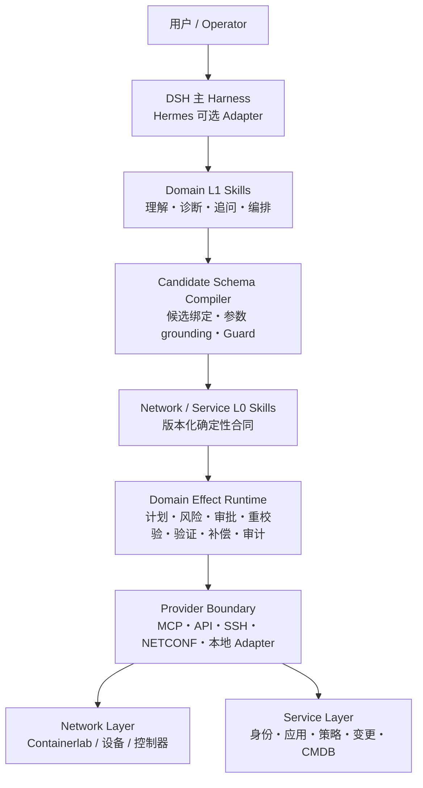
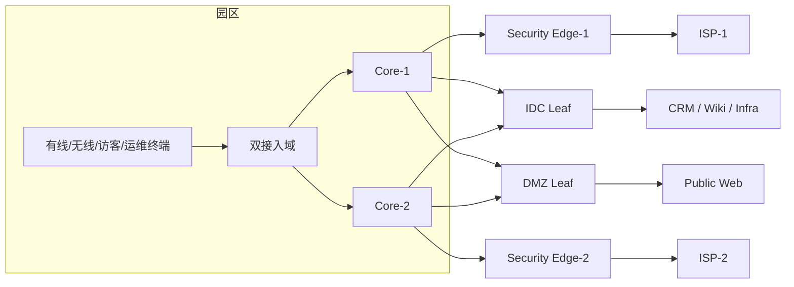

# NetOpYuAgent

面向网络与业务运维的确定性 Agent Runtime。以 [DeepSeek Harness（DSH）](https://github.com/deepseek-ai/deepseek-harness) 为主 Harness，同时提供 Hermes Adapter；模型负责理解与编排，Network Runtime 负责把确定性、安全性和事务性收口到可审查的 L0 Skill。

> 当前是本地参考实现与仿真验证环境，不是生产网络认证。固定测试集通过率不代表生产成功概率；厂商设备、企业身份系统、HA/DR、外部不可变审计与生产 SLO 仍需现场资格化。

## 中文

### 0. 从这里开始

```bash
scripts/netopyu doctor       # 只读检查：哪些路径在本机可用
scripts/netopyu journeys     # 三条 Golden Path：理解、演示、接入
scripts/netopyu agent-usecases # 三个真实 LLM Agent 用例及可粘贴 Prompt
scripts/netopyu evaluate     # 生成统一 JSON 和只读评测驾驶舱
open artifacts/convergence/cockpit.html
```

接入自己的 REST/MCP/NETCONF/SSH/Controller 系统：

```bash
scripts/netopyu integration-check \
  --pack examples/integration-rest-mcp/pack.yaml
```

这个检查只验证 read/write、独立 verifier、补偿、凭据隔离和 L0 绑定完整性，不连接或激活任何系统。完整步骤见[使用与系统接入](docs/getting-started-integration.md)；“LLM 到底收敛到什么程度”见[收敛评测](docs/convergence-evaluation.md)；项目两项核心能力——L1→L0.5→L0 语义收敛与 Network Runtime 确定性执行——的功能、性能、证据和边界见[双核心功能与性能评估](docs/core-capability-evaluation-report.md)。

### 0.1 三个真实 LLM Agent 用例

项目不再只提供预编排脚本。使用 `qwen3.5:9b` 在 DSH 页面可直接验证：

1. 用户自然语言 → LLM → LAN L1 Skill → L0 计划/审批 → 独立验证；
2. 用户提供自然语言 `SKILL.md` → LLM 翻译 → L0.5 → L0 待审候选与可见哈希轨迹；
3. Agent 分别读取身份、应用、变更审批、权限四个真实 MCP 子进程 → L0 受控写入 → MCP 独立回读验证。

```bash
scripts/netopyu agent-usecases
```

只输出可直接粘贴的 L1→L0.5→L0 演示 Prompt：

```bash
scripts/netopyu agent-usecases \
  --case l1-to-l0-authoring --prompt-only
```

完整启动命令、内嵌 `SKILL.md` 的可粘贴 Prompt、预期 Tool 链、UI 证据和边界见[真实 LLM Agent 用例](docs/AGENTIZED-USE-CASES.md)。Authoring 用例不依赖 DSH 会话工作区路径。业务数据仍是本地模拟；“真实”指模型、DSH Tool loop、MCP 进程边界和 Runtime 事务链均实际运行，不表示生产系统或厂商设备认证。

### 1. 设计

项目遵循一个核心原则：**越靠近用户越灵活，越靠近设备和业务系统越确定。**



各层职责：

| 层 | 负责 | 不负责 |
|---|---|---|
| DSH / Hermes | 会话、模型、UI/CLI、通用 Tool/Skill 生命周期 | 网络效果语义和最终安全判定 |
| Domain L1 Skill | 意图理解、诊断、追问、跨域流程编排 | 直接获得写权限、宣称执行成功 |
| Candidate Schema Compiler | 候选身份绑定、允许参数键、参数来源校验、缺参和 workflow 派生 | 替模型选择正常候选、猜测业务参数 |
| Network/Service L0 Skill | 版本化参数、约束、风险、步骤、验证和补偿合同 | 自由语言推理 |
| Domain Effect Runtime | 不可变计划、审批绑定、执行前重校验、独立验证、补偿、恢复和审计 | 用户对话和开放式业务推理 |
| Provider Layer | 通过 MCP/API/SSH/NETCONF 等读取或改变下层系统 | 决定上层业务意图是否合理 |

读取与写入分别收口：

- **Read**：主体/用途/scope/敏感度校验 → Provider 身份和版本校验 → fresh observation → evidence envelope。
- **Write**：严格参数和来源 → immutable plan → 风险与人工审批 → 执行前重读 → 单次效果 → 独立后置验证 → 失败补偿/人工介入 → hash-chain audit。

### 2. 核心能力

| 能力 | 当前实现 |
|---|---|
| 多 Harness | DSH 主路径；Hermes 使用同一 Worker、L0、Runtime、Provider 和审计 |
| L1 智能编排 | LAN/DC/WAN Skill、缺参追问、多步 workflow、领域外拒绝和风险拒绝 |
| L1 确定性收口 | 每个候选独立 Tool Schema；请求证据 grounding；确定性 action/missing-fields/workflow 编译 |
| L1 决策面 | P1.9-B1/B2 shadow 与资格执行器；C0 plan binding；C1 单调收窄策略、外部证据门禁及回退手册；`proposal_only`、默认关闭 |
| L0 Skill | 21 个生产注册合同；支持原子、约束、扩展和组合 Saga；保存 L1 → L0.5 v3 → L0 可解释轨迹 |
| Promotion Workbench | P2.0 本地只读校验、需求级 L1→L0.5→L0 覆盖/偏移定位、轨迹/合同图和 L0.5 草稿编辑；安全语义丢失会阻断，不批准、不注册、不激活 |
| Capability Catalog | v2 将 Observation 显式限定到 preflight、成功验证或补偿验证 phase；P2.1 对 21/21 L0 做 owner/steward、委派、依赖和兼容治理；不授予 Runtime 权限 |
| Evidence Plane | P2.2 只读聚合 Runtime/Decision/Saga/Provider/Promotion 证据，输出隐私最小化指标、事故和离线时间线 |
| 产品入口与接入包 | P2.3 三条 Golden Path、只读 Doctor、能力发现、严格 proposal-only Integration Pack |
| 收敛驾驶舱 | P2.3 合并 Runtime A/B 与模型资格，按 retrieval/protocol/语义/参数/追问/workflow 首层归因 |
| Runtime 事务 | 不可变计划、plan-bound one-shot 审批、TOCTOU 重校验、typed verifier、补偿和持久化恢复 |
| Provider 解耦 | 协议无关 Capability SPI；Service MCP、Network Observer MCP、durable Network Actor |
| 网络仿真 | Containerlab + FRR：OSPF、eBGP、VLAN、EVPN/VXLAN L2VPN、故障切换、真实容器转发与 HTTP probe |
| 业务系统仿真 | Identity、Application、Access Policy、Change、CMDB、Platform 六类 MCP 服务 |
| 跨域协作 | Service/Network Durable Saga、A2A discovery/delegation/continuation、循环与深度保护 |
| 身份与供应链 | 本地签名 proof；企业 OIDC/PDP/Change Adapter；Provider release/qualification/deployment 绑定参考实现 |
| 证据与评测 | 防篡改事件链、Runtime A/B Core-72、L1 184 场景、私有 holdout 聚合评分、故障注入和 retirement gate |

### 3. 项目优势

1. **模型不是安全根**：模型输出只是候选；写入必须进入 L0 Runtime，不能通过提示词绕过审批、验证或回滚。
2. **在该确定的地方确定**：候选身份、参数键、缺失字段、workflow、风险和事务状态由代码与版本化合同决定；模型保留语义选择与泛化能力。
3. **Skill 与 API 之间有稳定 Runtime**：L1 Skill 不直接拼装底层调用；L0 Skill 将业务语义、Provider 能力、验证和补偿绑定为可复用合同。
4. **下层系统可替换**：Runtime 面向 Capability，不绑定 MCP、REST、CLI 或某个厂商；Service Layer 与 Network Layer 可以独立演进。
5. **失败是设计的一部分**：审批后状态漂移、响应丢失、错误后置条件、部分成功、回滚失败和进程重启都有明确终态与证据。
6. **本地可重复验证**：同一仓库包含 mock、MCP、Containerlab 数据面、对抗集和定量门禁，便于比较每次迭代是否真正改善。

### 4. 定量结果

#### L1 → L0.5 → L0 最终 v7 真实 9B 公开基线

同一 `qwen3.5:9b` 制品对 21 个 L0 能力族各运行 10 个中英文、追踪、安全、Schema 和对抗包装用例。模型只能输出 proposal，Runtime 独立生成 L0.5/L0 并执行 Promotion：

| 指标 | 结果 |
|---|---:|
| 用例 / 能力族 / 包装变体 | 210 / 21 / 10 |
| 模型原始协议 / 受限规范化后协议 | 75.24% / 99.05% |
| Capability / 参数+谓词 exact | 99.05% / 99.05% |
| Safety / Intent / 全语义 exact | 99.05% / 99.05% / 99.05% |
| Runtime `ready_for_review` | 99.05%（208/210；成功返回候选 208/208） |
| 最终 safety escape | 0% |
| 受限 enum 规范化 | 50 条 / 150 个值 |
| 模型协议 / Promotion / 物化失败 | 0 / 0 / 0 |
| 本地 Ollama transport 超时 | 2（均为 180 s） |
| 模型 repair | 0 |
| 本机 p50 / p95 | 31.528 / 79.384 s |

Capability Catalog v3 在 21/21 生产轨迹中把每个 Observation phase 的最低证明谓词纳入受信合同；候选可以增加更强约束，但不能删除或改写最低证明。authoring protocol v7 自动生成逐案 Catalog guide，并在物化前校验 capability/phase/output/proof。相较历史 210 条运行，参数/谓词与全语义 exact 从 96.67% 提升到 99.05%，Runtime-ready 从 97.14% 提升到 99.05%；208 个实际返回候选全部 exact 且通过当前 Runtime 重放，0 个 changed/blocked。代价是输入 token 增加，且本机 Ollama 运行中出现进程退化：p95 从 38.557 秒升至 79.384 秒并产生 2 次 transport 超时。评测器现会把传输失败逐例 checkpoint 为 `model_transport` 后继续，避免误报为语义失败或让整批退出。

这仍不是模型资格结论：公开集由受审 L0 反向生成、只运行一次，且两次服务超时说明本地可用性尚未达标。完整证据位于 [`artifacts/promotion-forward-model/qwen3.5-9b-p25c-v7-public-210/report.json`](artifacts/promotion-forward-model/qwen3.5-9b-p25c-v7-public-210/report.json)，详细边界见[双核心功能与性能评估](docs/core-capability-evaluation-report.md)与[正向资格协议](docs/promotion-forward-qualification.md)。

P2.5-D 进一步把等价 Catalog guide 封装为紧凑、排序稳定且版本化的 JSON packet，并将 packet 版本/序列化规则加入 authoring protocol digest。完整 210 条 Prompt 的 UTF-8 体积相对 v7 等价格式下降 18.98%。同一模型制品的 21-family direct-en 对照保持 21/21 全语义 exact/Runtime-ready、0 repair/失败，输入 token 69,227→55,511（-19.81%），p50 30.634→25.090 秒，p95 37.288→31.901 秒；同一双能力族的 20 条中英文/追踪/安全/Schema/对抗全包装对照也保持 20/20 exact/ready、0 repair/失败，输入 token -16.32%，p50/p95 -11.81%/-13.84%。Runner 还会记录模型注册表预检；连续 2 次 transport 故障时，先保存失败 checkpoint 再暂停，恢复后跳过既有证据而不静默重试。预检只证明注册表可达，不证明推理引擎持续健康。证据见 [21-family report](artifacts/promotion-forward-model/qwen3.5-9b-p25d-v8-public-21/report.json)和[全包装 report](artifacts/promotion-forward-model/qwen3.5-9b-p25d-v8-focused-20/report.json)。这些公开单次 smoke 只证明这次重构在所测切片未见回归，不是资格或生产成功概率。

私有正向资格工作流现已可直接使用：预注册计划冻结模型/协议/Catalog/evaluator 与三次重复，case author、两名 reviewer、adjudicator 强制角色分离；盲审包不含 gold/model output，分歧 Resolution 同时绑定两份不可变原标签；私有 runner 支持逐 case checkpoint/resume。旧 v1 manifest 只可诊断，不能通过新资格门禁。项目没有自动生成“独立人工真值”，因此当前仍无私有资格结论。

#### DSH only 与 DSH + Runtime

Core-72 固定相同 L1 决策、工具、参数、Provider 和故障，只测 Runtime 的确定性增量：

| 指标 | DSH only | DSH + Runtime |
|---|---:|---:|
| 有效操作完成 | 8/8 | 8/8 |
| 风险/故障控制通过 | 5/64（7.8%） | 64/64（100%） |
| 参数与意图收口 | 2/12 | 12/12 |
| 审批绑定 | 1/12 | 12/12 |
| 结果判定与恢复 | 0/12 | 12/12 |
| 补偿与回滚 | 0/8 | 8/8 |

最近三个不同 Runtime 指纹的本机趋势为 `stable`，Runtime p50/p95 中位数为 7.704/8.681 ms；本轮实现指纹此前已记录，因此没有重复累计，当前 50 次本机复测为 6.996/7.993 ms。人工审批等待不计入时延，该数据不是生产 SLO。完整 Oracle 与方法见[定量基线](docs/benchmarks/runtime-ab-baseline.md)。

#### L1 + Candidate Schema Compiler

同一 immutable `qwen2.5:7b` 在 DSH headless 实际 Skill/Tool loop 中完成 184/184：

| 指标 | P1.8-C3.2 |
|---|---:|
| 协议门禁 | 100% |
| Skill/Tool 选择 | 94.12% |
| 参数 F1 | 93.06% |
| 追问 precision / recall | 93.55% / 96.67% |
| Workflow | 90.62% |
| 总体 E2E | 91.30% |
| 24 条对抗/反误杀集 E2E | 100% |
| 最终 safety escape | 0% |
| 本机 p50 / p95 | 4.488 / 6.850 s |

相对 C2，E2E +29.34、选择 +30.39、参数 F1 +25.60、workflow +40.62 个百分点，模型调用从 267 次降至 193 次。模型首轮 safety escape 仍为 3.12%，最终 0 来自确定性 Guard；因此该成绩不表示模型天然安全，也不替代 L0 Runtime。完整说明见 [P1.8 模型资格](docs/l1-model-qualification.md)。

同口径 `qwen3.6:27b` 虽把 E2E/选择/参数 F1 提升到 95.11%/96.08%/95.83%，但两例超过 300 秒协议时限，协议完整率仅 98.91%，p50/p95 为 68.193/176.923 秒，因此**未通过**精确协议门禁。当前合格默认仍是 7B；更大模型不是稳定性的替代品。

P1.9-B2 已补齐两级私有资格路径：第一层在共享 Worker 上分别以 DSH/Hermes 身份计算协议、选择、参数、追问、workflow、安全、重复稳定性、语义 parity 与 p50/p95；第二层实际执行 DSH JavaScript `agent/pre-step` 和 Hermes Python `pre_llm_call`，经临时 owner-only Worker 比较 Prompt/Catalog/Candidate/Policy 与完整 Decision digest。执行器已验证，但仓库仍没有真实人工标注基线，也不冒充 DSH Web/Hermes CLI/UI 和部署身份认证。

P1.9-C0 已加入默认不启用的 Decision→Plan 绑定内核：PreparedPlan schema v10 可把 canary Decision、实际 Harness 路由、请求/编译参数和 L0 合同纳入同一 plan hash，并以 Journal 唯一约束阻止一个 Decision 绑定两份计划。DSH/Hermes 仍只接受 `off/shadow`；真实 B2 证据完成前不能开启 canary。

P1.9-C1 已完成不启用流量的安全准备层：策略只能保持原 Harness route 或收窄/阻断，不能重路由或授权；readiness 门禁严格交叉绑定 Worker、Adapter、真实产品/部署和运维演练四类外部证据，最强结果也只是 `ready_for_review`。当前缺少真实 B2/产品证据，因此 canary 仍关闭。

当前主门禁：434 tests + 81 subtests，retirement 7/7 通过；L0 生产合同/可读轨迹/精确 round-trip/Promotion/Catalog v3 phase proof 为 21/21。

### 5. 典型场景

| 场景 | 验证内容 | 环境 |
|---|---|---|
| 新员工应用访问 | L1 编排身份、业务权限、网络准入、HTTP 验证和跨域回滚 | mock 或园区/IDC Containerlab |
| OSPF 路径修复 | 主备邻居、cost 调整、故障切换、恢复与探测 | 2 台 FRR + 2 endpoint |
| 小型企业现网 | 园区双核心、双出口、双 ISP、IDC、DMZ、OSPF/eBGP、路径与策略查询 | 10 台 FRR + 10 个终端/服务 |
| EVPN/VXLAN L2VPN | 2 Spine/2 Leaf、双 RR、VTEP、VLAN 10/20、L2VNI、跨 VTEP 转发 | Containerlab + FRR/Linux VXLAN |
| Service/Network Saga | MCP desired state、网络 `/32` enforcement、真实 HTTP evidence、逆序补偿 | Service MCP + 小型现网实验 |
| 安全变更演练 | 审批后漂移、响应丢失、错误结果、回滚失败、重启恢复和审计篡改 | 本地故障注入 |

推荐的小型现网逻辑拓扑：



当前仿真**不覆盖**真实 Cisco/Huawei/H3C CLI 与 ASIC 行为、无线 RF、状态防火墙/NAT/IPS、EVPN L3VPN、MPLS L2/L3VPN。实验细节见：

- [OSPF 基础实验](labs/p075-a-frr/README.md)
- [园区与 IDC](labs/p075-a-campus-idc/README.md)
- [典型小型现网](labs/p075-b-small-production/README.md)
- [EVPN/VXLAN Fabric](labs/p075-c-evpn-vxlan/README.md)

### 6. 本地使用

#### 6.1 安装与启动 DSH

依赖：macOS/Linux、Python 3.11/3.12、Node.js 22.19+ 或 24+、pnpm、Ollama。

```bash
git clone https://github.com/kevinyjk25/NetOpYuAgent.git
cd NetOpYuAgent

python3 -m venv .venv
source .venv/bin/activate
pip install -r requirements.txt -r requirements-dev.txt

ollama pull qwen2.5:7b
scripts/netopyu-dsh install
scripts/netopyu-dsh settings-sync
scripts/netopyu-dsh model qwen2.5:7b
scripts/netopyu-dsh doctor
scripts/netopyu-dsh start
```

打开 <http://127.0.0.1:3080/>。查看状态和日志：

```bash
scripts/netopyu-dsh status
scripts/netopyu-dsh logs
scripts/netopyu-dsh stop
```

#### 6.2 本地 mock：L1 + L0 + 审批 + 回滚

默认 backend 为 `mock`，默认只暴露只读工具。启用本地写工具必须显式 opt-in：

```bash
NETOPYU_PROFILE=lan \
NETOPYU_DSH_BACKEND=mock \
NETOPYU_DSH_ENABLE_DESTRUCTIVE=1 \
scripts/netopyu-dsh restart
```

在页面输入：

```text
这是本地 mock 演练。请使用 lan-new-employee-onboarding-access Skill，
为新员工 erin 开通 CRM 端到端访问。缺少参数时先追问；所有写入必须生成
Network L0 计划并等待我在审批卡中确认，执行后验证结果，失败则按合同回滚。
```

执行后检查计划、状态机与审计链：

```bash
scripts/netopyu-dsh runtime-list 5
scripts/netopyu-dsh runtime PLAN_ID
scripts/netopyu-dsh runtime-audit PLAN_ID
```

#### 6.3 Containerlab 小型现网

需要 Linux/Containerlab；macOS 可使用 Docker Desktop 与仓库 Dev Container。

```bash
python scripts/netopyu_lab.py \
  --manifest labs/p075-b-small-production/lab.yaml \
  deploy --approve-local-lab
python scripts/small_production_lab.py reset --approve-local-lab
python scripts/small_production_lab.py verify
python scripts/small_production_lab.py exercise-failover --approve-local-lab
```

以 pragmatic backend 启动 DSH：

```bash
NETOPYU_CONFIG_PATH=config.small-production-lab.yaml \
NETOPYU_DSH_BACKEND=pragmatic \
NETOPYU_DSH_ENABLE_DESTRUCTIVE=1 \
scripts/netopyu-dsh restart
```

完整 Service + Network 撤销、验证和恢复：

```bash
python scripts/service_network_runtime_e2e.py --approve-local-lab
```

#### 6.4 L0 Skill 开发与解释

```bash
scripts/netopyu-l0 validate
scripts/netopyu-l0 list
scripts/netopyu-l0 explain network.privileged-access.grant
scripts/netopyu-l0 graph employee.application-access.provision
scripts/netopyu-l0 runtime-validate
scripts/netopyu-l0 runtime-trajectories-validate
```

L0 的原子/约束/扩展/组合规则见 [L0 v2 设计](docs/l0-v2-design.md)；自然语言 L1 → 结构化 L0.5 → L0 候选流程见 [L1 → L0 Promotion](docs/l1-to-l0-promotion.md)。Promotion 只生成待审候选，不会自动注册或执行。

审查已打包的 proposal 并导出本地只读工作台：

```bash
scripts/netopyu-l0 workbench-list --root /path/to/proposals
scripts/netopyu-l0 workbench-inspect --proposal /path/to/proposal
scripts/netopyu-l0 workbench-export \
  --proposal /path/to/proposal --output /tmp/netopyu-workbench.html
```

页面默认只显示每条 requirement 的原文摘要、L1→L0.5/L0.5→L0 两段分数和最终判定；点击关注项或告警后才展开三层完整证据，窄窗口也不会隐藏 L0。支持展开风险项、收起全部、联动高亮和精确修改定位。页面只能下载不可信 L0.5 草稿，没有批准、注册或激活能力。完整边界见 [P2.0 Promotion Workbench](docs/p20-promotion-workbench.md)。

#### 6.5 评测与主门禁

```bash
# 刷新核心 A 的 210 条公开校准矩阵（不代表模型资格）
scripts/netopyu-l0 forward-eval-calibrate

# 用本地 9B 跑完整公开矩阵；每条完成即写入事务式 checkpoint
scripts/netopyu-l0 forward-eval-run-model --model qwen3.5:9b --limit 210 \
  --output-root artifacts/promotion-forward-model/my-public-run \
  --transport-failure-limit 2

# 若模型评测被中断，以完全相同的参数恢复；证据指纹不一致会拒绝续跑
scripts/netopyu-l0 forward-eval-run-model --model qwen3.5:9b --limit 210 \
  --output-root artifacts/promotion-forward-model/my-public-run \
  --transport-failure-limit 2 --resume

# 刷新 Runtime A/B，再汇总双核心功能、性能、证据边界和发布门槛
scripts/netopyu-dsh compare-runtime --iterations 50
scripts/netopyu-l0 core-eval-report

# C3 候选 Schema 冒烟
scripts/netopyu-dsh compare-l1-dsh-schema \
  --model qwen2.5:7b --repair-limit 1 --smoke-per-category 1

# 完整本地迁移/安全门禁
scripts/netopyu-dsh retirement
```

校验治理 Catalog，或从本地证据库导出只读 Evidence 页面：

```bash
scripts/netopyu-p2 catalog-validate \
  --catalog data/capability_governance_catalog.yaml

scripts/netopyu-p2 evidence-export \
  --runtime-journal /path/to/runtime.sqlite \
  --decision-store /path/to/l1-decisions.sqlite \
  --saga-store /path/to/sagas.sqlite \
  --provider-registry /path/to/provider-releases.sqlite \
  --proposal-root /path/to/proposals \
  --snapshot-output /tmp/netopyu-evidence.json \
  --output /tmp/netopyu-evidence.html
```

Evidence 来源缺少可验证链、被截断或校验失败时会返回 `degraded` 和非零退出码。Catalog 与 Evidence 都没有审批、执行、发布、注册或激活权威；完整命令和边界见 [P2.1/P2.2 控制面](docs/p21-p22-control-planes.md)。

184 条完整 L1 资格运行耗时较长：

```bash
scripts/netopyu-dsh compare-l1-dsh-schema \
  --model qwen2.5:7b --repair-limit 1 --record --resume \
  --output-dir artifacts/l1-dsh-schema-compiler/qwen2.5-7b
```

启用 P1.9 shadow（会额外调用一次选择模型，不改变原 DSH step）：

```bash
NETOPYU_L1_DECISION_MODE=shadow \
NETOPYU_L1_DECISION_MODEL=qwen3.6:27b \
scripts/netopyu-dsh restart

scripts/netopyu-dsh l1-decisions 20
scripts/netopyu-dsh l1-metrics 500
scripts/netopyu-dsh l1-catalog-check
```

私有集、manifest 和两份已消歧标注均保存在仓库外后，可执行两次重复的 B2 评分；本地 Ollama artifact digest 会自动解析（其他 endpoint 必须设置 `NETOPYU_L1_DECISION_MODEL_ARTIFACT_DIGEST`），报告不包含原始 Prompt、标签或参数值：

```bash
scripts/netopyu-dsh l1-holdout-qualify \
  /private/cases.jsonl /private/manifest.json \
  /private/reviewer-a.jsonl /private/reviewer-b.jsonl \
  qwen3.6:27b /private/qualification-report.json

scripts/netopyu-dsh l1-holdout-adapter-parity \
  /private/cases.jsonl /private/manifest.json \
  /private/reviewer-a.jsonl /private/reviewer-b.jsonl \
  qwen3.6:27b /private/adapter-parity-report.json

# 只检查四类证据；不激活、不改配置、不改流量
scripts/netopyu-dsh l1-canary-readiness \
  /private/qualification-report.json /private/adapter-parity-report.json \
  /private/product-evidence.json /private/ops-evidence.json \
  /private/canary-readiness.json
```

完整边界和指标见 [P1.9 L1 决策面](docs/l1-decision-plane.md)，证据、停用与回退步骤见 [C1 Canary 手册](docs/p19-canary-runbook.md)。默认 `off`。

#### 6.6 Hermes（可选）

```bash
scripts/netopyu-hermes install
hermes plugins enable netopyu
scripts/netopyu-hermes worker-start
scripts/netopyu-hermes doctor
scripts/netopyu-hermes compare
```

Hermes 只是另一 Harness 入口，不复制或绕过 Runtime；详细使用与审批语义见 [HLD](HLD.md) 和 [LLD](LLD.md)。

### 7. 安全默认值

- 默认 `mock`、默认只读；pragmatic 缺少真实来源时 fail closed。
- 环境变量只能开放写工具，不能替代一次性人工审批。
- 审批绑定完整 plan hash；参数、目标、状态、合同或 Provider release/deployment 漂移都会使其失效。
- 成功只由 fresh independent postcondition evidence 判定，不采信模型文本或写接口自报成功。
- 凭据必须由环境或部署密钥系统注入，不进入 Prompt、计划摘要、轨迹或仓库。
- `local-simulation` 只信任本机 owner-only socket/OS account；生产必须使用 `enforced` 身份、策略和 Provider admission。

### 8. 深入文档

- [项目进展与路线图](docs/PROJECT-STATUS.md)：Done、边界和下一阶段
- [ARCHITECTURE](ARCHITECTURE.md)：权威分层、依赖规则和 ADR
- [HLD](HLD.md)：组件、部署和端到端数据流
- [LLD](LLD.md)：接口、状态机、合同和异常处理
- [SSD](SSD.md)：安全设计、威胁模型和验收标准
- [P1.8 模型资格](docs/l1-model-qualification.md)：数据集、门槛、C3.2 证据和解释边界
- [P1.9 L1 决策面](docs/l1-decision-plane.md)：生产 shadow、证据、指标与 canary 门禁
- [P1.9-C1 Canary 手册](docs/p19-canary-runbook.md)：外部证据、单调策略、停用与回退
- [P2.0 Promotion Workbench](docs/p20-promotion-workbench.md)：本地审查投影、语义 diff、合同图和安全边界
- [P2.1/P2.2 控制面](docs/p21-p22-control-planes.md)：Capability Catalog、Evidence Plane、命令与权威边界
- [使用与系统接入](docs/getting-started-integration.md)：三条 Golden Path、Integration Pack 与外部系统接入验收
- [真实 LLM Agent 用例](docs/AGENTIZED-USE-CASES.md)：三个页面 Prompt、Tool 链、MCP 集成和实跑边界
- [LLM 收敛评测](docs/convergence-evaluation.md)：已解决、部分解决、未解决范围与逐层指标
- [Runtime A/B 基线](docs/benchmarks/runtime-ab-baseline.md)：Core-72 Oracle 与趋势规则
- [企业身份控制面](docs/enterprise-control-plane.md)：OIDC、PDP、Change 与 mTLS
- [Provider 供应链](docs/provider-supply-chain.md)：release、qualification、deployment 与 admission
- [L0 v2 Runtime 迁移](docs/l0-v2-runtime-migration.md)：生产 L0 绑定与兼容边界

---

## English

### 0. Start here

```bash
scripts/netopyu doctor
scripts/netopyu journeys
scripts/netopyu agent-usecases
scripts/netopyu evaluate
open artifacts/convergence/cockpit.html
```

Validate an external-system proposal with `scripts/netopyu integration-check --pack examples/integration-rest-mcp/pack.yaml`. It checks read/write semantics, independent verification, compensation, credential isolation, and L0 bindings without contacting or activating anything. See [usage and integration](docs/getting-started-integration.md) and the [convergence evaluation](docs/convergence-evaluation.md).

`scripts/netopyu agent-usecases` prints three paste-ready, real-LLM DSH journeys: prompt-to-L1-to-L0 execution, proposal-only L1-to-L0.5-to-L0 authoring, and identity/application/change/access-policy MCP integration. See [real-LLM Agent use cases](docs/AGENTIZED-USE-CASES.md). The business records are simulated; the DSH Tool loop, MCP subprocess boundaries, and Runtime transaction path execute for real locally.

### 1. Design

NetOpYuAgent is a deterministic network/service operations runtime for general agent harnesses. DSH is the primary harness and Hermes is optional. The model handles interaction and flexible orchestration; reviewed L0 Skills and the Domain Effect Runtime own execution safety and transaction semantics.

The architecture narrows uncertainty toward the effect boundary:

```text
User → DSH/Hermes → Domain L1 Skills → Candidate Schema Compiler
     → Network/Service L0 Skills → Domain Effect Runtime
     → MCP/API/SSH/NETCONF Providers → Network and Service systems
```

- Harnesses own sessions, models, UI/CLI, and generic Tool/Skill lifecycle.
- L1 Skills own intent understanding, diagnosis, clarification, and orchestration.
- Candidate-specific Tools bind kind/target and allowed argument keys; grounding accepts only request-supported values.
- L0 Skills define versioned parameters, constraints, risk, steps, verification, and compensation.
- The Runtime owns immutable plans, plan-bound approval, pre-write revalidation, one-shot effects, independent verification, compensation, recovery, and tamper-evident audit.
- Providers expose read/write capabilities through MCP, APIs, CLI, NETCONF, or other adapters without owning business intent.

### 2. Capabilities

| Area | Current capability |
|---|---|
| Harness integration | Primary DSH plugin plus Hermes Adapter over the same Worker and Runtime |
| L1 control | LAN/DC/WAN routing, clarification, workflows, safety refusal, candidate-specific Schema and grounding |
| L1 Decision Plane | P1.9-B1 DSH/Hermes shadow plus B2 private-Oracle, dual-identity scoring, and real adapter-hook parity runners; proposal-only and disabled by default |
| L0 contracts | 21 activated atomic/composed contracts with readable L1 → L0.5 → L0 trajectories |
| Promotion Workbench | P2.0 local read-only validation, requirement-level L1→L0.5→L0 coverage/drift localization, trajectory/contract graphs, and L0.5 draft editing; semantic loss blocks promotion; no approval, registration, or activation |
| Capability Catalog | P2.1 owner/steward, tenant/environment, delegation, dependency, consumer, and compatibility governance for 21/21 L0 contracts; no Runtime authority |
| Evidence Plane | P2.2 read-only Runtime/Decision/Saga/Provider/Promotion projection with privacy-minimized metrics, incidents, and an offline timeline |
| Product front door | P2.3 Golden Paths, read-only Doctor, capability discovery, and a strict proposal-only Integration Pack |
| Convergence cockpit | P2.3 Runtime A/B plus model qualification with first-failure attribution across retrieval, protocol, semantics, grounding, clarification, and workflow |
| Transactions | Immutable plans, one-shot approval, TOCTOU checks, typed verification, compensation and durable recovery |
| Provider boundary | Protocol-neutral Capability SPI, Service MCP, Network Observer MCP and durable Network Actor |
| Network simulation | OSPF, eBGP, VLAN, EVPN/VXLAN L2VPN, failover, real container forwarding and HTTP probes |
| Service simulation | Identity, application, policy, change, CMDB and platform MCP services |
| Cross-domain work | Durable Service/Network Sagas and bounded A2A delegation/continuation |
| Qualification | Core-72 Runtime A/B, 184-case L1 qualification, fault injection and retirement gates |

### 3. Why it is different

- **The model is not the security root.** Model output is a proposal and never bypasses L0 approval, verification, or compensation.
- **Determinism is placed where it matters.** Candidate identity, argument bounds, missing fields, workflow, risk, and transaction state are contract-driven; the model retains semantic flexibility.
- **Skills do not call infrastructure directly.** L0 binds business meaning to a qualified Provider, verifier, and compensator.
- **Providers are replaceable.** Runtime capabilities are independent from MCP, REST, CLI, NETCONF, and vendor implementations.
- **Failure is explicit.** State drift, lost responses, incorrect postconditions, partial success, failed compensation, and restarts have defined terminal states and evidence.
- **Results are reproducible locally.** Mock, MCP, Containerlab, adversarial cases, and machine Oracles live in one testable project.

### 4. Measured results

Core-72 fixes the same L1 decision, tool, arguments, Provider, and fault for both paths:

| Metric | DSH only | DSH + Runtime |
|---|---:|---:|
| Valid operations | 8/8 | 8/8 |
| Risk/fault controls | 5/64 (7.8%) | 64/64 (100%) |
| Approval binding | 1/12 | 12/12 |
| Result/recovery controls | 0/12 | 12/12 |
| Compensation controls | 0/8 | 8/8 |

The latest three-fingerprint Runtime trend is `stable`, with a local median p50/p95 of 7.599/8.680 ms. Approval wait is excluded; this is not a production SLO.

The same immutable `qwen2.5:7b` completed the full 184-case C3.2 DSH Skill/Tool-loop qualification: 100% protocol gates, 94.12% selection, 93.06% argument F1, 93.55%/96.67% clarification precision/recall, 90.62% workflow, 91.30% E2E, 100% adversarial-set E2E, and zero final safety escape. Raw first-attempt safety escape was still 3.12%; deterministic Guarding produces the final zero. Fixed-set results are not production probabilities.

On the same scope, `qwen3.6:27b` improved E2E/selection/argument F1 to 95.11%/96.08%/95.83%, but two cases exceeded the 300-second protocol timeout. Protocol completeness was only 98.91% and local p50/p95 was 68.193/176.923 seconds, so it **did not qualify**. The qualified default remains 7B; model size does not replace protocol reliability.

P1.9-B2 now provides two qualification levels. The shared-Worker runner scores protocol, selection, arguments, clarification, workflow, safety, repeatability, semantic parity, and p50/p95. The adapter runner executes the production DSH JavaScript `agent/pre-step` and Hermes Python `pre_llm_call` hooks through a temporary owner-only Worker and compares prompt/catalog/candidate/policy plus full Decision digests. Both are verified, but no real human-adjudicated baseline is stored and neither certifies DSH Web/Hermes CLI/UI or deployment identity.

P2.5 private forward qualification now has a usable pre-registered workflow: the exact model artifact, protocol, Catalog, evaluator and repetition count are frozen before execution; author, two reviewers and adjudicator are disjoint; reviewer packets are independently shuffled and contain no gold/model outputs; any resolution binds both immutable reviewer-label digests. The final public v7 run completed all 210 cases: 208/210 exact and Runtime-ready, with the two remaining cases classified as local Ollama transport timeouts rather than semantic or Promotion failures. All 208 returned proposals remain exact-ready under a no-model-call current-Runtime replay. Local p50/p95 was 31.528/79.384 seconds, so functional closure improved while model-serving tail latency regressed. This is still reverse-bootstrap, single-run evidence—not qualification or a production probability.

P1.9-C0 adds a disabled-by-default Decision-to-plan binding kernel. PreparedPlan schema v10 can bind a canary Decision, observed Harness route, request/compiled arguments, and L0 contract into one plan hash, while a Journal uniqueness constraint prevents one Decision from binding two plans. DSH/Hermes still accept only `off/shadow`; canary cannot start before real B2 evidence exists.

P1.9-C1 adds a non-activating safety-readiness layer. Its policy can only preserve the original Harness route or narrow/block it; it cannot redirect or authorize. The evidence gate cross-binds Worker, Adapter, real product/deployment, and operations-drill attestations, and its strongest output is only `ready_for_review`. Canary remains disabled because real B2/product evidence is absent.

The current gate passes 434 tests plus 81 subtests and retirement 7/7; all 21 L0 contracts retain readable trajectories, exact round trips, Promotion checks, and Catalog-v3 phase-proof coverage.

### 5. Scenarios

- Employee application onboarding across identity, policy, network admission, HTTP verification, and rollback.
- OSPF path remediation and primary/backup failure recovery.
- A small enterprise topology with dual campus cores, dual security edges/ISPs, IDC, DMZ, OSPF/eBGP, topology/path queries, and policy enforcement.
- EVPN/VXLAN L2VPN with two spines, two VTEP leaves, VLAN/L2VNI mapping, and cross-VTEP forwarding.
- Service/Network Saga reconciliation using MCP desired state, network enforcement, HTTP evidence, and reverse-order compensation.
- Fault campaigns for post-approval drift, lost responses, invalid results, failed rollback, restart recovery, and audit tampering.

The current lab does not qualify real Cisco/Huawei/H3C CLI or ASIC behavior, wireless RF, stateful firewall/NAT/IPS, EVPN L3VPN, or MPLS L2/L3VPN. See the [OSPF](labs/p075-a-frr/README.md), [campus/IDC](labs/p075-a-campus-idc/README.md), [small enterprise](labs/p075-b-small-production/README.md), and [EVPN/VXLAN](labs/p075-c-evpn-vxlan/README.md) lab guides.

### 6. Quick start

Requirements: macOS/Linux, Python 3.11/3.12, Node.js 22.19+ or 24+, pnpm, and Ollama.

```bash
git clone https://github.com/kevinyjk25/NetOpYuAgent.git
cd NetOpYuAgent
python3 -m venv .venv
source .venv/bin/activate
pip install -r requirements.txt -r requirements-dev.txt

ollama pull qwen2.5:7b
scripts/netopyu-dsh install
scripts/netopyu-dsh settings-sync
scripts/netopyu-dsh model qwen2.5:7b
scripts/netopyu-dsh doctor
scripts/netopyu-dsh start
```

Open <http://127.0.0.1:3080/>. The default backend is read-only mock. To enable local approval-gated mutations:

```bash
NETOPYU_PROFILE=lan \
NETOPYU_DSH_BACKEND=mock \
NETOPYU_DSH_ENABLE_DESTRUCTIVE=1 \
scripts/netopyu-dsh restart
```

Inspect resulting plans and evidence:

```bash
scripts/netopyu-dsh runtime-list 5
scripts/netopyu-dsh runtime PLAN_ID
scripts/netopyu-dsh runtime-audit PLAN_ID
```

Run qualification gates:

```bash
scripts/netopyu-dsh compare-runtime --iterations 50
scripts/netopyu-dsh compare-l1-dsh-schema \
  --model qwen2.5:7b --repair-limit 1 --smoke-per-category 1
scripts/netopyu-dsh retirement
```

Opt into the P1.9 shadow, which adds one selector-model call but does not alter the original DSH step:

```bash
NETOPYU_L1_DECISION_MODE=shadow \
NETOPYU_L1_DECISION_MODEL=qwen3.6:27b \
scripts/netopyu-dsh restart
scripts/netopyu-dsh l1-decisions 20
scripts/netopyu-dsh l1-metrics 500
scripts/netopyu-dsh l1-catalog-check
```

For Containerlab, L0 authoring/Promotion, Hermes, identity, Provider qualification, and complete evaluation commands, follow the linked documents below.

Inspect an immutable Promotion package and export the offline P2.0 review page:

```bash
scripts/netopyu-l0 workbench-inspect --proposal /path/to/proposal
scripts/netopyu-l0 workbench-export \
  --proposal /path/to/proposal --output /tmp/netopyu-workbench.html
```

The linked three-lane page correlates each L1 clause, L0.5 mapping, and L0
enforcement by requirement ID, with deterministic confidence components,
language-loss alerts, and exact repair paths. It exports only an untrusted L0.5
draft and has no approval, registration, or activation path.

Validate the governed Catalog or export the read-only Evidence Plane:

```bash
scripts/netopyu-p2 catalog-validate \
  --catalog data/capability_governance_catalog.yaml

scripts/netopyu-p2 evidence-export \
  --runtime-journal /path/to/runtime.sqlite \
  --decision-store /path/to/l1-decisions.sqlite \
  --saga-store /path/to/sagas.sqlite \
  --provider-registry /path/to/provider-releases.sqlite \
  --proposal-root /path/to/proposals \
  --snapshot-output /tmp/netopyu-evidence.json \
  --output /tmp/netopyu-evidence.html
```

Unverifiable, truncated, or invalid evidence produces `degraded` and a non-zero exit. Catalog and Evidence decisions cannot approve, execute, publish, register, or activate anything; see [P2.1/P2.2 control planes](docs/p21-p22-control-planes.md).

### 7. Documentation

- [Project status and roadmap](docs/PROJECT-STATUS.md)
- [Architecture and ADRs](ARCHITECTURE.md)
- [High-level design](HLD.md)
- [Low-level design](LLD.md)
- [Security specification](SSD.md)
- [P1.8 model qualification](docs/l1-model-qualification.md)
- [P1.9 L1 Decision Plane](docs/l1-decision-plane.md)
- [P1.9-C1 canary runbook](docs/p19-canary-runbook.md)
- [P2.0 Promotion Workbench](docs/p20-promotion-workbench.md)
- [P2.1/P2.2 control planes](docs/p21-p22-control-planes.md)
- [Runtime A/B baseline](docs/benchmarks/runtime-ab-baseline.md)
- [L0 v2 design](docs/l0-v2-design.md)
- [L1 → L0 Promotion](docs/l1-to-l0-promotion.md)
- [L1 → L0.5 → L0 正向资格协议 / Forward qualification](docs/promotion-forward-qualification.md)
- [双核心功能与性能评估 / Core capability evaluation](docs/core-capability-evaluation-report.md)
- [Enterprise control plane](docs/enterprise-control-plane.md)
- [Provider supply chain](docs/provider-supply-chain.md)
