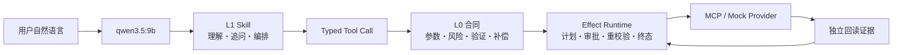

# 真实 LLM Agent 用例 / Real-LLM Agent Use Cases

## 中文

### 1. 这三个用例证明什么

它们不是把已知步骤写死后再播放的 Python 脚本。用户在 DSH 页面输入自然语言，真实本地模型决定加载哪个 L1 Skill、按 Skill 调用哪些 Tool；所有写操作仍必须被 L0 合同与 Domain Effect Runtime 收口。



模型可以选错 Skill、漏参数或表达不准确，因此不是权威。Runtime 对合法候选执行确定性检查；它能阻止越权或结构错误，但不能保证模型对任意新业务意图永远选对。三个用例是本地端到端证据，不是生产成功概率。

### 2. 一次性准备

```bash
ollama pull qwen3.5:9b
NETOPYU_OLLAMA_MODEL=qwen3.5:9b scripts/netopyu-dsh settings-sync
scripts/netopyu-dsh model qwen3.5:9b
scripts/netopyu agent-usecases
```

`scripts/netopyu agent-usecases` 以 JSON 输出三个用例的启动命令、可直接粘贴的 Prompt、预期终态和效果边界。`scripts/netopyu-dsh restart` 会同时重启 Web 与 Python Worker，确保切换 `mock`/`pragmatic` 或配置文件后不会继续使用旧 backend。

### 3. 用例一：用户意图 → L1 → L0 → Runtime

启动本地 mock 写入演练：

```bash
NETOPYU_PROFILE=lan \
NETOPYU_DSH_BACKEND=mock \
NETOPYU_DSH_ENABLE_DESTRUCTIVE=1 \
NETOPYU_OLLAMA_MODEL=qwen3.5:9b \
scripts/netopyu-dsh restart
```

打开 <http://127.0.0.1:3080/>，新建会话并输入：

```text
请使用 agentized-lan-access-remediation Skill 检查用户 erin 的网络准入；
如果被阻止，请恢复。变更原因：CHG-1001 新员工入职。
最终分开说明 LLM 决策、L1 Skill、L0 contract 和验证证据。
```

预期实际链路：

1. 模型加载 `agentized-lan-access-remediation`；
2. 调用 `get_user_access(erin)`，只读当前状态；
3. 被阻止时调用 `check_nac_policy(erin)`；
4. 条件满足后调用一次 `grant_user_access`；
5. Adapter 把 Tool call 编译成 `network.lan.user-access.grant@1.0.0` 不可变计划；
6. 页面展示准确参数、L0 id、intent/plan/workflow hash、验证器和补偿器；
7. 操作者在 DSH 审批卡选择“允许一次”；
8. Runtime 执行前重读、调用 Provider、独立验证，并只以 `verified_success` 终态宣告成功。

拒绝审批、参数漂移、验证失败或结果不确定都会进入显式终态；模型不能把 Provider 的“已发送”文字当成成功。

### 4. 用例二：自然语言 L1 Skill → L0.5 → L0 候选

本例继续使用 mock backend，但不会执行网络效果。样例源码位于 [examples/agentized/restore-employee-lan-access/SKILL.md](../examples/agentized/restore-employee-lan-access/SKILL.md)，但 **DSH 的会话工作区不一定是项目仓库，不能把这个仓库相对路径直接交给模型读取**。

运行下面的命令，把终端输出原样复制到 DSH 页面：

```bash
scripts/netopyu agent-usecases \
  --case l1-to-l0-authoring --prompt-only
```

该 Prompt 已在 `<BEGIN_L1_SKILL>` 与 `<END_L1_SKILL>` 之间内嵌完整 `SKILL.md`，因此不依赖 `/Users/steven/Documents/DSH` 或任何其他会话工作区路径。不要改回 `examples/...` 相对路径。实际 Tool 链分为四步：

1. `netopyu_l0_authoring_capture` 原样保存用户 L1，返回不可猜测的 `draft_id`；
2. `netopyu_l0_authoring_template` 提供可信 Capability Catalog 与结构化示例；
3. 模型提出参数、effect、observer、verifier、compensation、risk、approval 和映射解释；
4. `netopyu_l0_authoring_submit` 只接受 Catalog 中的能力，运行 Schema、scope/risk 单调性、需求级语义覆盖与编译检查，并保存轨迹；例如“身份必须 active”不能只翻译成 `facts exists`。

Tool 返回的 `semantic_coverage.requirements` 是定位偏移的权威入口。每行显示
L1 原句、L0.5/L0 路径、`preserved/weakened/missing/ambiguous` 判定和
`fix.file/path/hint`。安全关键语义被漏掉或削弱时，结果必须为 `blocked`，
不会生成可 review proposal。

通过时还会生成 `artifact_paths.semantic_review_workbench` 指向的离线 HTML；
打开后可按表格直接审查每条 L1→L0.5→L0 映射。该页面只读审查并只能导出
不可信 L0.5 草稿，没有批准、注册、激活或执行能力。

成功结果为 `ready_for_review`，目录类似：

```text
data/l0-proposals/proposal-<id>/proposal/
├── 00-capability-catalog.yaml
├── 01-L1-SKILL.md
├── 02-L0.5.yaml
├── 03-L0-authoring.yaml
├── 04-L0-compiled.json
├── trajectory.json
└── report.json
```

`agent-trace.json` 另外区分模型提出的字段、模型的 `translation_logic` 和 Runtime 验证结果。编造 Capability、缺少独立 verifier/compensation、扩大参数或降低风险会失败关闭。该入口没有批准、注册、激活或执行 API；`ready_for_review` 只表示结构候选可进入人工审查。

当前 Agent authoring 演示只开放 `lan-user-access` 可信 Catalog。扩展到其他领域时应增加经过审查的 Catalog 和测试，而不是允许模型自由发明 Tool。

### 5. 用例三：Agent 与四个外部 MCP 系统交互

启动 service-only pragmatic 演示：

```bash
NETOPYU_PROFILE=lan \
NETOPYU_DSH_BACKEND=pragmatic \
NETOPYU_CONFIG_PATH=config.agentized-service-demo.yaml \
NETOPYU_DSH_ENABLE_DESTRUCTIVE=1 \
NETOPYU_OLLAMA_MODEL=qwen3.5:9b \
scripts/netopyu-dsh restart
```

然后输入：

```text
请使用 enterprise-access-mcp-agent Skill，通过真实本地 MCP 外部系统检查并为用户
erin 开通 crm 的 sales-rep 权限。change_id=CHG-1001，
reason=CHG-1001 新员工 CRM 入职授权。必须分别读取身份、应用、业务审批变更和权限系统；
满足条件才提交 L0 计划。最终列出每条数据的 MCP source，
并区分业务变更审批和 DSH 一次性执行审批。
```

四个系统由四个独立 stdio MCP 子进程提供：

| Tool | 系统边界 | 用途 |
|---|---|---|
| `identity_get_user` | `mcp:identity-service` | 身份是否存在、是否 active |
| `application_get` | `mcp:application-service` | 应用与角色是否有效 |
| `change_validate_window` | `mcp:change-service` | 外部业务工单是否 approved 且窗口开启 |
| `access_policy_evaluate/get_entitlement` | `mcp:access-policy-service` | 资格、现有角色和 revision |
| `access_policy_grant_entitlement` | `mcp:access-policy-service` | 经 L0/Runtime 后执行事务写入 |

这些 MCP 进程共享 `data/agentized_service_layer.sqlite`，以模拟企业业务系统的事务数据。它们是实际进程、MCP 握手和 Tool 调用，不是 Runtime 内的固定返回值；但其中的人员、应用和工单仍是模拟数据。

两类审批不能混淆：

- `change-service` 的 `CHG-1001=approved` 是外部业务前置条件；
- DSH“允许一次”是绑定具体 L0 plan/参数/hash 的执行授权。

即使业务工单已批准，操作者拒绝 DSH 审批，Runtime 也不会写。写入后 Runtime 再调用 `access_policy_get_entitlement`，只有 fresh evidence 显示 `roles=[sales-rep]`、`allowed=true` 且 revision 前进，才返回 `verified_success`。

首次数据库中 `erin:crm` 没有角色。重复演示时如果已授权，Skill 应只读并停止，不制造重复写入；要重新验证写链可使用另一个无角色的 active 用户，或停止 DSH 后只清理这个演示数据库，让 MCP 服务重新播种。

### 6. 2026-08-30 本机实跑结果

三个用例均在 DSH Web 中使用 `qwen3.5:9b` 完成真实 Tool loop：

| 用例 | 观察到的结果 | 不能推出的结论 |
|---|---|---|
| Runtime L1→L0 | 模型选择目标 Skill；审批卡绑定 L0；终态 `verified_success` | 9B 对任意意图都能选对 Skill |
| L1→L0 authoring | 四阶段 proposal 通过并返回 `ready_for_review`；未激活 | 自然语言可无人工审查直接变成生产 L0 |
| 四 MCP 外部集成 | 依次读取四系统；权限 revision 0→1；fresh 回读验证成功 | 本地 SQLite 等同企业 IAM/ITSM 或生产延迟 |

这是单次诊断而非性能基准。外部 MCP 用例页面显示首 token 平均约 26.9 秒、约 11 tok/s，完整长链超过 6 分钟，且工具阶段约 2 分钟；主要瓶颈是 9B 对大 Tool/Skill 上下文的推理，以及当前 CLI fallback 对 stdio MCP 的重复进程启动。它与 Runtime A/B 中约 7.6/8.7 ms 的 p50/p95 不是同一口径。下一步性能优化应优先做 MCP 长连接/连接池、Tool Catalog 按场景裁剪、减少重复上下文和更紧凑的终态报告，而不是削弱 L0 检查。

### 7. 查看证据和停止环境

```bash
scripts/netopyu-dsh runtime-list 10
scripts/netopyu-dsh runtime PLAN_ID
scripts/netopyu-dsh runtime-audit PLAN_ID
scripts/netopyu-dsh logs
scripts/netopyu-dsh stop
```

详细边界见 [L0 v2 设计](l0-v2-design.md)、[L1 → L0 Promotion](l1-to-l0-promotion.md)、[系统接入](getting-started-integration.md)和[收敛评测](convergence-evaluation.md)。

---

## English

### 1. What the three cases demonstrate

These are not pre-scripted Python playbacks. A user sends natural language in DSH, a real local model selects and follows an L1 Skill, and every effect remains constrained by an L0 contract and the Domain Effect Runtime.

The three cases cover: prompt-to-L1-to-L0 execution, agent-assisted L1-to-L0.5-to-L0 proposal authoring, and a four-system MCP integration followed by an L0-governed entitlement write. They are local end-to-end evidence, not production success probabilities.

### 2. Setup and discovery

```bash
ollama pull qwen3.5:9b
NETOPYU_OLLAMA_MODEL=qwen3.5:9b scripts/netopyu-dsh settings-sync
scripts/netopyu-dsh model qwen3.5:9b
scripts/netopyu agent-usecases
```

The last command prints the exact startup command, paste-ready prompt, expected terminal state, and effect boundary for each case. See the Chinese section above for the complete step-by-step UI walkthrough.

### 3. Authority boundaries

- The model owns semantic interpretation and L1 orchestration, not effect authority.
- L0 owns the parameter, risk, preflight, verification, and compensation contract.
- Runtime owns immutable plans, one-shot approval binding, revalidation, terminal states, recovery, and audit.
- MCP providers own external records and effects, but cannot decide whether the operator's intent is authorized.
- The authoring Agent can generate only a review proposal. It cannot register, activate, approve, or execute a new L0 Skill.

### 4. Observed local result

All three cases completed through the real DSH Tool loop with `qwen3.5:9b` on 2026-08-30. The runtime case and external MCP write reached independently verified terminal success; the authoring case produced a four-stage `ready_for_review` package without activation.

The external case took more than six minutes in this single run, with substantial model-context and repeated MCP subprocess startup overhead. This is a diagnostic observation, not a benchmark or SLO. Optimize persistent MCP connections, scenario-scoped Tool catalogs, compact context, and final-report rendering before treating the demo as an interactive production UX.
