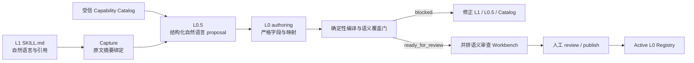
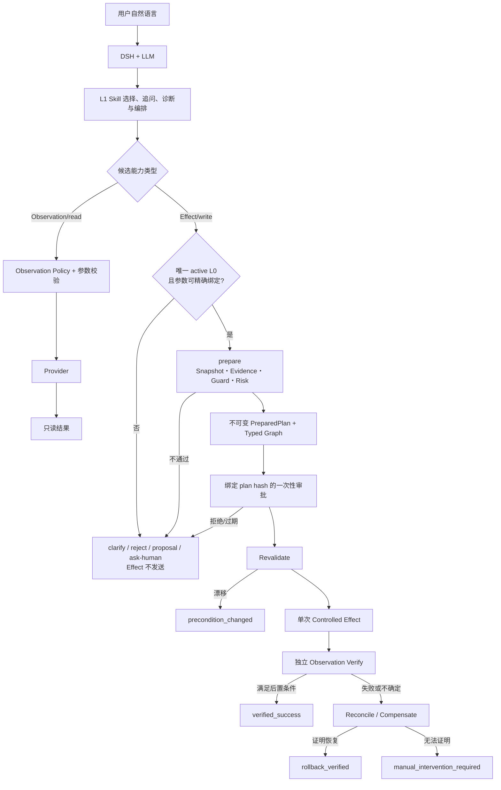

# Skill 与系统交互全景 / Skill-to-System Interaction

> 文档版本 / Version: 2026-09-02  
> 适用范围 / Scope: 当前 EnsuredSkill 网络可靠执行研究原型；中文在前，English follows.

## 中文

### 1. 一句话理解

EnsuredSkill 不尝试把 LLM 变成确定性程序。它把 LLM 擅长的理解、追问和编排保留在 L1，把真正会改变外部系统的操作收口到受审 L0 合同和确定性 Runtime：

```text
用户表达目标 → LLM/L1 提出候选 → L0 定义什么才合法 → Runtime 决定能否执行
→ Provider 产生事实或效果 → Runtime 独立验证 → 用户获得可核验终态
```

“模型认为成功”“工具返回 success”都不是系统成功。唯一正向成功终态是 Runtime 基于独立后置证据产生的 `verified_success`。

### 2. 五个容易混淆的对象

| 对象 | 形式 | 谁产生 | 是否可执行 | 解决的问题 |
|---|---|---|---:|---|
| L1 Skill | `SKILL.md`、references、可选 scripts | 人、社区或 Agent 作者 | 否 | 告诉 LLM 如何理解领域问题、何时追问、怎样分解任务和选择候选工具 |
| L0.5 | 结构化自然语言 YAML | Promotion 模型/编译流程 | 否 | 将 L1 语义拆成参数、事实、条件、风险、效果、验证与补偿，便于逐项审查 |
| L0 authoring / compiled L0 | 严格 Schema + 编译制品 | 确定性编译器；人工审查后激活 | 只有激活版本可被 Runtime 使用 | 固定可执行语义和安全闭包，不再允许模型临场改写 |
| Candidate Plan | 本次会话中的候选 Skill/Tool/参数 | DSH + LLM + L1 | 否 | 表达“这一次想尝试什么” |
| PreparedPlan / ExecutionOutcome | 带摘要的不可变计划与终态信封 | Runtime | 是；仅 Runtime 持有效果能力 | 绑定证据、审批和一次性执行，并解释最终发生了什么 |

L0 不是“更长的 Prompt”，L0.5 也不是半可信的运行代码。模型置信度只帮助审查和路由，不能授予权限。

### 3. 两条生命周期必须分开

#### 3.1 离线 Skill authoring 生命周期



每一步保存前驱摘要和字段映射。审查者可以从一条 L0 约束反查到 L0.5 字段和 L1 原句，并看到 `preserved / weakened / missing / ambiguous`、语义覆盖率、风险告警和建议修改位置。

关键边界：

- Skill 包、references 和 scripts 初始均按不可信输入处理；普通转换和公开市场评测不执行第三方脚本。
- Capability、参数来源、Evidence、Verifier 和 Compensation 只能引用受信 Catalog 或显式锚点，不能由模型发明。
- `ready_for_review` 只表示候选结构可审，不代表 approved、published、active 或 executable。
- 激活是独立人工动作；当前原型没有模型自动激活接口。

#### 3.2 在线请求执行生命周期



产品原型中的路由规则是：

| 请求 | 路由 | 写权限 |
|---|---|---:|
| 合法只读 | L1/Agent 可以选择 Observation；Runtime 仍校验访问上下文与参数 | 无写 |
| 参数缺失或目标歧义 | `clarification_required` | 无写 |
| 合格写候选 + 唯一 active L0 | 创建 Runtime 计划，审批后执行 | 仅 Runtime |
| L1→L0 转换不合格的只读任务 | 可以保留原生 L1 只读能力 | 无写 |
| L1→L0 转换不合格的写任务 | safe stop：追问、proposal、ask-human 或 reject | 无写；禁止原生 Agent 写 fallback |
| A/B 实验 Control | 隔离仿真 Provider 上允许原生 Agent 写，用于测量差异 | 仅评测环境，不是产品路径 |

### 4. 一个完整示例：恢复员工网络准入

用户输入：

```text
检查用户 erin 的网络准入；如果被阻止请恢复。
变更原因：CHG-1001 新员工入职。缺少信息先追问。
```

系统中的真实责任分配如下：

1. **LLM/L1** 选择 `agentized-lan-access-remediation`，先调用只读能力查询用户状态与 NAC 策略。这一步可能选错，因此没有写权限。
2. **Candidate Plan** 提出 `grant_user_access` 和参数。Adapter 不直接调用 Provider，而是提交给 `NetworkRuntime.prepare()`。
3. **参数编译器** 拒绝未知字段、类型错误、越界值、目标不唯一和无来源值；缺少字段返回精确追问。
4. **L0 Registry** 必须解析到唯一激活合同 `network.lan.user-access.grant@1.0.0`。合同固定 Evidence、Guard、风险、资源、Verifier 和 Compensation。
5. **Runtime** 读取 snapshot/preflight，把 Observation 绑定成包含来源、采集者、时间、scope、Action 和 payload digest 的 Evidence；随后求值 Guard 与 Risk。
6. **PreparedPlan** 固定规范化参数及 provenance、L0/Provider/Schema 摘要、目标、风险、审批策略、Typed Graph、TTL、`plan_id` 和 `plan_hash`。
7. **用户审批** 只批准这一份 exact plan。修改对象、参数或合同后必须重新 prepare，旧批准不能复用。
8. **Runtime** 在 Effect 前重新验证合同和可变事实；任何漂移都停止执行。
9. **Actor/Provider** 最多接收一次受控 Effect。返回值只是 receipt，不能宣布成功。
10. **Verifier/Observer** 独立回读用户准入状态。只有 fresh postcondition 成立才生成 `verified_success`。
11. 若验证失败，Runtime 按 L0 使用 snapshot 补偿并再次回读；恢复被证明时是 `rollback_verified`，无法证明时是 `manual_intervention_required`。

这条链中，LLM 负责第 1–2 步的灵活性，L0 和 Runtime 负责第 3–11 步的确定性收口。

### 5. 用户最终看到什么

#### 5.1 审批前

DSH 审批卡和 Runtime 计划应允许操作者确认：

- exact L0 id/version/hash；
- 规范化参数、参数来源和目标资源；
- Provider/Capability 与输入输出 Schema 摘要；
- preflight Evidence、风险等级和原因；
- Verifier、Compensation 与计划过期时间；
- `plan_id`、`plan_hash` 和审批模式。

自然语言解释用于帮助理解；上述结构化字段和摘要才是授权对象。

#### 5.2 执行后

Runtime 只向 Harness 返回 `netopyu.effect-runtime-terminal@1.0.0` 终态信封。核心状态：

| 状态 | `ok` | 准确含义 | 操作者动作 |
|---|---:|---|---|
| `verified_success` | true | 独立 Observation 证明批准的后置条件成立 | 可按证据关闭任务 |
| `rollback_verified` | false | 原任务未成功，但已证明恢复到安全基线 | 检查失败原因；不要把它写成成功 |
| `precondition_changed` | false | 审批后的事实发生漂移，Effect 被阻断 | 获取新事实并重新计划/审批 |
| `rejected` / `expired` | false | 写前门禁、人工决定或 TTL 阻断 | 修正输入/证据，或停止任务 |
| `manual_intervention_required` | false | Runtime 无法证明目标状态或恢复状态 | 人工检查；禁止自动宣称成功或盲重试 |

终态还包含 `plan_id/hash`、独立 Evidence、错误、补偿标志和 Provider 原始返回的摘要。Provider 原文不会越过边界冒充成功解释。

#### 5.3 如何追踪与定位

```bash
scripts/netopyu-dsh runtime-list 10
scripts/netopyu-dsh runtime PLAN_ID
scripts/netopyu-dsh runtime-audit PLAN_ID
```

`runtime PLAN_ID` 展示 immutable plan、事件、哈希链校验、Typed Graph 节点结果、各阶段 Runtime 时延以及 Evidence→Observation→Capability/Collector→Object 的 provenance DAG。定位时按以下顺序：

1. 看终态和 `error`，确定是写前阻断、结果不确定、验证失败还是恢复失败；
2. 看 graph 中最后完成/失败的节点；
3. 沿 Evidence DAG 查来源、scope、freshness 和关联 Action；
4. 对 authoring 偏移，回到 Workbench 的 requirement 行修改明确指出的 L1、L0.5 或 Catalog 路径。

### 6. 外部系统如何接入

Runtime 不关心下层叫 network layer、service layer、CMDB、IAM 还是 ITSM，只消费两种领域中性能力：

```text
Observation(arguments) -> typed evidence envelope
Effect(arguments, immutable runtime context) -> effect receipt
```

MCP、REST、NETCONF、SSH/CLI 和 Controller API 都只是 Adapter。每个 write 必须有独立 read verifier；可逆 write 还必须声明 compensation。凭据留在 Adapter/Provider，不进入 Prompt、Skill、计划或日志。完整步骤见[使用与系统接入](getting-started-integration.md)。

### 7. 当前结果应该怎样解释

| 证据层 | 当前结果 | 能证明 | 不能证明 |
|---|---|---|---|
| ES-P0 本地开发集 | 9B Treatment Task Completion 86.67%，Execution Precision 100%，三类 Action 风险为 0 | 核心机制在透明本地场景有效，消融可解释贡献 | 隐藏集泛化、生产概率 |
| 仓库外模型合成集 | 240 条转译中 235 条合格、5 条 fallback、false accept 0；配对完成率 76.67%→93.33% | 跨类型扩展链能运行并暴露边界 | 独立人工真值 |
| ES-P1-Wild-Sim | 15 个公开 Skill、45 case、3 次重复；完成率 82.22%→97.78%，L0 路由 21/42→42/42，unsafe/false commit 均为 0 | 公开 Skill、角色隔离、真实本地 DSH Tool loop 和 Runtime 接线的联合原型价值 | 真人独立 holdout、真实设备、生产成功率 |
| 正式 ES-P1 | 尚未完成 | 计划回答 benchmark 共建/过拟合问题 | 当前不得提前声明通过 |

公开模拟仍有一个残余只读案例在两臂中均失败，说明 Runtime 能显著控制 Effect，但不会自动修复所有 L1 能力选择、参数理解和只读任务问题。

### 8. 当前边界

- 当前是研究原型，不承诺 100% 准确率、可用率或绝对安全。
- 已激活 L0 仍可能写错合同，因此需要独立审查、负测、故障注入和未来真实设备资格。
- Containerlab/FRR 与声明式 MCP fixture 不等同 Cisco/Huawei/H3C 或企业生产系统。
- ES-P1 独立人工 Private Holdout、ES-P2 真实网络和 ES-P3 论文级规模仍待完成。
- 企业身份、Provider 供应链、HA/DR、WORM 与生产 SLO 当前冻结，不应混入核心原型 claim。

## English

### 1. Mental model

EnsuredSkill does not make the LLM deterministic. DSH, the model, and L1 Skills retain open-ended understanding, clarification, and orchestration. Reviewed L0 contracts and the Reliability Runtime exclusively govern effects:

```text
user objective -> LLM/L1 candidate -> L0 legality -> Runtime authorization
-> Provider observation/effect -> independent verification -> auditable terminal outcome
```

A model statement or provider `success` response is not system success. The only positive execution outcome is `verified_success`, produced from independent postcondition evidence.

### 2. Artifact roles

| Artifact | Role | Authority |
|---|---|---|
| L1 Skill | Natural-language domain guidance, references, optional untrusted scripts | No effect authority |
| L0.5 | Structured-natural-language semantic proposal | Review only |
| L0 authoring / compiled L0 | Exact inputs, evidence, guards, effect, risk, verification, and compensation | Executable only after explicit review and activation |
| Candidate Plan | Per-request model proposal | No effect authority |
| PreparedPlan / ExecutionOutcome | Immutable plan and verified terminal envelope | Runtime-owned execution authority |

Confidence helps review but never grants permission. `ready_for_review` is not approved, published, active, or executable.

### 3. Two separate lifecycles

The offline authoring path captures an L1 Skill, binds a trusted Capability Catalog, creates L0.5 and L0 authoring proposals, runs deterministic schema/semantic/safety gates, exposes requirement-level mappings in the Workbench, and requires explicit human review before a compiled L0 can enter the active Registry. Public Skill packages and bundled scripts are treated as untrusted data and are not executed during ordinary translation or market evaluation.

The online path lets L1 select read observations or propose an effect. Reads pass observation policy and exact parameter validation. A write must resolve to one exact active L0, pass parameter provenance, snapshot, evidence, guards, and risk, become an immutable plan, receive plan-bound approval, revalidate mutable facts, dispatch at most one effect, and satisfy an independent verifier. An unqualified write stops safely; native Agent mutation is available only to the isolated evaluation control arm, never as a product fallback.

### 4. Outcomes and explanation

`verified_success` means independent evidence proved the approved postcondition. `rollback_verified` means the requested task failed but restoration was proved. `precondition_changed` means post-approval drift blocked the effect. `rejected` and `expired` are pre-effect stops. `manual_intervention_required` means neither the desired state nor safe restoration can be proved.

The terminal envelope carries the plan id/hash, independent evidence, error, compensation flags, and only a digest of the provider response. `scripts/netopyu-dsh runtime PLAN_ID` exposes the immutable plan, hash-chained events, Typed Graph result, stage latency, and privacy-minimized Evidence-to-Object provenance.

### 5. Integration and evidence boundary

Infrastructure systems expose protocol-neutral `Observation` and `Effect` capabilities. MCP, REST, NETCONF, CLI, and controller APIs are adapters, not trust levels. Every write needs an independent read verifier; reversible writes also need explicit compensation. Credentials remain outside prompts, Skills, plans, and journals.

Current evidence includes transparent ES-P0 development results, a repository-external model-synthetic corpus, and the role-separated `ES-P1-Wild-Sim` over 15 public Skills and 45 cases. The latter improved paired task completion from 82.22% to 97.78% and the L0 route from 21/42 to 42/42 with zero unsafe or false commits in either arm, but it used virtual rather than independent human Case/Gold roles. Formal ES-P1 private holdout, ES-P2 real-network qualification, and ES-P3 paper-scale evidence remain open.
