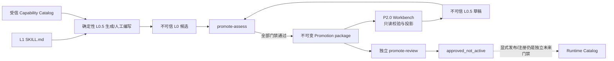

# P2.0 L0 Promotion Workbench

## 中文

### 1. 目标与状态

P2.0 本地参考实现已完成。它把不可变 Promotion package 投影为可读的 L1 → L0.5 → L0 轨迹、语义差异和 Runtime 合同图，并提供一个离线 L0.5 草稿编辑器，降低人工构建和审查 L0 的学习成本。

Workbench **不是**发布或执行控制面：它没有 approve、register、activate、Runtime 或 Provider API。即使 proposal 已由独立 CLI 记录为 `approve`，页面状态也只能是 `approved_not_active`。

### 2. 信任与数据流



确定性校验包括：

- proposal report、package 文件清单、逐文件 SHA-256 和 trajectory hash；
- L1 → L0.5 → L0-authoring → L0-compiled 的精确前驱链；
- Source Skill、L0.5、Capability Catalog、compiled contract 与 report 的交叉绑定；
- compiled contract 内部 hash、id、version、kind 与 report 一致；
- review v2 完整性，以及 `activatesRuntime=false`、`grantsExecutionAuthority=false`；
- 普通文件、非符号链接和单文件 2 MB 上限。

### 3. 功能

- `workbench-list`：列出目录下的直接子 proposal；目录名只以摘要形式输出，无效包安全标记为 `invalid`。
- `workbench-inspect`：输出机器可读的审查投影、语义差异、轨迹、合同图和控制边界。
- `workbench-export`：生成无外部依赖的本地 HTML；CSP 禁止网络、插件、frame 和外部资源。
- HTML 编辑器：编辑结构化 L0.5 的 JSON/YAML 兼容表示并下载草稿；Reset 可恢复原始不可变内容。
- 原子合同图按 Runtime 阶段展示；组合合同边按实际 `dependsOn` 展示，不把文件顺序误当依赖。

### 4. 使用

先生成一个受审 proposal（完整参数见 [L1 → L0 Promotion](l1-to-l0-promotion.md)），然后：

```bash
scripts/netopyu-l0 workbench-list --root /path/to/proposals
scripts/netopyu-l0 workbench-inspect --proposal /path/to/proposals/change-001
scripts/netopyu-l0 workbench-export \
  --proposal /path/to/proposals/change-001 \
  --output /tmp/netopyu-change-001.html
```

在浏览器中打开导出的 HTML。编辑后下载的 `L0.5-draft.json` 必须作为新输入重新执行 `promote-assess` 和 `promote-package`；不得覆盖原 proposal 或直接进入 Runtime。

独立 reviewer 只能在终端记录决策：

```bash
scripts/netopyu-l0 promote-review \
  --proposal /path/to/proposals/change-001 \
  --reviewer <identity> \
  --decision approve|reject \
  --reason <text>
```

### 5. 当前边界与后续

当前是单机、静态 HTML、本地文件型工作台，已通过浏览器交互和安全回归，但不具备组织身份、多人并发、评论流、远端对象存储、签名发布、合同注册或生产授权。P2.1 将建设多团队/多租户 Capability Catalog 与策略委派；P2.2 将建设 Evidence Plane、运营分析和事故复盘。生产发布仍依赖 P1.3–P1.7 的现场能力。

---

## English

### 1. Goal and status

The P2.0 local reference implementation is complete. It projects an immutable Promotion package into readable L1 → L0.5 → L0 lineage, semantic diffs, and a Runtime contract graph, and provides an offline L0.5 draft editor.

The Workbench is **not** a publication or execution control plane. It exposes no approve, register, activate, Runtime, or Provider API. Even an independently approved proposal is shown only as `approved_not_active`.

### 2. Trust and data flow

The Workbench validates the report and exact file manifest, every package digest, the predecessor-linked trajectory, report-to-stage bindings, the compiled contract hash/id/version/kind, the review-v2 authority flags, regular-file semantics, and the 2 MB per-file bound. It then emits a privacy-minimized view. Reviewer identity and reason appear only as digests.

An edited document is always an untrusted L0.5 draft. It must pass a new deterministic assessment, packaging, and independent review. No Workbench output is automatically loaded by the Runtime.

### 3. Commands

```bash
scripts/netopyu-l0 workbench-list --root /path/to/proposals
scripts/netopyu-l0 workbench-inspect --proposal /path/to/proposals/change-001
scripts/netopyu-l0 workbench-export \
  --proposal /path/to/proposals/change-001 \
  --output /tmp/netopyu-change-001.html
```

Open the exported self-contained HTML locally. The page has no external dependency or network call, no approval button, and only downloads an untrusted draft.

### 4. Boundary and next phases

This is a single-host static-file workbench, not an organizational identity, collaborative review, signed publication, contract registry, or production authorization service. P2.1 adds multi-team/tenant Capability Catalog and delegated policy. P2.2 adds an Evidence Plane, operational analytics, and incident review. Production publication still depends on the P1.3–P1.7 site controls.
