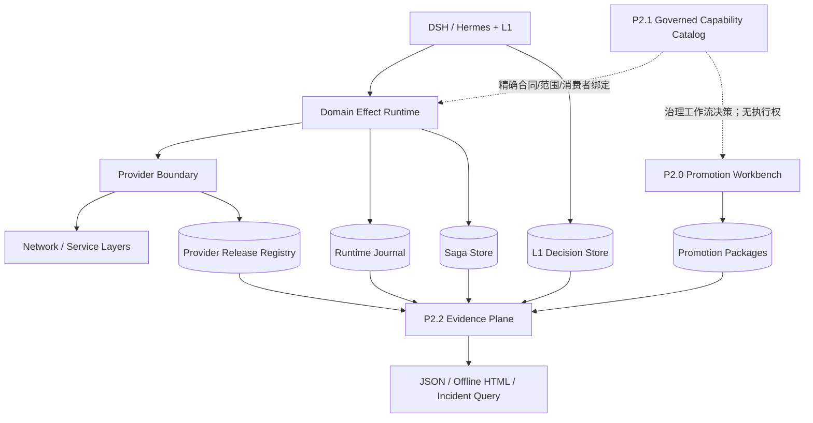

# P2.1 Capability Catalog 与 P2.2 Evidence Plane / Control Planes

## 中文

### 1. 结论与边界

P2.1 和 P2.2 已完成为可重复运行的本地参考实现：

- P2.1 把当前 21 个已激活 L0 合同投影为源码管理、摘要绑定的治理 Catalog，支持团队职责分离、租户/环境范围、委派、生命周期、依赖、消费者影响和兼容性分析。
- P2.2 以只读方式聚合 Runtime Journal、L1 Decision Store、Saga、Provider Release Registry 和 Promotion package，生成隐私最小化的统一事件、指标、事故和离线 HTML 页面。
- 两个控制面都不获得 Runtime read/write、人工审批、Provider 发布、合同注册或激活权威。

这是本地治理与证据原型完成，不是生产认证。生产仍需要企业 IAM/PDP、独立发布系统、远端不可变审计、HA/DR、监控告警和现场 SLO。

### 2. 架构位置



Catalog 是治理投影，不替代 Runtime PEP；Evidence Plane 是观测投影，不参与交易状态机。执行权仍只来自已注册 L0 合同、Provider admission、不可变计划、审批证明与 Runtime 状态机。

### 3. P2.1 Capability Catalog

源码文件：[`data/capability_governance_catalog.yaml`](../data/capability_governance_catalog.yaml)

每个能力绑定：

- `id + version + namespace + kind`；
- 精确 L0 `contractHash`、输入/输出 schema 摘要与 profile；
- owner 与 steward 分离；
- tenant、environment、consumer 和 lifecycle；
- 可选的精确版本依赖与 `supersedes` 迁移关系。

当前本地基线为 21 个 effect 能力、7 个团队、1 个租户/环境和 9 条委派。Schema 同时支持 observation；`bind_read` 与 `propose_write` 是互斥的 Catalog 工作流动作，不能转换为 Runtime read/write 权限。

安全不变量：

- Catalog 文件整体由 `catalogHash` 绑定，符号链接、超大文件、未知字段和摘要漂移 fail closed。
- owner 与 steward 不能相同；review 与 publish 不能在同一委派中出现；禁止自委派。
- 只有 capability owner 能委派，且 tenant/environment/pattern 不能扩大原能力范围。
- 依赖必须存在并精确绑定被依赖合同摘要；未知、漂移、自依赖和环依赖均拒绝。
- 兼容性报告把原地合同/schema/profile/依赖/范围变化、能力删除和生命周期回退标为 breaking，并以摘要标识受影响消费者。
- 报告和 access decision 均声明 `runtime_read_authority=false`、`runtime_effect_authority=false`；兼容报告没有激活接口。

常用命令：

```bash
# 从当前已激活 L0 合同重新投影 Catalog
scripts/netopyu-p2 catalog-bootstrap \
  --output data/capability_governance_catalog.yaml

# 校验 Catalog 摘要与 21/21 Runtime 合同/profile 精确覆盖
scripts/netopyu-p2 catalog-validate \
  --catalog data/capability_governance_catalog.yaml

# 只评估 Catalog 工作流权限，不授权 Runtime 或 Provider
scripts/netopyu-p2 catalog-authorize \
  --catalog data/capability_governance_catalog.yaml \
  --team lan-operations --action propose_write \
  --capability network.lan.user-access.grant --version 1.0.0 \
  --tenant local-lab --environment local-simulation

# 比较候选版本；breaking 时退出码为 1
scripts/netopyu-p2 catalog-diff \
  --previous /path/to/catalog-v1.yaml \
  --candidate /path/to/catalog-v2.yaml
```

`catalog-bootstrap` 会覆盖目标文件，应只在 L0 合同变化后运行，并将 diff 与消费者影响纳入 review。它不会注册或激活合同。

### 4. P2.2 Evidence Plane

Evidence Plane 支持五类 adapter：

| 来源 | 验证与投影 |
|---|---|
| Runtime Journal | plan/event 摘要链、终态、审批/执行/验证/补偿类别、成功/回滚/人工介入和 p50/p95 |
| L1 Decision Store | Decision evidence 摘要、route/参数/safety observation、动作与模型时延 |
| Saga Store | Saga 事件摘要链、终态、补偿和人工介入 |
| Provider Release Registry | release 事件摘要链、promote/rollback 事件 |
| Promotion root | package/workbench 完整性、review 状态；永不激活 |

所有 SQLite 数据库均使用 `mode=ro` 和 `query_only=ON` 打开。投影只保留摘要标识、时间、类别、状态、结果和受限的非敏感标量；不输出原始 Prompt、参数值、审批身份、Provider payload 或文件路径。

来源缺少可验证事件链、记录被截断或完整性校验失败时，快照状态为 `degraded`，CLI 返回非零；它不会把“不可验证”伪装成成功。跨来源事件再形成独立 `projection_digest` 链，整个快照由 `snapshot_digest` 绑定。

每个快照同时生成按 source/severity/code 的失败聚类和有限漂移信号。`evidence-trend` 比较两个以上唯一、摘要有效的快照，展示成功/回滚、L1 精确率、安全逃逸、事故、来源完整性和本地 p50/p95 变化；只有安全完整性信号自动分类 `stable|improved|regressed`，时延变化保留给受控环境人工判断。

```bash
# 生成隐私最小化 JSON
scripts/netopyu-p2 evidence-collect \
  --runtime-journal data/network_runtime.sqlite \
  --decision-store data/l1_decisions.sqlite \
  --saga-store /path/to/sagas.sqlite \
  --provider-registry /path/to/provider-releases.sqlite \
  --proposal-root /path/to/proposals \
  --output /tmp/netopyu-evidence.json

# 同时导出无外部依赖、无控制按钮的离线页面
scripts/netopyu-p2 evidence-export \
  --runtime-journal /path/to/runtime.sqlite \
  --decision-store /path/to/l1-decisions.sqlite \
  --saga-store /path/to/sagas.sqlite \
  --provider-registry /path/to/provider-releases.sqlite \
  --proposal-root /path/to/proposals \
  --snapshot-output /tmp/netopyu-evidence.json \
  --output /tmp/netopyu-evidence.html

# 从摘要绑定的 snapshot 查询单个事故
scripts/netopyu-p2 evidence-incident \
  --snapshot /tmp/netopyu-evidence.json \
  --incident-id sha256:...

# 比较两个以上快照；regressed 时退出码为 1
scripts/netopyu-p2 evidence-trend \
  --snapshot /path/to/evidence-before.json \
  --snapshot /path/to/evidence-after.json
```

当前指标用于本地回归和事故定位，不是生产 SLO、生产成功概率或合规审计结论。P2.2 也没有远程 WORM、告警投递、跨实例 trace correlation 或长期容量管理，这些属于 P1.7/P1.6 现场建设。

### 5. 验收证据

- 专项测试覆盖 Catalog 摘要/范围/委派/职责分离/依赖/兼容性，以及五类 Evidence adapter、隐私、链篡改、legacy 无链降级、CLI 和 HTML 摘要绑定。
- 浏览器实测页面为 5 个来源、18 个事件、2 个事故；时间线筛选有效，无按钮、无外部请求且无控制台错误。
- 主门禁以仓库最新全量测试和 `scripts/netopyu-dsh retirement` 输出为准。

## English

### 1. Result and boundary

P2.1 and P2.2 are complete as reproducible local reference implementations.

- P2.1 projects all 21 activated L0 contracts into a source-controlled, digest-bound governance Catalog with team separation, tenant/environment scope, delegation, lifecycle, dependencies, consumer impact, and compatibility analysis.
- P2.2 opens Runtime, Decision, Saga, Provider release, and Promotion evidence read-only and produces a privacy-minimized event/metric/incident snapshot plus a self-contained offline page.
- Neither plane receives Runtime read/write, human approval, Provider publication, contract registration, or activation authority.

This is local control-plane completion, not production certification. Enterprise IAM/PDP, independent release systems, remote immutable audit, HA/DR, monitoring, alerting, and site SLOs remain external work.

### 2. P2.1 contract

The governed source is [`data/capability_governance_catalog.yaml`](../data/capability_governance_catalog.yaml). Each entry binds exact identity/version, namespace/kind, L0 contract and schema digests, profiles, owner/steward separation, tenant/environment, lifecycle, consumers, and optional exact dependencies/supersession.

The Catalog rejects self-delegation, combined review/publication delegation, non-owner grants, scope widening, unknown or drifted dependencies, cycles, unbound supersession, and tampered documents. `bind_read` and `propose_write` are separated Catalog workflow actions. Every decision explicitly denies Runtime read/effect and Provider publication authority.

Use `scripts/netopyu-p2 catalog-bootstrap|catalog-validate|catalog-authorize|catalog-diff`. Bootstrap and diff never register or activate a capability.

### 3. P2.2 contract

The Evidence Plane supports Runtime Journal, L1 Decision Store, Saga Store, Provider Release Registry, and Promotion roots. SQLite sources use read-only URI mode plus `query_only`; projections exclude raw prompts, argument values, approval identities, Provider payloads, and filesystem paths. Snapshots include bounded failure clusters and drift signals; `evidence-trend` compares two or more unique digest-valid snapshots and classifies only safety/integrity changes, leaving latency interpretation to controlled-environment review.

Missing chains, truncation, or integrity failures produce `degraded` and a non-zero CLI result. Source evidence is re-projected into a cross-source digest chain and the complete snapshot is digest-bound. The HTML has a restrictive CSP, no external network dependency, and no approval/execution/registration/activation controls.

Use `scripts/netopyu-p2 evidence-collect|evidence-export|evidence-incident`. Metrics are local operational indicators, not production SLOs, success probabilities, or an external immutable audit opinion.

### 4. Acceptance evidence

Automated coverage includes governance integrity/scope/delegation/separation/dependency/compatibility, all five evidence adapters, privacy, chain tampering, legacy-chain degradation, CLI behavior, and snapshot-bound HTML. Browser QA verified five sources, 18 events, two incidents, functional timeline filtering, zero controls, zero external requests, and no console errors.
